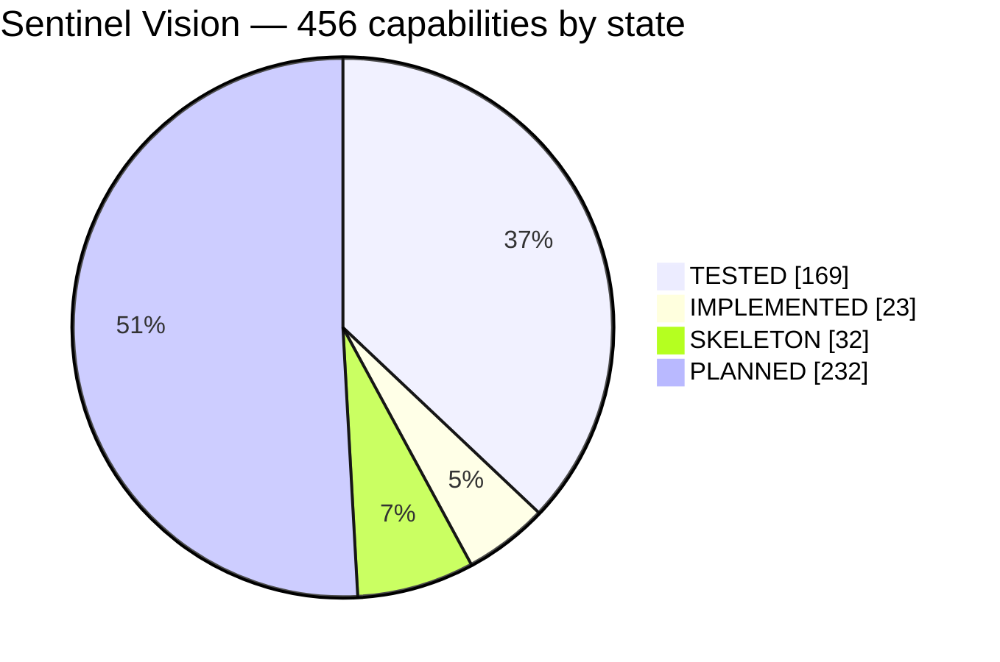
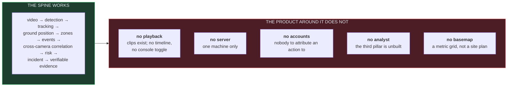
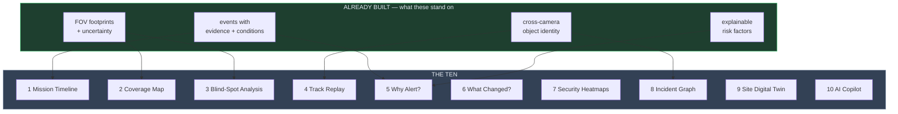

# Sentinel Vision — product definition

**The product definition.** The engineering specification says how; this says
*what*, as capabilities rather than implementation. Every line carries the state
it is actually in, because a feature list without one is a wish list, and §130 of
the specification exists precisely to stop that.

> **In one sentence.** Sentinel Vision ingests a network of cameras, understands
> what is happening in each video, tracks activity through space and time,
> correlates observations across cameras, understands geographic context, detects
> configured behavioural events, prioritises incidents, reconstructs what
> happened, presents the evidence on a live map and a synchronised video
> timeline, and lets a human operator investigate and document all of it —
> entirely locally, or across a secured LAN, with no WAN dependency.

| State | Meaning |
|---|---|
| **`TESTED`** | Works, and a test fails if it stops working |
| **`IMPL`** | Works. Not yet covered by a test that would catch a regression |
| **`SKEL`** | Types, a code path or scaffolding exist. Does not do the job yet |
| **`PLAN`** | Designed. No code |

**Nothing is `PRODUCTION-READY`.** Nothing here has been run against real
footage, trained detection weights, a physical IP camera, a GPU, or a
multi-machine LAN. Everything marked `TESTED` is tested against generated
fixtures and one real webcam, which is a real bar and not the same bar.

Related: [STATUS.md](STATUS.md) — measurements and honest gaps ·
[ROADMAP.md](ROADMAP.md) — the order to build in ·
[docs/USAGE.md](docs/USAGE.md) — how to use what exists.

---

## The scoreboard

456 capabilities, each with a state. Many lines cover several related things —
"heading · pitch · roll" is one row — so this counts *claims*, not code.

| | Count | Share | What it means |
|---|---:|---:|---|
| **`TESTED`** | 169 | 37% | A test fails if it stops working |
| **`IMPL`** | 23 | 5% | Works; a regression would go unnoticed |
| **`SKEL`** | 32 | 7% | Something is there; it does not do the job |
| **`PLAN`** | 232 | 51% | Designed, no code |

**Read that 37% carefully.** It is not "a third of the product is finished" — it
is that the part which is finished is the analytical core plus, now, the
recording that makes its evidence real, while most of what is planned is the
product surface around them. The parts a demonstration shows off are the parts
that exist; several of the parts a deployment depends on still do not.

---

## Where the product stands

The analytical core — the hard part, and the part everything else is worth
nothing without — is built and measured. What is missing is almost entirely
*product surface*: recording, a control plane, identity, an interface for things
the engine already computes.

---

## 🖥️ Desktop & platform

| Capability | State | Note |
|---|---|---|
| Cross-platform desktop application | `TESTED` | Windows. Linux and macOS are code paths CI has never run |
| Windows support | `TESTED` | Developed and packaged here |
| Linux support | `SKEL` | Container runs the engine; the console has never been shown on Linux |
| macOS support | `SKEL` | Never built or run |
| Standalone completely local operation | `TESTED` | Three enforcement points; see Network |
| LAN distributed operation | `PLAN` | |
| Headless AI worker nodes | `PLAN` | `python -m sentinel` is headless but is not a node — it exits |
| Multi-monitor command-centre layouts | `PLAN` | First step: the map in a `QDockWidget` that floats to a second monitor and remembers its geometry; selection and modes keep working across windows. Video on one screen and the map on the other is how a control room is laid out. |
| Fullscreen security-operations mode | `PLAN` | |
| System tray operation | `PLAN` | |
| Application lock | `PLAN` | Needs accounts first |
| Local user accounts | `PLAN` | |
| Role-based access control | `PLAN` | Design is permission-based, never role-name checks |
| Administrator / operator / analyst / viewer roles | `PLAN` | |
| First-run setup wizard | `PLAN` | |
| Professional security-operations UI | `TESTED` | Native Qt widgets, no webview — asserted by test |
| Dark command-centre interface | `TESTED` | Distinct state colours, asserted distinguishable |
| Arabic / English / French interface | `PLAN` | No string extraction yet |
| RTL support | `PLAN` | |
| Crash recovery | `SKEL` | An unhandled exception is logged with its traceback; nothing restarts |
| Automatic service recovery | `SKEL` | A camera reconnects with backoff — genuinely, since the pipeline began using it; the application does not |
| Health monitoring | `PLAN` | |
| Diagnostics centre | `SKEL` | `sentinel where` and the log are the whole of it |

## 🌐 Network & deployment

| Capability | State | Note |
|---|---|---|
| Zero-WAN operation | `TESTED` | Static source audit, runtime egress guard, offline CI job — all three tested |
| Zero cloud dependency | `TESTED` | The audit fails the build on any cloud SDK |
| Zero telemetry | `TESTED` | Including onnxruntime's own, switched off explicitly |
| LAN-only architecture | `IMPL` | The guard is on the decode path — the only outbound socket this build opens |
| Automatic LAN node discovery | `PLAN` | |
| Manual node discovery by IP | `PLAN` | |
| Secure node pairing | `PLAN` | Six-word fingerprint compared off-channel |
| Trusted-node management | `PLAN` | |
| Encrypted node communication | `PLAN` | mTLS, pinned identities |
| Node health monitoring | `PLAN` | |
| Worker assignment | `PLAN` | |
| Camera-to-worker assignment | `PLAN` | |
| Distributed AI inference | `PLAN` | |
| Distributed video processing | `PLAN` | |
| Local event synchronisation | `SKEL` | Deterministic event ids make the reconciliation an upsert — the reason they exist |
| Offline worker buffering | `PLAN` | |
| Automatic worker reconnection | `PLAN` | |
| Network-isolation verification | `TESTED` | `docker compose run --rm verify` — the whole suite, `network_mode: none` |
| LAN failure detection | `PLAN` | |
| Network diagnostics | `SKEL` | The reachability probe reports refused vs unreachable vs timed out |

## 📷 Camera management

| Capability | State | Note |
|---|---|---|
| Automatic IP camera discovery | `PLAN` | |
| ONVIF discovery | `PLAN` | |
| ONVIF camera interrogation | `PLAN` | |
| RTSP cameras | `SKEL` | The code path is complete. **No IP camera has ever been contacted** |
| Manual RTSP configuration | `IMPL` | Console dialog and CLI; the URL is validated and redacted |
| USB cameras | `TESTED` | Through each OS's own capture API — see below |
| Local video-file cameras | `TESTED` | The only source that is *evidence*: every frame, in order, reproducibly |
| Camera naming | `TESTED` | |
| Camera descriptions | `PLAN` | |
| Camera grouping | `PLAN` | |
| Camera tagging | `PLAN` | |
| Camera location assignment | `TESTED` | |
| Camera map placement | `IMPL` | The first placement is the dialog's, because a click cannot say how high a camera is or which way it faces, and there is deliberately no default pose; a placed camera is then moved by clicking the plan view. Dragging is the next row. |
| Camera orientation · elevation · heading · pitch · roll | `TESTED` | All five stored and used in projection |
| Horizontal FOV · vertical FOV · range | `TESTED` | |
| Camera status | `IMPL` | Live / stale / fault, reported in place, never modally |
| Camera health history | `PLAN` | |
| Camera latency monitoring | `PLAN` | |
| FPS monitoring | `SKEL` | Measured in the pipeline stats, not surfaced per camera |
| Bitrate monitoring | `PLAN` | |
| Dropped-frame monitoring | `TESTED` | Counted, because a system silently discarding half its input is worse than one that says so |
| Decode-error monitoring | `IMPL` | Every failure is logged with its type |
| Reconnection monitoring | `TESTED` | Counted, with bounded backoff, and now reported in the run summary — a camera that lost half its input no longer prints the same line as one that lost none |
| Stream-profile selection · main/sub-stream | `PLAN` | |
| Codec detection | `PLAN` | |
| Connection testing | `TESTED` | Socket probe before the decoder — OpenCV's own 30 s timeout cannot be changed |
| Authentication testing | `PLAN` | |
| Camera credential management | `SKEL` | Redaction is `TESTED`; **nothing persists a password**, so nothing can leak one from storage |
| PTZ cameras · manual control · presets · home | `PLAN` | Permission-gated and audited by design |
| Camera enable/disable | `PLAN` | |
| Camera AI enable/disable | `PLAN` | |
| Camera recording enable/disable | `PLAN` | `Recorder` and retention are `TESTED` and CLI-only. A per-camera checkbox in the camera list passed into `Node.add_camera`/`start()` as the CLI already does, a red dot while a segment is open, segment count and disk used from `RecorderStats`. A checkbox in front of finished work, and it gates every replay feature. |
| Camera-specific AI policies | `PLAN` | |
| Camera schedules | `PLAN` | Zone schedules exist; camera schedules do not |
| Drag a placed camera on the map, with a live footprint and heading handle | `PLAN` | Dragging the selected camera's marker moves it and recomputes `field_of_view()` per mouse move (one FFI call, 16 segments while dragging, 28 on release); a handle at the stalk's end rotates heading, Shift snaps to 5°, Shift-click a ground point aims the camera there. The footprint, near and far edges and the ground band ('7.2 m to 85.8 m ahead') redraw live. Commit once on release through `Node.place_camera` — one audit row, not one per pixel. Right-click 'Place here…' pre-fills only the position and opens the height/pitch/optics form; until it is accepted the camera stays unplaced and projects nothing — an assumed pose would produce positions that look exactly like measured ones. Configure mode only. |
| Camera position entry in decimal degrees, DMS, UTM or site metres | `PLAN` | The placement form accepts any of the four and shows the same position in the others as you type — pyproj for UTM, imported with `PROJ_NETWORK=OFF` and `pyproj.network.set_network_enabled(False)` asserted by test. The stored value is the site-frame position plus the text as typed, so what was entered is auditable. Survey drawings give UTM, a phone gives DMS, an indoor plan gives metres; converting by hand is where sign and zone errors enter. |

### Local cameras, through the operating system

| Platform | Enumerated through | Opened through | State |
|---|---|---|---|
| Windows | `Win32_PnPEntity` — the PnP device registry | Media Foundation → DirectShow | `TESTED` |
| Linux | `/sys/class/video4linux` — the V4L2 device tree | Video4Linux2 | `IMPL` |
| macOS | `system_profiler SPCameraDataType` | AVFoundation | `IMPL` |

Listing opens nothing. An index nothing has opened is reported as *assumed*,
because there is no supported mapping from an OS device to a capture index and
two identical webcams are indistinguishable by name.

## 🎥 Live video

| Capability | State | Note |
|---|---|---|
| Live camera viewing | `TESTED` | |
| Multi-camera video wall | `TESTED` | A pane per camera, a pipeline per camera |
| 1-camera · 2×2 · 3×3 · 4×4 · custom layouts | `SKEL` | An automatic near-square grid; not selectable |
| Camera pinning · fullscreen · switching | `PLAN` | |
| Live AI bounding boxes | `TESTED` | |
| Track overlays | `TESTED` | Confirmed and coasting tracks drawn *differently* |
| Zone overlays | `TESTED` | On the plan view, drawn distinctly from evidence |
| Event overlays | `PLAN` | |
| Camera metadata overlay | `IMPL` | |
| FPS overlay · AI performance overlay | `PLAN` | |
| Stream health indicator | `IMPL` | |
| Low-latency viewing | `TESTED` | Newest-wins; a backlog is worse than a gap |
| Sub-stream fallback | `PLAN` | |
| Zone outlines in the camera image, and zones drawn on the video | `PLAN` | Every zone ring is projected into each pane with the existing `image_coordinates()`: vertices below the horizon and in range are drawn; the part a camera cannot see is a broken line labelled 'beyond this camera'. The inverse: a Draw-on-video mode where the operator clicks the bay's corners in the frozen frame and each vertex is projected with `project_to_ground()` carrying its σ, so the edge is drawn on the map as a band, not a line; a vertex above the horizon is refused. Two FFI calls that exist, no ABI change. Hovering a ground point on the map draws a crosshair in every pane that sees it — the map alone cannot tell an operator whether the polygon is the bay or the pavement beside it. |

## 🤖 AI computer vision

| Capability | State | Note |
|---|---|---|
| Real-time object detection | `TESTED` | Motion, boxes, or instance masks — chosen by *reading* the model file, not by a flag. Motion still emits `UNCLASSIFIED` and never claims otherwise |
| Person · vehicle · car · truck · bus · motorcycle · bicycle detection | `TESTED` | YOLOv8n-seg, 80 COCO classes. Verified on a live webcam: one person at 0.86 held 160 frames / 11.5 s, plus two correctly-classed bottles. Weights are operator-supplied and never downloaded |
| Animal · bag · package · smoke · fire detection | `PLAN` | |
| Custom detection classes | `TESTED` | Class names are read from the model's own metadata; a model that carries none reports no labels rather than inventing them |
| Instance segmentation | `TESTED` | Per-object masks from a two-output model. The ground-contact point comes from the mask's own lowest row — not the bottom edge of a rectangle, which is what the whole position layer used to rest on |
| Mask-derived contact drives the map position | `TESTED` | The point crosses the Rust boundary (ABI 6) and is what the projection uses; a box-only detector sends its bottom-centre and gets exactly the answer it always did. Until this row existed the contact was computed in Python and **used by nothing** — the fifth instance of correct, tested code that nothing called |
| Conclusions never squeezed out of sight | `TESTED` | On a short window the video shrinks, not the incident and track panels. A live screenshot had shown "2 tracked now" above a table reduced to its header row |
| Contact point drawn in the console | `TESTED` | A dot in the track's colour where the position was projected from — on the feet with a mask, at the box's bottom-centre without. Checked as pixels, not as a call |
| Segmentation masks drawn in the console | `TESTED` | The silhouette, at low alpha, instead of a box. An overlay that hides the pixels it describes makes the frame useless as evidence |
| Remove a camera | `TESTED` | From the toolbar. Stopped first if running, its last events drained; its events and incidents are kept. Row, pane and picker entry go |
| Move a camera on the map | `TESTED` | Click the plan view; height, heading and optics are kept. The first placement is the dialog's, because a click cannot say which way a camera faces |
| Change or remove a zone | `TESTED` | Rename, change kind, remove — persisted and audited with what changed. The last zone's removal drops the zone rules. Zone ids are never reused |
| One camera per device | `TESTED` | A second camera on the same device or stream is refused by name; a duplicate already stored is restored, faulted and never started. An operator's log had three cameras on `device:0` fighting one webcam. Files are exempt: a replay may back any number of cameras |
| Models found beside the executables | `TESTED` | A packaged build looks in `models/` next to the `.exe`, not inside `_internal`; packaging copies any model in the checkout there; `sentinel where` prints the directory |
| Model switching · multiple models | `TESTED` | Three detectors, interchangeable everywhere downstream. `--model` on `run`, `node` and the console; the console falls back to motion and says so |
| GPU inference | `PLAN` | |
| CPU fallback | `TESTED` | The only provider used today |
| Hardware acceleration · GPU detection · VRAM monitoring | `PLAN` | |
| Inference FPS monitoring | `IMPL` | 433 fps / 2.31 ms measured on an idle machine |
| Model benchmarking | `IMPL` | `engine/tests/bench_scaling.py` |
| Model A/B testing | `PLAN` | |
| Detection confidence | `TESTED` | |
| Model version tracking | `TESTED` | Recorded on every event |
| Model integrity verification | `TESTED` | SHA-256 of the weights |
| Local model installation | `SKEL` | A path under `models/`. No import flow |
| Offline model management | `PLAN` | **Nothing is ever downloaded** — a missing model is an error that says so |

## 👁️ Tracking & scene understanding

| Capability | State | Note |
|---|---|---|
| Persistent object tracking · track IDs | `TESTED` | |
| Track trajectories | `TESTED` | Trails drawn on the plan view |
| Direction estimation | `TESTED` | Withheld when the object is not moving — jitter is not a heading |
| Velocity estimation | `TESTED` | Withheld below 1.2 s of observation |
| Zone membership | `TESTED` | Three states: inside / outside / **uncertain** |
| Temporary occlusion handling | `TESTED` | Coasting with a gap budget; held-open frames are counted |
| Track history | `TESTED` | |
| Object appearance features | `PLAN` | **The known limit**: 4 objects reported for 3 people, 7 identity switches |
| Multi-object tracking | `TESTED` | |
| Group tracking | `SKEL` | Distinct-object count is exact; grouping as a concept is not modelled |
| Track visualisation | `TESTED` | |
| Track timeline | `IMPL` | Inside an incident |
| Track history search | `PLAN` | |
| Track position samples persisted at 1 Hz for replay and heatmaps | `PLAN` | Migration: `track_samples (camera_id, track_id, at_millis, lat, lon, uncertainty_m, class_label)` written by the node from `poll()` at most once per second per track — about 100 bytes × tracks × 86,400 per camera per day, stated in the docs as a budget. Retention by age, except that samples inside a preserved incident window are preserved like segments and never deleted, and the evidence package includes them as `tracks.jsonl`. Turns 'trails are context, not a recording' into replayable trails and a heatmap of movement rather than of alerts. |

## 🧑 People: named identity, opt-in

Until now the answer to "who is that?" was *the system does not know and will not
guess*. This is the design for knowing, on purpose, where an operator has decided
their site needs it — a warehouse with twelve staff, a depot with a contractor
list — and it is built so that the decision stays visible and reversible.

Three properties hold the whole section up, and every row below is downstream of
them. **It is off until somebody turns it on**, and off means no face is detected,
embedded or stored, not that the column is hidden. **Nobody is enrolled by being
seen** — enrolment is an operator naming a track, once, deliberately. **A name is
never asserted without the evidence for it**: the score and the matched face are
shown wherever the name is, because a security product that says "this is Ali"
with nothing behind it is worse than one that says nothing.

Face work runs only inside a person track's box, so a scene with no people costs
nothing, and only while the feature is on.

| Capability | State | Notes |
|---|---|---|
| Face detection | `PLAN` | `cv2.FaceDetectorYN` — YuNet, which OpenCV 5 already ships. The operator supplies the ONNX, as with the segmenter; nothing is ever downloaded. Run only inside an existing person track, never over the whole frame |
| Face embedding | `PLAN` | `cv2.FaceRecognizerSF` — SFace, also in OpenCV 5. A 128-float template per face, compared by cosine distance. A template is not an image and cannot be turned back into one, which is what makes storing it defensible where storing the crop would not be |
| People register: enrol a face and give it a name | `PLAN` | `people` and `face_templates` tables. Enrolment is only ever an explicit act on a track — "Name this person…" — never automatic and never from a passer-by. The row records who enrolled, when, and the lawful basis they chose from a list the site configured |
| A track is matched to a person, with its score | `PLAN` | Aggregated across the frames of a track, never decided on one. Above the high threshold it reads *match*; between the two thresholds it reads *possible match*, is drawn differently and fires no rule; below, nothing is claimed at all. The score and the matched crop travel with the name everywhere it appears |
| The name is shown on the track, in the table and on the map | `PLAN` | With the same *match* / *possible match* distinction in all three, so an operator cannot see the certain form in one panel and the hedged form in another |
| Movement history for a person, across cameras and time | `PLAN` | Every track matched to that person, listed with camera and time and drawn as a trail on the plan view. This is the feature the rest exists to serve: *where has this person been* |
| People menu: register, enrol, rename, merge, forget | `PLAN` | One place that lists everybody enrolled, how many templates each has, when they were last seen, and what they are allowed to be matched against |
| Off by default, switched on per site, audited both ways | `PLAN` | With it off, no face is detected, no template computed and none stored — enforced in the pipeline, not in the interface. Turning it on and off is an audit row like any other configuration change |
| Forget a person, completely | `PLAN` | Deletes every template, unlinks the movement history, and audits the deletion. A biometric register with no delete is not lawful in most jurisdictions and not defensible in any of them |
| Retention for biometric templates | `PLAN` | Templates expire on a per-site policy unless the person is pinned, swept by the same retention job that deletes recorded video. The default is short on purpose |
| Face crops stored only when the operator opts in separately | `PLAN` | The template is the default and the crop is not kept. A crop is a photograph of somebody's face and needs its own justification, its own retention and its own audit row |
| Nothing biometric leaves the machine | `PLAN` | Covered by the existing offline guarantee — no network at runtime — and by extending the evidence exporter's credential scanner to refuse any package carrying templates unless the operator explicitly included them |
| An unmatched face is never enrolled, counted or stored | `PLAN` | A stranger walking past produces a track like any other and nothing else. There is no "unknown persons" gallery, because that is an identity database built by accident |

## 🚗 Vehicles and number plates

The same shape as people, for the object a site can identify without touching
anybody's biometrics: the plate on the front of a vehicle. The safeguards are
kept anyway — a plate is personal data in most of the world — but the evidence
is a photograph of a legally displayed identifier, which is a materially weaker
claim on someone than their face.

| Capability | State | Notes |
|---|---|---|
| A track is known to be a vehicle | `IMPL` | `car`, `truck`, `bus` and `motorcycle` already come from the COCO segmenter; nothing new is needed to know a track is a vehicle, only to read it |
| Plate detection inside a vehicle track | `PLAN` | An operator-supplied ONNX detector run only inside a vehicle's box, never over the frame. Off with the feature, like faces |
| Plate text recognition | `PLAN` | `cv2.dnn.TextRecognitionModel` (CRNN), which OpenCV 5 ships; the operator supplies the weights and the character set for their country |
| A plate is read from a track, not from a frame | `PLAN` | One frame is a guess. The same characters agreeing across several frames of one track is a reading, and the count is kept and shown |
| A partial or unsure read is never shown as a plate | `PLAN` | Unresolved characters are drawn as `?` with the crop beside them. A plate that reads `B?7 4?21` must never be presented, matched or exported as `BX7 4921` |
| Vehicles register: plate, name, notes | `PLAN` | Normalised per the site's country format so `B 7421` and `B-7421` are one vehicle, with the raw read kept beside the normalised form |
| Watchlist: a plate that raises an event when read | `PLAN` | The one place plate reading becomes a rule rather than a record. Severity and schedule per entry, like a zone |
| Movement history for a vehicle | `PLAN` | Every track its plate was read on, across cameras and time, drawn on the plan view — the same panel as a person's history |
| Vehicles menu: register, name, watchlist, forget | `PLAN` | |
| Off by default, audited, retained and deletable | `PLAN` | The same machinery as people: a per-site switch enforced in the pipeline, an audit row for every change, a retention sweep, and a delete that really deletes |

## 🔗 Multi-camera intelligence

| Capability | State | Note |
|---|---|---|
| Same-object cross-camera correlation | `TESTED` | Union-find, transitive — two views of one world produce one incident, one object |
| Cross-camera track continuation | `TESTED` | |
| Camera transition prediction | `PLAN` | |
| Camera topology graph | `PLAN` | |
| Expected travel-time modelling | `PLAN` | |
| Direction-aware correlation | `PLAN` | |
| Spatial correlation | `TESTED` | Elliptical gate accounting for both positions' uncertainty |
| Appearance-based correlation | `PLAN` | The same gap as above, and the reason association is deliberately weak |
| Cross-camera confidence score | `TESTED` | With its reasons, so an operator can disagree with it |
| Group movement correlation | `SKEL` | |
| Track history across an entire site | `SKEL` | The data exists; nothing presents it |
| Site-wide movement timeline | `PLAN` | See *Mission Timeline* below |
| Multi-camera incident reconstruction | `TESTED` | Per-incident timeline across every camera that saw it |
| Consolidate duplicate observations | `TESTED` | **13 events → 1 incident. 92% less for a person to read** |
| Follow a track across the camera network | `PLAN` | See *Track Replay* below |
| Search all observations for one track | `PLAN` | |

## 🗺️ Geospatial intelligence

| Capability | State | Note |
|---|---|---|
| Real geographic map | `SKEL` | A metric grid in real coordinates, no basemap under it. The local frame is anchored on the first placed camera and re-anchors when that camera is removed, so every other object moves on screen; the site record row fixes the origin. Two hand-rolled tangent-plane frames exist today (`MapView._to_local`, `coverage._Frame`); one `SiteFrame` replaces both — no PROJ is needed at site scale. |
| Offline map · local map packages | `PLAN` | |
| Vector tiles · raster tiles · PMTiles · GeoJSON overlays | `PLAN` | |
| Camera locations | `TESTED` | |
| Camera FOV cones | `TESTED` | An **annular sector**, never a pie slice — a tilted camera cannot see its own mast |
| Camera coverage visualisation | `TESTED` | |
| Moving tracks on map | `TESTED` | |
| Live event positions | `TESTED` | |
| Incident locations | `TESTED` | |
| Security zones · restricted areas | `TESTED` | |
| Perimeters · assets · gates · checkpoints · buildings · sites · roads · terrain | `PLAN` | |
| Map snapshots | `PLAN` | On export the console renders an offscreen `MapView` (1600×1200) with the incident's cameras, zone versions, event positions and links to `map.png`, hashed as a file, with `map.json` naming the layers, versions, renderer version, font and size. The vector inputs are the record; the picture is labelled derived and never compared by digest across machines — `sentinel render-map` regenerates and compares by structural similarity. The headless CLI ships no picture and says so rather than shipping a labelless one. |
| Map-based incident investigation | `SKEL` | Selecting an incident frames the cameras and zones involved, dims everything else, draws the objects' event positions and links for the incident's window, and shows the zone version in force at the time; Esc returns to the full view. Reads the selection bus; needs zone versions to be honest about 'as it was'. |
| Map-based camera placement | `IMPL` | By dialog |
| Map-based zone creation | `TESTED` | A square of chosen size, in front of the selected camera or centred on a point clicked on the plan view, or any outline drawn corner by corner; five kinds, each explained in the dialog and drawn in its own colour |
| Outdoor · indoor · building / floor maps | `PLAN` | One site per node; floors are levels within it. A LOCAL-frame site imports a floor-plan image scaled by two clicks and a known distance (or a world file), gives it a level, and binds cameras and zones to a level; the plan view switches level and a track on level 2 cannot enter a zone on level 1. Internally the engine keeps lat/lon on a fixed synthetic origin the site record marks NOT GEOGRAPHIC — every FFI function takes lat/lon — and the console, track table, exports and evidence show metres and never a coordinate for such a site. Stairwells and cross-floor correlation are out of scope and said so. |
| **Fetches nothing** | `TESTED` | Asserted: no module in the plan view references a URL or an HTTP client |
| Coverage gaps drawn on the plan view · covered % per zone | `PLAN` | `coverage.analyse()` is `TESTED` and CLI-only. The console calls it against the site boundary from the site record, draws each `Gap` ring with its holes hatched and labelled with its true area as a toggleable layer, and the Zones list shows covered % from `zone_report`. Recomputed when a camera or zone changes, never per frame. The layer carries the CLI's caveat verbatim: geometric upper bound, nothing models occlusion. Dark cameras are excluded (see the camera-health row). |
| Event markers with decay · correlated-event links for the selected incident | `PLAN` | `Node.recent_events(seconds)` over the events it already drains; each is a pin at its stored position in its severity colour, labelled by type, fading over 60 s, bounded to the last 200; clicking one selects its incident. For the selected incident, `Incident.associations` (already computed) draws a line between the two associated events' positions weighted by confidence and labelled 'correlated events', reasons on hover. Deliberately not a live cross-camera identity: track ids are per camera and correlation runs over persisted events on a cadence, so merging live discs would draw an inference the engine has not made. |
| Measure tool and scale verification | `PLAN` | Click two points for distance and bearing, keep clicking for a path total, Esc clears. Optionally type the true distance (a paced fence, a known bay) and the ratio is recorded as a scale check into the plan layer's provenance ('verified by 3 measurements, worst 1.8 %'). The cheapest truth test there is, and it catches a plan imported at the wrong paper size before a zone is drawn on it. |
| Map labels that never collide | `PLAN` | Zone and camera labels placed by a greedy collision pass and hidden below a zoom threshold, with the selected and hovered items always labelled. Fixes the overlapping zone labels the first live photograph showed (HANDOFF §3). |
| Cursor ground readout and copy-to-clipboard | `TESTED` | The status bar shows the ground point under the pointer continuously, as distance and bearing from the selected camera — named, because "37 m at 148°" is useless without knowing what it is 37 m from — plus lat/lon. Ctrl+C copies it; right-clicking a track row copies its position. It is a permanent widget, so a status message cannot scroll it away |
| Footprint and coverage reflect camera health | `PLAN` | A stopped, stale or faulted camera has its footprint drawn hollow and hatched with 'dark since HH:MM'; the coverage layer and per-zone covered % exclude dark cameras; a zone whose every covering camera is dark gets an 'unwatched now' warning and pulses. Driven by the same `PipelineStats` and fault the camera list reads. A solid footprint over a dead camera is the most dangerous false claim the map can make — Roadmap 3.4's 'the absence of events is itself a signal'. |
| Obstruction polygons cast shadows in the footprint | `PLAN` | A building or wall drawn on the plan (or promoted from GeoJSON) with a height becomes an obstruction; Shapely casts its shadow from the camera across the footprint and subtracts it. The visible part stays solid, the shadowed part is drawn hollow, coverage uses the visible part, and a zone behind it reports UNCERTAIN there. Roadmap 5.1. |
| Footprint shaded by position error | `TESTED` | `coverage.sigma_bands` walks the image by bisection for the 0.5 / 1 / 2 / 5 m 1σ contours and the map paints them nested over the footprint, so the ground a camera can *adjudicate* is visibly distinct from the ground it can merely reach. Memoised per pose — about two thousand FFI calls, once per placement, never from a paint |
| Map legend for the shading | `TESTED` | Two lines, bottom-right, measured to its own text and kept clear of the scale bar and under 45% of the view width — the first fixed-size version clipped its last line to "…not de", and the first measured one came out 489 px wide on a 600 px view |
| A zone is always inside the fitted view | `TESTED` | `_fit_view` frames zones as well as cameras and footprints. A zone drawn behind the camera — precisely the one whose warning says it can never fire — used to be framed out of the only view that could show the operator why |
| Measure a distance on the ground | `TESTED` | Two clicks give metres and bearing, drawn on the map and in the band. Read-only, so it is allowed while the site is locked — the only map gesture that changes nothing |
| Ground orthophoto from one camera | `PLAN` | Every placed camera already has a pinhole ground projection; inverting it over a grid of ground cells samples the frame into a top-down patch. Only the ground plane is correct — anything with height smears radially away from the camera, which is exactly why the next row exists |
| A temporal median makes the moving objects vanish | `PLAN` | Each ground cell keeps a running median over minutes, so a person walking through contributes to no cell's final value. What is left is the empty site, which is what a basemap should be — and it is built from footage the site already has rather than from an aerial photograph nobody can obtain offline |
| Site orthomosaic from every camera | `PLAN` | Patches composited in the site frame. Where footprints overlap, each cell is taken from the camera with the smallest position error there — `coverage.sigma_bands` already computes precisely that, so the sharpest available view wins every cell |
| The generated map is drawn under the plan view | `PLAN` | As a basemap layer beneath zones, footprints and tracks: the real ground under the virtual map, with no tile server, no download and no external imagery. The layer panel toggles it like any other |
| Per-cell freshness and coverage, drawn honestly | `PLAN` | A cell last updated an hour ago is drawn faded and the layer reports its age; cells no camera covers are left empty rather than interpolated, because inventing ground nobody has seen is the one thing a map under a security overlay must not do |
| The generated basemap is a site asset with a fingerprint | `PLAN` | Stored against the site record with the SHA-256 of its bytes, the poses it was built from and when, so an incident judged 'inside the fence' against it can be re-checked later — the same treatment as an imported plan or tile package |

## 📐 Spatial & camera geometry

| Capability | State | Note |
|---|---|---|
| Camera heading · pitch · roll | `TESTED` | |
| FOV visualisation · camera range | `TESTED` | |
| Ground-plane projection | `TESTED` | `d = h/tan θ`, derived and checked against hand arithmetic |
| Image-to-ground coordinate estimation | `TESTED` | Round-trips with the inverse to 1e-6 |
| Camera calibration · camera matrix · distortion · extrinsics | `PLAN` | Pose fit from the picture: pause the pane, click a kerb corner or gate post in the frame and the same point on the map (or type a surveyed coordinate); with four or more pairs `cv2.solvePnP` with intrinsics derived from the stated FOV recovers heading, pitch, roll and height and writes an ordinary `CameraPose`, so the Rust projection, σ and footprint are unchanged and there is no ABI change. Per-pair residuals in metres and the typed-versus-fitted difference are shown before Accept, which is disabled above 1 m RMS or below four pairs; the hull of the control points is drawn as the verified area. Pairs, residuals, the frozen frame's SHA-256 and the result are a `calibration_versions` row referenced by later events. Intrinsics and distortion from an OpenCV `calibrateCamera` file undistort the contact point before projection and derive FOV from K ('FOV from calibration' vs 'FOV typed', never the same label). A homography projection path is deferred: it would be a second projection with no σ, in Python, on the hot path. |
| Ground-plane configuration | `SKEL` | Flat ground assumed. First fix: a ground elevation per camera, exact and one number, so a mast on a 1.2 m dock stops reporting the yard 3 m too far. Second, approximate and labelled: a zone elevation applied as a second pass — project onto the camera's plane, test the zone, re-project onto the zone's plane if inside — because the ray must land before it knows which zone it landed in. Slopes remain unmodelled and the field says so (Roadmap 5.2). |
| Position uncertainty visualisation | `TESTED` | 1σ disc, never separated from the position. Grows **super-linearly** with distance |
| Unprojectable rays are refused | `TESTED` | A ray that misses the ground returns nothing rather than a clamped guess |
| Iso-uncertainty bands on every footprint | `PLAN` | Inside each footprint, the regions where 1σ is ≤ 0.5, ≤ 1, ≤ 2 and ≤ 5 m, shaded progressively, found by bisecting `project_to_ground()` down each image column from the horizon row (about 1,200 FFI calls per camera, memoised per frozen `CameraPose`, never per frame). The same model that draws the discs, so a zone drawn on the plan is seen against how well this camera can locate anything there — before the first UNCERTAIN alert explains it. |
| Uncertainty legend, provenance glyphs and hover readout | `TESTED` | Hovering a track gives its id and camera, distance and bearing from that camera, ±1σ, how the position was obtained, speed and heading; a camera gives its ground band and aim; a zone its kind, corners and schedule state. A position that fell back to "something at this camera" is drawn as a dashed ring, not a filled dot, and says "not located" — reported as a position it would be a claim the geometry never made |
| Footprint far edge: range clamp or horizon, drawn differently | `PLAN` | The far arc is solid when the top of the vertical field meets the ground and dashed when the declared range clamps a ray that would otherwise reach the horizon; near and far radii are printed beside the camera; a camera whose top-of-frame is above the horizon shows a 'sees the horizon' marker. A dashed edge says 'you told me 90 m'; a solid one says 'the optics end here' — different claims the plan view draws identically today. |
| Uncertainty as an ellipse from the pinhole Jacobian | `PLAN` | Replace the fixed 1.5° angular error and circular disc with propagation through the projection Jacobian in the Rust core (an ABI change): the 1σ region becomes an ellipse elongated along range, which is where the error lives toward the horizon — at 40 m from a 6 m mast the depth error is several times the lateral one, so a zone boundary running across the view is adjudicated very differently from one running along it. Legend states '1σ · 68 % · axes in metres'; zone membership takes the ellipse. |
| Walk test: projected position against a marked truth | `PLAN` | With a person in view the operator clicks where that person actually stands on the plan; the click is paired with the nearest live track's projected position and the error vector, distance and σ are recorded. A per-camera table shows mean and 95th-percentile error and whether it is within the claimed σ; errors are arrows on the map. Every accuracy number in the project is about generated geometry; this is how a real site finds out whether its discs are true (Roadmap Tier 0). |

## 🚧 Zones & geofencing

| Capability | State | Note |
|---|---|---|
| Draw zones directly on map | `TESTED` | Click each corner, double-click or Enter to close, right-click to undo, Esc to abandon. Fewer than three corners is never an area; a self-intersecting outline is refused with Shapely's reason. Corners land within 0.5 m of the click |
| Reshape a zone on the map | `TESTED` | Drag a corner, click an edge to add one, right-click a corner to remove it (never below three), drag inside to move the whole outline. Enter applies, Esc reverts. The audit row names the outline change with corner counts. Honest limit: `Store.save_zone` overwrites the ring in place, so an event raised before a reshape now points at a shape that no longer exists — the versioned-geometry row is what lifts that. |
| Zone properties panel | `TESTED` | Name, kind, schedule (wraps midnight, weekdays), dwell before counting, release after leaving, whether an uncertain position counts. Nothing written until Apply; Revert restores what is stored. Honest limit: `pipeline._evaluate` hands `Schedule.covers` a UTC moment, so 18:00–06:00 typed here is evaluated as 18:00–06:00 UTC until the site time zone row lands — three hours late in Beirut. |
| Zone selection linked across list and map | `TESTED` | Click a zone on the plan view and its row and properties come forward; select a row and the outline is highlighted |
| Invalid zone outlines refused by the engine | `TESTED` | `Zone` itself rejects a figure of eight or collinear points, so no path — console, CLI, restored row — can create a zone with no inside |
| Polygon zones | `TESTED` | Any polygon, with a minimum-area guard |
| Rectangle · circle · line-crossing · corridor zones | `PLAN` | Rectangle (drag two corners, optional rotation handle) and circle (centre plus radius, a 32-gon via `destination_point`) are presets that produce the same polygon record the engine already takes — nothing below the console changes — and they retire the toolbar half-width spinbox and the square. Vertices snap to footprint edges and other zones' corners within 8 px (Shift disables). 'Copy this footprint as a zone' is allowed as a one-time copy labelled 'copied from C01 at HH:MM; does not follow the camera'. Line-crossing and corridor are gated on the tripwire row: a corridor is a Shapely `buffer` of a polyline plus a direction rule, and direction rules do not exist yet. |
| Restricted zones · monitoring zones | `TESTED` | |
| Perimeters · no-entry · parking · loading · critical-asset zones | `PLAN` | |
| Nested zones | `PLAN` | Overlap and containment are reported by the validation row: two zones that overlap (with area), an exclusion covering any part of a restricted or perimeter zone (which silences it there), and a zone smaller than the local 1σ — each naming both zones and offering to zoom to the overlap. Nesting as a deliberate structure, a room inside a building, is still not modelled. |
| Zone schedules | `TESTED` | Wrap midnight correctly |
| Zone-specific object classes | `PLAN` | |
| Zone direction rules | `PLAN` | The one zone item that changes engine semantics: a two-point LINE geometry with a signed side and an arrow, a `geometry_type`/`direction_deg` migration, and the reserved `PERIMETER_BREACH` finally raised. A crossing counts only when consecutive positions are confidently on opposite sides — each further than its σ from the line — with hysteresis, so a jittering estimate straddling the line raises nothing (Shapely `LineString` side test in Python first; Rust `segments_intersect` already exists if it moves to the core as ABI 7). Inbound-only wires ignore outbound crossings. A corridor is a buffered polyline plus the direction rule. `Zone.__post_init__` keeps refusing two points for area zones. |
| Zone duration rules | `TESTED` | |
| Zone confidence thresholds | `PLAN` | |
| Zone cooldowns | `TESTED` | |
| Enter · exit · dwell detection | `TESTED` | Hysteresis on both edges; exit slower than entry |
| Direction violations | `PLAN` | |
| Zone validation against what the cameras can actually adjudicate | `TESTED` | `coverage.zone_report` gives covered / confident fractions, the cameras that see it, best and worst 1σ and the area; `zones.zone_warnings` turns those into an ordered list: nothing can see it, most of it beyond confident range, same-kind overlap with its area, silenced by an exclusion, a schedule covering no time, under a square metre. Warnings, never refusals — the operator may be about to place the camera that fixes it. Shown live in the map band while drawing, as a Covered column with a warning glyph in the zone list, and in the properties panel |
| Versioned zone geometry — an edit creates a new version, never overwrites the ring | `PLAN` | Migration v4: `zone_versions (zone_id, version, ring, kind, name, schedule, enter/exit millis, accept_uncertain, valid_from, superseded_at, actor, sha256)` written on every save; `zones` becomes the current version; remove marks `superseded_at` instead of deleting; `Zone` gains `version` defaulted so every existing constructor call still works; `events.zone_version` is nullable so v3 rows read back. The migration round-trips up and down on a populated database. This is what lets the reshape that already ships stay honest: last month's alarm keeps pointing at the ring it was measured against. |
| Site time zone, declared and used by schedules | `IMPL` | Schedules are now read against the machine's own clock (`Node(site_tz=…)`, default `datetime.now().astimezone().tzinfo`), labelled as such under the schedule fields and in the after-hours condition (`19:30 UTC+0300 falls within 18:00–06:00`); `Event.occurred_at` stays UTC. Tested with a fixed offset. Still to do: a *declared* IANA zone on a site record, so a site is not at the mercy of the machine it happens to run on |
| Zone health in the list: last fired, events in 24 h, open presences, silent zones | `PLAN` | Columns from the `events` table, which already carries `zone_id` and is indexed by it, plus open presences from a small `Node.open_presences()` accessor. A zone armed longer than a configurable period that has never fired is flagged 'silent — nothing happened, or nothing can see it; check coverage' beside its coverage warning. The cheapest signal a site has that a zone is misdrawn, and today it is discovered only when an incident is missed. |
| Dry-run a zone against recent tracks before arming it | `PLAN` | From the properties panel: the last N minutes of track positions (the console's ring buffer, later `track_samples`) are fed through a throwaway `ZoneEvaluator` built from this zone alone; the presences it would have raised are listed by camera with durations and drawn on the map. Coverage says whether a camera can see the zone; only a replay says whether the fence line fires for everyone walking past. The operator-facing half of 'Rule testing · simulation'. |
| Zones drawn by their arming state | `PLAN` | A zone outside its schedule, temporarily disarmed, or carrying a 'can never fire' warning is drawn dotted with no fill and a small state glyph, and the legend says so. Kind colours say what a zone means; this says whether it is doing anything right now, so an after-hours zone at 14:00 reads as asleep rather than watched. |
| Disarm a zone temporarily, with a reason and an automatic re-arm | `PLAN` | Right-click: 'Disarm for 30 min / 1 h / until…' with a reason. The zone is drawn hatched with a countdown, its rules do not fire, it re-arms itself, and both edges are audited. Disarmed zones are always listed in the status bar so a bypass is never silent. A delivery to a restricted bay should not produce forty alerts, and the alternative — deleting the zone — is how zones go missing. |
| Weakening a zone asks for confirmation and records it | `PLAN` | Changing kind from RESTRICTED or PERIMETER to EXCLUSION or INTEREST, lengthening the entry delay, or removing a schedule shows the effect ('this zone will stop raising events') and the audit row carries `confirmed_weakening = true`. The edit most worth auditing is the one that makes the system quieter; it should be possible, visible afterwards, and impossible by accident. Nothing else in the panel confirms — undo covers it. |
| Live adjudicability while an outline is drawn | `TESTED` | The map band's second line reads "covered 100% · confident 0% · 7 m² · seen by gate" from the third corner onward, so the number arrives before the zone is committed rather than after |
| The part of a zone no camera can see is hatched | `TESTED` | On the selected zone, the area outside every footprint is drawn with a diagonal hatch — a zone half outside the coverage is half a zone, and an operator should see which half |

## 🧠 Behavioural intelligence

| Capability | State | Note |
|---|---|---|
| Loitering detection | `TESTED` | |
| Restricted-area entry | `TESTED` | |
| After-hours entry | `TESTED` | |
| Rapid movement | `TESTED` | Silent when the position is not confident enough to support the speed |
| Repeated approach detection | `PLAN` | |
| Unusual stopping · unusual direction · wrong-way movement | `PLAN` | |
| Crowd detection · group movement | `PLAN` | |
| Dwell-time analysis | `TESTED` | |
| Repeated movement patterns | `PLAN` | |
| Suspicious sequence detection · abnormal activity | `PLAN` | |
| Camera tampering detection | `PLAN` | |
| Scene-change · lens obstruction · orientation change · unexpected darkness | `PLAN` | |
| Event sequence recognition | `PLAN` | |

## 🚨 Event intelligence

| Capability | State | Note |
|---|---|---|
| Automatic event generation | `TESTED` | |
| Event severity · confidence · timestamps · evidence | `TESTED` | Every event carries the conditions that fired it |
| Event status | `SKEL` | |
| Event deduplication | `TESTED` | Deterministic ids make replay idempotent |
| Event correlation · grouping | `TESTED` | |
| Event escalation · suppression | `PLAN` | |
| Event cooldowns | `TESTED` | |
| Event history | `TESTED` | Persisted |
| Event search · filtering | `SKEL` | The store answers; no interface asks |
| Camera-offline events · camera-tamper events | `PLAN` | |
| Detection events · zone events · behaviour events | `TESTED` | |
| Multi-camera correlation events | `TESTED` | |

**Produced today:** `ZONE_ENTRY`, `LOITERING`, `AFTER_HOURS_PRESENCE`,
`RAPID_MOVEMENT`. **Reserved and unraised:** `ZONE_EXIT`, `PERIMETER_BREACH` —
labelled, with three tests asserting the labels stay true.

## 🔴 Incident management

| Capability | State | Note |
|---|---|---|
| Automatic incident creation | `TESTED` | |
| Incident severity | `TESTED` | The worst of its events, unless risk says worse |
| Incident status | `PLAN` | Derived from the latest action in the ledger, never stored as a column — the question in a review is who decided what, when, on what grounds, and whether anyone changed their mind. |
| Incident timeline | `TESTED` | |
| Incident location · related cameras · tracks · events | `TESTED` | |
| Incident evidence | `TESTED` | |
| Incident notes | `PLAN` | Immutable, when it lands |
| AI incident summary | `PLAN` | |
| Human assessment | `PLAN` | |
| Incident acknowledgement · investigation workflow · escalation · resolution | `PLAN` | An append-only `incident_actions` table (incident_id, action, reason_code, note, actor, claimed_by, at, hash) — not a status column on `incidents`, which correlation upserts on every pass and would silently reset. Acknowledge, dismiss (reason from a fixed vocabulary plus a note), escalate (optionally exports evidence in the same transaction) and note; notes are immutable and a correction is a new note referencing the old. `actor` stays the literal `unauthenticated` until accounts exist, with an operator's initials stored as `claimed_by` and rendered 'claimed, unverified' everywhere. On the map, unacknowledged HIGH and CRITICAL incidents pulse their zone and marker; acknowledged ones stop; dismissed ones leave the active list but stay searchable. `Node.act_on_incident()`, `sentinel incidents ack`, and a test that fails if anyone adds an update or delete path. No autonomous action follows any of these. |
| False-positive classification | `PLAN` | A dismissal reason from a fixed vocabulary — false detection, authorised presence, zone misdrawn, duplicate, other — plus free text, in the ledger. 'Zone misdrawn' feeds the zone health row. |
| Incident archive | `PLAN` | |
| Incident search · filtering | `SKEL` | |
| Incident replay | `PLAN` | A `ReplayView` asks the store for recordings overlapping the incident window per camera (the query evidence export already uses), decodes with `cv2.VideoCapture` seek-by-frame on a worker thread (QtMultimedia stays out of the spec), and shows the incident's events as ticks on one slider; scrubbing seeks every camera to the same wall-clock instant using each segment's start and measured fps; the map shows event positions at that instant and the zone versions then in force. Trails replay only once track samples exist, and the view says 'events only' until then. Roadmap 4.2. |
| Incident export | `TESTED` | From memory *and* from the database, long after the fact |

## 🧮 Risk & threat prioritisation

| Capability | State | Note |
|---|---|---|
| Explainable risk scoring | `TESTED` | The score never appears without its factors |
| Low / medium / high / critical severity | `TESTED` | |
| Context-aware scoring | `TESTED` | |
| After-hours · restricted-zone · duration · multi-camera · repeated-behaviour weighting | `TESTED` | Each contributes a named factor with its points and its reason |
| Normal-behaviour reduction | `PLAN` | |
| Alert prioritisation | `TESTED` | Sorted by severity, not arrival |
| Alert deduplication · alert fatigue reduction | `TESTED` | **Measured: 92% reduction.** That reduction is the product, not a side effect |

## 🧑‍💻 AI security analyst

The third pillar — *"the AI is an analyst"* — and **entirely unbuilt**. The
design constraints are settled: structurally incapable of asserting anything not
in the evidence it was given, every claim cited to the events it reasoned from,
`OBSERVED` / `INFERRED` / `UNKNOWN` never conflated, local inference only, and it
must never touch a camera or a security action.

| Capability | State |
|---|---|
| Natural-language incident search · event search | `PLAN` |
| Local AI incident summaries | `PLAN` |
| Incident timeline generation | `PLAN` |
| Cross-camera reasoning | `PLAN` |
| Evidence retrieval · event explanation · correlated-event explanation | `PLAN` |
| Incident report generation | `PLAN` |
| Operator question answering | `PLAN` |
| *"Why was this triggered?"* · *"Which cameras saw this?"* · *"Where did this track go?"* | `PLAN` |
| *"What happened before / after the alert?"* · *"What evidence supports this?"* | `PLAN` |
| *"What information is missing?"* | `PLAN` |
| AI confidence · observed vs inferred vs unknown · evidence-linked answers | `PLAN` |
| Local LLM support · local VLM support · model selection | `PLAN` |
| Prompt versioning · AI audit trail | `PLAN` |

> Built last, deliberately. An analyst reasoning over a system that cannot record
> and has never seen a real object would generate confident prose about nothing.

## 🎞️ Recording & video investigation

Was the single largest hole in the product; the engine half is now closed.
What remains missing is the *investigation surface* — playback, scrubbing,
event-linked jumps — and the console toggle.

| Capability | State | Note |
|---|---|---|
| Continuous recording | `TESTED` | Segmented `mp4v`, wall-clock names, SHA-256 on close. **CLI only** — no console toggle yet |
| Motion · event · manual recording | `PLAN` | Continuous came first: with it, pre-event footage is already on disk |
| Pre-event recording buffer | `TESTED` | By construction — export asks for a lead window over continuous footage |
| Post-event recording buffer | `TESTED` | Same mechanism, trailing side |
| Configurable retention | `TESTED` | Age, total size and free-space bounds; dry-run by default; every deletion audited |
| Per-camera · per-event retention | `PLAN` | One policy for the store today |
| Incident evidence preservation | `TESTED` | Exporting marks its clips as evidence and audits it; a preserved segment is never deleted, however old, however full the disk. Tested through the CLI, because for a while every part worked and nothing called them |
| Segmented recordings | `TESTED` | A power cut costs at most one segment |
| Recording search | `SKEL` | The index answers by camera and window; no interface asks |
| Timeline scrubbing · video playback | `PLAN` | Clips are ordinary `.mp4`; any player opens them |
| Synchronised · multi-camera playback | `PLAN` |
| Event-linked · track-linked · map-linked playback | `PLAN` |
| Incident replay | `PLAN` |
| Evidence extraction | `TESTED` | The segments overlapping an incident are copied into its package |
| Video clip generation · still-frame extraction | `PLAN` | No re-encode or frame pull yet — whole segments only |

## 🔍 Investigation

| Capability | State | Note |
|---|---|---|
| Search by camera · time · event · incident · zone · severity | `SKEL` | The store supports these queries; nothing in the interface issues them |
| Search by object type · track · location · date range | `PLAN` | |
| Search related observations · complete track history | `PLAN` | |
| Cross-camera timeline | `SKEL` | Per incident only |
| Multi-camera synchronised playback | `PLAN` | Needs recording |
| Event-to-video jump | `PLAN` | Needs recording |
| Event-to-map jump | `PLAN` | |
| Camera-to-camera transition visualisation | `PLAN` | |

## 📦 Evidence & chain of custody

| Capability | State | Note |
|---|---|---|
| Incident evidence packages | `TESTED` | A folder verifiable by somebody who has only the folder |
| Video evidence | `TESTED` | Clips with a `--lead`/`--trail` window, plus `footage.json` stating per-camera coverage and **timing every gap**. Asserted by running the real CLI and opening the package |
| Still images · thumbnails | `PLAN` | |
| Event metadata · track data · timeline | `TESTED` | |
| AI analysis | `PLAN` | |
| Operator notes | `PLAN` | |
| Software version · model version | `TESTED` | |
| Evidence hashes · SHA-256 manifest | `TESTED` | Per file, plus one for the manifest |
| Export timestamp · export operator | `TESTED` | Recorded as `unauthenticated` today — the truth, rather than an invented name |
| Evidence verification | `TESTED` | |
| Immutable incident history | `SKEL` | The audit log is append-only with no edit method; incidents themselves are upserted and `Store.save_zone` overwrites the ring. The boundary between configuration (editable, versioned) and evidence (never editable) becomes a written list — `events`, `incident_events`, `audit_logs`, `incident_actions`, `zone_versions`, `pose_versions`, layer fingerprints, preserved recordings — enforced by a test that fails if an UPDATE or DELETE naming any of them appears in `store.py`, the way the audit test already does; `save_incident` narrows to append-only fields; docs/DATABASE.md carries the table. |
| Name collisions are made unique, never overwritten | `TESTED` | Two clips both called `clip.mp4` lose nothing, and nothing can overwrite `incident.json` |
| Events and incidents reference the exact zone and camera-pose versions that produced them | `PLAN` | `Event` gains `zone_version` and `pose_version`; `Incident.zones` becomes (zone_id, version, name) rather than names; `incident.json` and `report.txt` print the version and its hash beside the zone name. Nothing downstream resolves a zone by id alone. Without the pointer a geometry snapshot has no anchor and the record describes 'a zone called Restricted Area A', which is a label, not a place. |
| Evidence package carries site_context/: zone versions, poses, map fingerprint and calibration as they were | `PLAN` | Alongside `incident.json`: `zones.geojson` (the referenced versions, canonical JSON), `cameras.json` (referenced pose versions, source redacted, no `credentials_ref`), `map_context.json` (site frame, plan and basemap fingerprints and georeference), `calibration.json`, `audit_excerpt.jsonl`, and `tracks.jsonl` when samples exist — all hashed into the existing manifest and all run through the nine-shape credential scanner before the manifest is written. A dot inside a polygon is evidence only if the polygon, the camera that produced the dot and the map both were drawn on travel with it. `evidence._incident_dict` exports zones as names only today. |
| Canonical JSON serialisation for everything that is hashed | `PLAN` | One `canonical.py` — sorted keys, shortest-repr floats, UTF-8, no whitespace, RFC 8785 semantics — used for zone and pose versions, audit rows, manifests and map fingerprints, cross-checked against the `rfc8785` package by test so two machines hashing the same polygon get the same digest. Without it every 'reproducible' claim above is false in practice. |

## 📄 Reporting

| Capability | State | Note |
|---|---|---|
| Incident JSON | `TESTED` | |
| Human-readable report | `TESTED` | `report.txt` — readable with no tooling at all |
| Complete evidence package | `TESTED` | |
| Incident PDF · CSV | `PLAN` | |
| Video clip · image · timeline · map snapshot export | `PLAN` | |
| AI-generated incident report | `PLAN` | |
| Human operator notes | `PLAN` | |
| Audit report · system health · camera health · AI performance report | `PLAN` | First cut: `sentinel audit report --incident ID` (and the Audit tab's Export) writes `audit.txt` and `audit.jsonl` covering every edit to the zones, cameras, calibration and layers the incident references, from creation to export, with chain hashes so the excerpt can be checked against the full log; `sentinel site diff A B` prints what differs between two bundles or a bundle and the live site. Health and AI performance reports remain unbuilt. |
| Model benchmark report | `IMPL` | Stage breakdown and thread/process scaling curves |

## 🖥️ Command centre

| Capability | State |
|---|---|
| Live camera wall · live map · active incidents · priority alerts | `TESTED` |
| Incident timeline · active tracks · active zones | `TESTED` |
| Camera health | `IMPL` |
| Worker · GPU · storage health · network status · system status | `PLAN` |
| Site overview | `PLAN` |
| Quick incident investigation | `SKEL` |
| Alarm acknowledgement · operator activity | `PLAN` |

| Capability | State | Notes |
|---|---|---|
| Selection bus: one selected thing across map, video wall, track table and incidents | `TESTED` | A console-side `Selection` (camera ／ zone ／ track ／ incident; a track keyed by *(camera_id, track_id)* because ids repeat across cameras) on one `SelectionBus`. `MapView.hit_test` tests smallest-first — a track disc sits inside a zone, so testing the largest thing first would make the small ones unclickable. Clicking a disc outlines the box on the wall and the row in the table; clicking bare ground clears. The bus is silent when nothing changed, so a re-click does not yank a scrolled table |
| Map modes with a visible mode band; Escape always returns to Select | `TESTED` | Select ／ Draw ／ Measure as mutually exclusive checked buttons, filled in the highlight colour — a checkable button that looks unchecked is a mode indicator that indicates nothing. The mode is derived from the gesture in progress, never stored twice, so a drawing that closes on its own unchecks Draw. The map band says what the next click does; Escape abandons the gesture first and clears the selection second |
| Monitor and Configure modes with a layout lock | `TESTED` | The console opens in Monitor: select, hover, pan, zoom and measure only. Adding or removing cameras, placing them, and drawing, reshaping or removing zones need Configure, entered from the toolbar and left on Escape or after ten idle minutes — with whatever was half-drawn abandoned. Both edges are audited. Selecting things deliberately does *not* restart the countdown: an operator clicking around is watching, not configuring |
| Camera list panel with per-camera status strip | `PLAN` | Replaces the toolbar combo box: one row per camera with live/stale/fault dot, placed or not, analysed fps, dropped-frame fraction, reconnects, last-frame age, objects tracked now and the recording dot — all already in `PipelineStats`/`RecorderStats`, exposed through a `Node.camera_health(camera_id)` accessor so the console never reaches into the runner. Click selects everywhere and centres the map if off screen; double-click fits to its footprint; right-click gives Place / Move / Start / Stop / Remove; keys 1–9 select. Never shows a source in anything but its redacted form; the redaction test is extended to every cell. A combo box hides every camera but one. |
| Undo and redo as compensating, audited edits — never a deletion from history | `PLAN` | A `QUndoStack` whose commands call node inverses: add zone ↔ remove, place camera ↔ restore the previous pose as a new version, change zone ↔ previous version. Each undo is itself an audited node call with `undo_of = <audit id>`, so the log shows both directions and a zone that existed for eleven seconds is recorded as such. Ctrl+Z / Ctrl+Shift+Z; a status toast 'Removed Loading bay — Undo' for 8 s. Policy: nothing undoable asks for confirmation; only removing a running camera and removing a zone with a presence open right now still confirm. |
| Keyboard shortcuts and a shortcut sheet | `PLAN` | Every action is a `QAction` so its shortcut appears in its tooltip: Z draw zone, C place camera, M measure, Esc cancel or clear selection, Del remove selected (undoable), F fit all / Shift+F fit selected, 1–9 select camera, Ctrl+1–9 toggle layers, A/D/E acknowledge/dismiss/escalate, Space pause, Ctrl+Z / Ctrl+Shift+Z undo/redo, L layers, ? shows the sheet. Digits go to cameras — the thing an operator switches between under pressure — and layers take the modifier. |
| Layer panel with provenance for every layer | `PLAN` | Checkboxes with opacity, persisted per machine in `QSettings` (a local INI): site plan, basemap, grid and rings, footprints, σ bands, uncertainty discs, trails, each zone kind, labels, coverage gaps, event markers, links, GeoJSON overlays, heatmap. Each imported layer carries a provenance row — source file, SHA-256, CRS, how it was georeferenced (world file / N control points with RMS / none) and when; a layer with no georeferencing evidence is marked so and drawn with a hatched border. An operator inheriting a site must be able to tell a plan placed by four surveyed points from one dragged into roughly the right place. |
| Pause, rewind and scrub the live plan view — analysis, not footage | `PLAN` | A console ring buffer of (time, tracks per camera, recent events) snapshots taken in the poll, about five minutes at 10 Hz; a transport bar under the map with pause, a slider and Live, which flashes after 30 s paused. Paused, the map draws the chosen snapshot, the panes freeze on their last frame under a 'PAUSED — not live' band, and — once versions exist — the zone and pose versions in force at that instant are drawn, labelled 'as of HH:MM:SS (zone-3 v2)'. No recordings, no store change; video replay is the incident-replay row. |
| Map freshness stamp | `PLAN` | The map shows the age of the last poll that changed it; older than two seconds turns amber with 'no update for N s', distinct from the deliberate Paused band. A frozen map looks exactly like a quiet site, and the node already knows a thread can stick. |
| Follow the selected track | `PLAN` | A toggle keeps the map centred on the selected track (or the selected incident's latest position) until Esc or a manual pan, and draws that trail brighter; with the view paused it follows the scrubbed position. Watching one person cross a yard means panning by hand today. |

## 🏢 Site management · 🏭 asset protection · 🚪 checkpoints

Entirely `PLAN`. Multiple sites, site profiles and maps, perimeters, buildings,
floors, rooms, assets and asset zones, gates, checkpoints, entrance and exit
zones, camera groups, site schedules, site-wide rules, incidents, statistics and
health; asset-specific rules, approaches, dwell monitoring, incident history,
camera association and coverage visualisation; checkpoint schedules,
associations, event history, restricted-access and after-hours rules.

The zone engine and the geometry underneath are the foundation these sit on, and
both are `TESTED`.

| Capability | State | Notes |
|---|---|---|
| Site record with boundary, origin, frame kind and time zone | `PLAN` | Migration: `sites (id, name, boundary_ring, origin_lat, origin_lon, frame CHECK IN ('GEOGRAPHIC','LOCAL'), rotation_deg, timezone, sha256, created_at)` with `site_id` on cameras and zones defaulting to one 'default' site so every database migrates untouched; one site per node, floors are levels within it. One `SiteFrame` class (local tangent plane — the maths `MapView._to_local` and `coverage._Frame` both do today; no PROJ) with `to_xy`/`to_latlon`, used by the plan view, coverage, the zone editor and exports, round-tripping 1,000 points within 5 km to under 1 mm; a grep test fails if another module builds its own frame. 'Set site boundary…' is drawn like a zone or promoted from GeoJSON, stored here and drawn as a neutral outline — not a PERIMETER zone and not a rule — and is what coverage subtracts from, so `sentinel coverage` runs without `--site`. A LOCAL site wears a 'local frame · not georeferenced' badge and hides every lat/lon field. Changing the frame is an audited edit that supersedes. |
| Site configuration export and import | `PLAN` | `sentinel site export DIR` and File → Export site write `site.json` — schema version, site record with frame and time zone, cameras (redacted source, pose versions, `credentials_ref` only if 'include keychain references (same machine)' is ticked, never a password), zone versions with schedules, plan, basemap and GeoJSON references with digests and georeferencing evidence, layer state — plus a `manifest.json` of per-file SHA-256 and the audit chain head, explicitly `unsigned` until accounts and a keychain exist. The nine-shape credential scanner runs over every produced byte and refuses to finish on a hit. Import verifies hashes first, shows an added/changed/removed diff, applies each change through the node's own audited methods, faults cameras `credential required`, refuses any path resolving outside the folder or any URL carrying userinfo, and offers a read-only Review mode that opens the bundle without touching the live database. |

## 🎛️ Rules & automation

| Capability | State | Note |
|---|---|---|
| Rules with object · zone · direction · time · duration · cooldown · confidence conditions | `TESTED` | In code |
| Visual rule builder | `PLAN` | Every rule is currently a Python class |
| Rule templates · enable/disable · schedules · priority · thresholds | `PLAN` | |
| Rule testing · simulation | `SKEL` | Every rule has unit tests; there is no operator-facing simulator |
| Rule history · versioning · audit log | `PLAN` | |

## 📈 Analytics

| Capability | State | Note |
|---|---|---|
| Detection counts · object counts · frames with detections | `TESTED` | Per run, bounded so a long run cannot grow without limit |
| Events per hour · incidents per hour | `PLAN` | |
| Camera activity · zone activity · peak periods | `PLAN` | |
| Camera uptime / downtime | `PLAN` | |
| AI FPS | `IMPL` | |
| GPU utilisation · VRAM usage · worker load | `PLAN` | |
| False-positive statistics · rule performance | `PLAN` | |
| Detection trends · incident trends | `PLAN` | |
| Site activity heatmaps · track density maps | `PLAN` | `numpy.histogram2d` over `track_samples` in the site frame — or, as a labelled fallback, event positions — blurred with `cv2.GaussianBlur`, coloured through a perceptual ramp into a low-alpha `QImage` layer; the legend states the source ('track samples, last 24 h' vs 'event positions only'), sample count and window. Computed on demand on a worker thread, never per frame. A heatmap of alerts presented as activity would be dishonest, which is why samples come first. |
| Camera coverage statistics | `TESTED` | Union of every placed camera's footprint against a site boundary: what fraction is covered, and every uncovered region with its true area |

## 🧪 AI / model lab

| Capability | State |
|---|---|
| Model hashes · metadata · version tracking | `TESTED` |
| Model benchmark · FPS comparison · latency comparison | `IMPL` |
| Model registry · local import · licensing | `PLAN` |
| Model A/B testing · precision comparison · GPU performance testing | `PLAN` |
| Camera/model compatibility · per-camera · per-worker assignment | `PLAN` |

## 🧰 Simulation & training

| Capability | State | Note |
|---|---|---|
| Synthetic scenes · synthetic tracks | `TESTED` | `scene.py` and `world.py` — a real encoded file, generated content |
| Repeatable scenarios | `TESTED` | Fully determined by their generator, so a binary is never committed |
| Multi-camera scenarios | `TESTED` | Two rendered views of one world |
| Prerecorded cameras | `TESTED` | Any file can be replayed as if live |
| Demo mode · virtual cameras · operator training mode | `PLAN` | Fixtures exist; a demonstration mode does not |
| Camera · worker · network failure injection | `SKEL` | Camera failure is tested; the other two have nothing to fail |
| Full system demonstration without hardware | `SKEL` | Possible from the CLI; not a mode |

## 🧯 Resilience

| Capability | State | Note |
|---|---|---|
| Automatic camera reconnect | `TESTED` | Bounded backoff — one outage must not become a broadcast storm. This row was `TESTED` for months while **nothing in the product called the class**: a live source was iterated like a file, so one failed read ended the run and the log said "analysis finished". The class was tested; the capability was absent |
| Decoder restart | `TESTED` | And the thread can no longer die silently |
| Database retry | `IMPL` | WAL, transactional |
| Graceful GPU fallback · CPU fallback | `IMPL` | CPU is the only path today |
| Degraded-mode operation | `SKEL` | Unplaced cameras still track; unprojectable objects still report |
| Disk-space warnings | `PLAN` | |
| Worker restart · AI recovery · local buffering · control-node recovery · queue recovery | `PLAN` | |
| Network failure recovery · service restart · crash recovery | `PLAN` | |

## 🔐 Security

| Capability | State | Note |
|---|---|---|
| Secret redaction | `TESTED` | Structural: one private slot, one read, everything downstream redacted — **including every exception and every log line** |
| Credential isolation | `TESTED` | Nine awkward URL shapes that each caused a real leak are now tests |
| Path-traversal protection | `TESTED` | A path escaping its destination is **refused**, not sanitised |
| File validation · secure imports | `IMPL` | |
| Audit logs | `TESTED` | Append-only, with no method to edit one — and a test fails if somebody adds it |
| Local authentication · role-based permissions | `PLAN` | |
| Secure node pairing · TLS | `PLAN` | |
| OS secure credential storage | `PLAN` | **No secret is persisted at all today** |
| Request IDs · replay protection · timestamp validation · rate limiting | `PLAN` | Needs a protocol to protect |
| Permission-controlled PTZ · evidence export · configuration changes | `PLAN` | |
| Treat the LAN as hostile | `IMPL` | The rule is enforced where there is a boundary; most boundaries do not exist yet |

## 📝 Auditability

| Capability | State | Note |
|---|---|---|
| Audit log, append-only | `TESTED` | |
| Incident actions · evidence exports | `TESTED` | Who exported what, and when |
| User activity log | `PLAN` | There is nobody to attribute an action to |
| Camera configuration history · rule changes · model changes | `PLAN` | `pose_versions (camera_id, version, all nine pose fields, valid_from, superseded_at, hash)`; `place_camera` appends rather than overwriting and audits before → after as JSON. Ground positions are derived from the pose, so a reviewer must be able to re-run `project_to_ground` with the pose in force at the event's timestamp and reproduce the coordinates the incident printed. |
| Node pairing · permission · retention changes · PTZ activity | `PLAN` | |
| Immutable operator notes | `PLAN` | |
| AI generation history · model/prompt provenance | `PLAN` | |
| Structured before/after audit records for every map, zone and camera edit | `PLAN` | The audit row grows `before_json`, `after_json`, `node_id`, `session_id`, `request_id` and `undo_of`; the prose `detail` stays for humans (`_describe_zone_change` already writes it). Every edit — zone create/change/remove, camera add/place/move/remove, plan or basemap import, calibration accept, mode changes — writes the canonical JSON of both states. A read-only Audit tab shows a field-by-field diff filterable by subject and time, with moved ring corners highlighted. 'restricted → exclusion' as a string is readable but not queryable and omits the schedule and ring that changed with it. |
| Hash-chained audit log with `sentinel audit verify` | `PLAN` | Each row stores `prev_hash` and `row_hash = SHA-256(prev_hash ‖ canonical row)`; `verify` walks the chain and names the first broken row; the chain head goes into every evidence and site export so a package pins the log state at export time. Append-only is enforced by the absence of a method today, and the file is writable by any SQLite editor; a chain makes edits detectable by anyone with the file. |
| Clock provenance on every audited action and geometry version | `PLAN` | Each audit and version row stores wall-clock UTC, the process monotonic offset and the store's per-camera clock skew at that moment (`clock_skew` exists); a system-time change larger than a threshold between two rows is itself audited as `clock.jumped`. Order of edits versus events is what a review turns on. |

## 💾 Storage

| Capability | State | Note |
|---|---|---|
| One data directory, per-OS, overridable | `TESTED` | `SENTINEL_DATA_DIR`. Never beside the code |
| Database storage · evidence storage · log storage | `TESTED` | |
| Model storage · map storage | `SKEL` | Directories exist; no import flow |
| Log rotation | `TESTED` | 5 MB × 5, so the log cannot become what fills the disk |
| Configurable recording disk | `TESTED` | `--record DIR`, or `SENTINEL_DATA_DIR` — video is the one thing that wants its own disk |
| Storage quotas | `TESTED` | Total-size and free-space bounds enforced by retention |
| Disk monitoring | `SKEL` | Free space is measured during a retention pass; nothing watches between passes |
| Retention cleanup | `TESTED` | On invocation (`sentinel retention --apply`), not yet on a schedule |
| Incident evidence protection | `TESTED` | Preservation beats every other rule, and a shortfall is reported rather than resolved by deleting evidence |
| Backup · restore · backup validation | `PLAN` | Migrations each carry a reversal, which is the nearest thing today |

## 🗺️ Offline GIS

Entirely `PLAN`: offline basemaps, local vector and raster maps, PMTiles,
GeoJSON, local styles and packages, package validation and versioning, region
imports, multiple packages, outdoor, indoor, building and floor plans, terrain
and elevation.

What exists is the guarantee the rest will be built on: **the plan view fetches
nothing**, asserted by test.

| Capability | State | Notes |
|---|---|---|
| Site-plan image import with world file or control points | `PLAN` | Import a PNG/JPG/TIFF from disk, copied into `map-data/<site>/` with path traversal refused and SHA-256 recorded. A world file (`.pgw/.jgw/.tfw`, six numbers) or GeoTIFF tags read with `tifffile` place it with no clicking; otherwise the operator pairs image points with map points or typed coordinates — two solve a similarity, three or more an affine by least squares (`cv2.estimateAffine2D` / `numpy.linalg.lstsq`) — each point showing its residual in metres as an arrow and a table row with RMS in the header, and with exactly three the dialog says '3 points: no check possible, add a fourth' rather than a reassuring 0.00 m. The solved rotation is applied so the plan view stays north-up and headings stay true bearings; opacity slider; per-level toggle. Drawn under the grid via `QPainter.setTransform`. No GDAL: it would add ~150 MB to the bundle for six numbers. |
| Offline raster basemap from MBTiles or PMTiles | `PLAN` | MBTiles is SQLite (stdlib, a `tiles` query); PMTiles v3 through the pure-Python `pmtiles` package's file source only — its HTTP source is never imported and `tools/offline_audit.py` checks. Import validates magic and version, bounds, zoom range, that every directory offset lies inside the file, refuses a `style.json` naming any URL, records SHA-256 — the checks docs/MAPS.md already lists. Web Mercator tile corners are converted into the site frame; Qt decodes PNG/JPEG/WebP with a small LRU. Vector tiles are read and listed but not rendered, and the layer says 'vector tiles: not rendered' rather than drawing nothing; MapLibre died with the TypeScript prototype and rendering MVT in QPainter is a renderer project. `test_the_map_fetches_nothing` extends to the tile module. |
| GeoJSON overlay import and promote-to-zone | `PLAN` | A local `.geojson` parsed with `json` and Shapely for validity; a file with no CRS member is WGS84 as the spec requires, a declared non-WGS84 CRS is reprojected with pyproj (network disabled) or refused if unknown. Stored as a named layer with source path, digest, CRS and feature count; features styled by kind (building, fence, road), properties in a tooltip. Right-click a polygon feature: 'Make this a zone…' pre-fills the ring into the properties flow; a MultiPolygon becomes one zone per part; a feature with a height can become an obstruction. Sites already have their fences drawn; redrawing them is a second copy that drifts. |
| Basemap and plan-image fingerprinting on every render | `PLAN` | On import a plan raster or tile package gets the SHA-256 of its bytes, a canonical hash of its georeference (control points, affine, CRS, bounds) and a content-derived package id, stored in `map_layers` and audited; the status strip shows the layer id and every incident created while a layer is active records it in `map_context.json`. Replace the image with a shifted georeference later and `verify` flags the installed layer as differing from the one the operator judged 'inside the fence' against. |
| Offline guarantee extended to GIS: no GDAL, PROJ network off, audit covers the tile reader | `PLAN` | PROJ can fetch grids from cdn.proj.org when `PROJ_NETWORK` is on and GDAL opens `/vsicurl/` and `http://` paths — exactly the automatic-Internet paths the constraint forbids, and the audit knows neither today. Rule: pyproj only for reprojecting imported files that declare a non-WGS84 CRS, imported with `PROJ_NETWORK=OFF` and `pyproj.network.set_network_enabled(False)` asserted by test; no GDAL or rasterio anywhere; any path containing `://` or `/vsi` refused before it reaches a library; `tools/offline_audit.py` and `test_the_map_fetches_nothing` extended to the GIS modules and to `pmtiles`'s HTTP source. |

## 📱 Operator notifications

Entirely `PLAN`: desktop notifications, local audible alarms, LAN webhooks,
internal-network notifications, configurable priorities, cooldowns,
acknowledgement, alert history, escalation rules.

## 🧩 Extensibility

| Capability | State | Note |
|---|---|---|
| Pluggable detector | `TESTED` | Two implementations, interchangeable everywhere downstream |
| Pluggable camera sources | `TESTED` | File, RTSP and local device behind one type |
| Pluggable AI models | `TESTED` | Detection and segmentation graphs both load; the factory picks by output count, so a file and a flag can never disagree |
| Pluggable segmenter | `TESTED` | Behind the same `Detector` interface as the other two |
| Pluggable tracker · classifier · pose estimator · embeddings | `PLAN` | |
| Pluggable VLM · local LLM | `PLAN` | |
| Pluggable map sources · worker nodes | `PLAN` | |
| Versioned APIs · versioned worker protocol | `PLAN` | |
| Versioned ABI across the Rust boundary | `TESTED` | Version- and layout-checked before a single call. At 6: `CDetection` carries a flagged contact point, `CTrack` reports the one it used |

---

## The ten that would make it feel like a platform

Named as first-class features rather than buried in a list. None exists; each is
listed with what it already has to stand on.

**1 · Mission Timeline** — `PLAN`. One timeline of everything happening across
the site, not one per incident. *Stands on:* events already carry a camera, a
timestamp, a zone and their triggering conditions.

**2 · Security Coverage Map** — `PLAN`. Which parts of the site are actually
covered. *Stands on:* the annular-sector footprint is already computed per camera
and drawn — the near edge, the far edge and the blind foreground are all real
numbers today.

**3 · Camera Blind-Spot Analysis** — **`TESTED`, and it was as cheap as
predicted.** `sentinel coverage --site` unions every placed camera's footprint,
subtracts it from the site boundary, and reports each uncovered region with its
true area — exiting non-zero when anything is uncovered, so a scheduled check
says something. `shapely` does the geometry. The numbers are a geometric upper
bound and the report says so: nothing models occlusion or resolution, and both
only ever make real coverage smaller.

**4 · Track Replay** — `PLAN`. Click a track, watch it reconstructed across
`C01 → C04 → C07 → C09` on map and video together. *Stands on:* cross-camera
object identity is `TESTED`; the video half needs recording.

**5 · "Why Alert?"** — `PLAN` as a screen, `TESTED` as data. Every risk factor
already carries its points and its reason, and every event its triggering
conditions. This is presentation over facts the system already has.

**6 · "What Changed?"** — `PLAN`. Current activity against historical normal.
*Needs:* the analytics baseline, which does not exist.

**7 · Security Heatmaps** — `PLAN`. Where activity concentrates, by class and by
outcome. *Stands on:* every track already has ground positions with uncertainty.

**8 · Incident Graph** — `PLAN`. The relationships between evidence, not only
their order. *Stands on:* union-find already computes exactly this structure and
throws away everything but the grouping.

**9 · Site Digital Twin** — `PLAN`. `SITE → MAP · CAMERAS · ZONES · ASSETS ·
TRACKS · EVENTS · INCIDENTS` as one model. *Stands on:* five of those seven
exist; sites and assets do not.

**10 · Full local AI Copilot** — `PLAN`. Natural language to structured local
query, evidence retrieved, results explained. **Built last**, for the reason in
the analyst section.

---

## What this changes about the plan

Nothing in [ROADMAP.md](ROADMAP.md) is displaced; several things are confirmed.

- **Recording** (Roadmap 1.1) gates 30+ capabilities here — the whole recording
  and video-investigation section, video evidence, incident replay, track replay
  and half of investigation. It is the highest-leverage item in the product, not
  only in the engineering plan.
- **Appearance features** (1.3) gate appearance-based correlation, camera
  topology, group tracking and the honesty of every cross-camera claim.
- **The headless daemon** (1.2) gates everything under Network & deployment.
- **Accounts** (3.1) gate every "permission-controlled" line, most of
  auditability, and the operator half of incident management.
- **Offline GIS** turns out to be larger than the roadmap credited: it is not
  only a basemap, it is what sites, assets, checkpoints, indoor maps and the
  digital twin all sit on.

The five together account for the large majority of everything marked `PLAN`
above. That is a coherent order rather than a coincidence.
