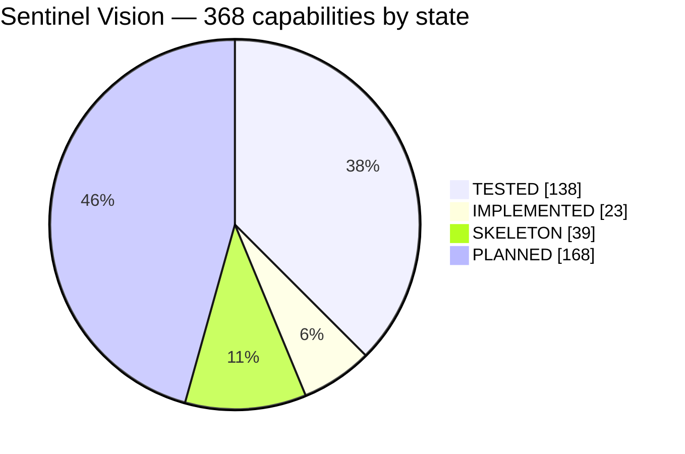
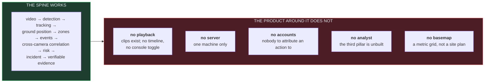
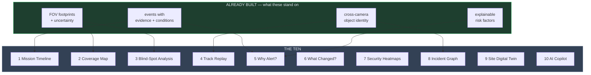

# Sentinel Vision — product definition

**The product definition.** The engineering specification says how; this says
*what*, as capabilities rather than implementation. Every line carries the state
it is actually in, because a feature list without one is a wish list, and §130 of
the specification exists precisely to stop that.

> **In one sentence.** Sentinel Vision ingests a network of cameras, understands
> what is happening in each video, tracks activity through space and time,
> correlates observations across cameras, understands geographic context, detects
> configured behavioural events, prioritises incidents, reconstructs what
> happened, presents the evidence on a live map and a synchronised video
> timeline, and lets a human operator investigate and document all of it —
> entirely locally, or across a secured LAN, with no WAN dependency.

| State | Meaning |
|---|---|
| **`TESTED`** | Works, and a test fails if it stops working |
| **`IMPL`** | Works. Not yet covered by a test that would catch a regression |
| **`SKEL`** | Types, a code path or scaffolding exist. Does not do the job yet |
| **`PLAN`** | Designed. No code |

**Nothing is `PRODUCTION-READY`.** Nothing here has been run against real
footage, trained detection weights, a physical IP camera, a GPU, or a
multi-machine LAN. Everything marked `TESTED` is tested against generated
fixtures and one real webcam, which is a real bar and not the same bar.

Related: [STATUS.md](STATUS.md) — measurements and honest gaps ·
[ROADMAP.md](ROADMAP.md) — the order to build in ·
[docs/USAGE.md](docs/USAGE.md) — how to use what exists.

---

## The scoreboard

368 capabilities, each with a state. Many lines cover several related things —
"heading · pitch · roll" is one row — so this counts *claims*, not code.

| | Count | Share | What it means |
|---|---:|---:|---|
| **`TESTED`** | 138 | 38% | A test fails if it stops working |
| **`IMPL`** | 23 | 6% | Works; a regression would go unnoticed |
| **`SKEL`** | 39 | 11% | Something is there; it does not do the job |
| **`PLAN`** | 168 | 46% | Designed, no code |

**Read that 38% carefully.** It is not "a third of the product is finished" — it
is that the part which is finished is the analytical core plus, now, the
recording that makes its evidence real, while most of what is planned is the
product surface around them. The parts a demonstration shows off are the parts
that exist; several of the parts a deployment depends on still do not.

---

## Where the product stands

The analytical core — the hard part, and the part everything else is worth
nothing without — is built and measured. What is missing is almost entirely
*product surface*: recording, a control plane, identity, an interface for things
the engine already computes.

---

## 🖥️ Desktop & platform

| Capability | State | Note |
|---|---|---|
| Cross-platform desktop application | `TESTED` | Windows. Linux and macOS are code paths CI has never run |
| Windows support | `TESTED` | Developed and packaged here |
| Linux support | `SKEL` | Container runs the engine; the console has never been shown on Linux |
| macOS support | `SKEL` | Never built or run |
| Standalone completely local operation | `TESTED` | Three enforcement points; see Network |
| LAN distributed operation | `PLAN` | |
| Headless AI worker nodes | `PLAN` | `python -m sentinel` is headless but is not a node — it exits |
| Multi-monitor command-centre layouts | `PLAN` | |
| Fullscreen security-operations mode | `PLAN` | |
| System tray operation | `PLAN` | |
| Application lock | `PLAN` | Needs accounts first |
| Local user accounts | `PLAN` | |
| Role-based access control | `PLAN` | Design is permission-based, never role-name checks |
| Administrator / operator / analyst / viewer roles | `PLAN` | |
| First-run setup wizard | `PLAN` | |
| Professional security-operations UI | `TESTED` | Native Qt widgets, no webview — asserted by test |
| Dark command-centre interface | `TESTED` | Distinct state colours, asserted distinguishable |
| Arabic / English / French interface | `PLAN` | No string extraction yet |
| RTL support | `PLAN` | |
| Crash recovery | `SKEL` | An unhandled exception is logged with its traceback; nothing restarts |
| Automatic service recovery | `SKEL` | A camera reconnects with backoff; the application does not |
| Health monitoring | `PLAN` | |
| Diagnostics centre | `SKEL` | `sentinel where` and the log are the whole of it |

## 🌐 Network & deployment

| Capability | State | Note |
|---|---|---|
| Zero-WAN operation | `TESTED` | Static source audit, runtime egress guard, offline CI job — all three tested |
| Zero cloud dependency | `TESTED` | The audit fails the build on any cloud SDK |
| Zero telemetry | `TESTED` | Including onnxruntime's own, switched off explicitly |
| LAN-only architecture | `IMPL` | The guard is on the decode path — the only outbound socket this build opens |
| Automatic LAN node discovery | `PLAN` | |
| Manual node discovery by IP | `PLAN` | |
| Secure node pairing | `PLAN` | Six-word fingerprint compared off-channel |
| Trusted-node management | `PLAN` | |
| Encrypted node communication | `PLAN` | mTLS, pinned identities |
| Node health monitoring | `PLAN` | |
| Worker assignment | `PLAN` | |
| Camera-to-worker assignment | `PLAN` | |
| Distributed AI inference | `PLAN` | |
| Distributed video processing | `PLAN` | |
| Local event synchronisation | `SKEL` | Deterministic event ids make the reconciliation an upsert — the reason they exist |
| Offline worker buffering | `PLAN` | |
| Automatic worker reconnection | `PLAN` | |
| Network-isolation verification | `TESTED` | `docker compose run --rm verify` — the whole suite, `network_mode: none` |
| LAN failure detection | `PLAN` | |
| Network diagnostics | `SKEL` | The reachability probe reports refused vs unreachable vs timed out |

## 📷 Camera management

| Capability | State | Note |
|---|---|---|
| Automatic IP camera discovery | `PLAN` | |
| ONVIF discovery | `PLAN` | |
| ONVIF camera interrogation | `PLAN` | |
| RTSP cameras | `SKEL` | The code path is complete. **No IP camera has ever been contacted** |
| Manual RTSP configuration | `IMPL` | Console dialog and CLI; the URL is validated and redacted |
| USB cameras | `TESTED` | Through each OS's own capture API — see below |
| Local video-file cameras | `TESTED` | The only source that is *evidence*: every frame, in order, reproducibly |
| Camera naming | `TESTED` | |
| Camera descriptions | `PLAN` | |
| Camera grouping | `PLAN` | |
| Camera tagging | `PLAN` | |
| Camera location assignment | `TESTED` | |
| Camera map placement | `IMPL` | A dialog, not click-on-map |
| Camera orientation · elevation · heading · pitch · roll | `TESTED` | All five stored and used in projection |
| Horizontal FOV · vertical FOV · range | `TESTED` | |
| Camera status | `IMPL` | Live / stale / fault, reported in place, never modally |
| Camera health history | `PLAN` | |
| Camera latency monitoring | `PLAN` | |
| FPS monitoring | `SKEL` | Measured in the pipeline stats, not surfaced per camera |
| Bitrate monitoring | `PLAN` | |
| Dropped-frame monitoring | `TESTED` | Counted, because a system silently discarding half its input is worse than one that says so |
| Decode-error monitoring | `IMPL` | Every failure is logged with its type |
| Reconnection monitoring | `TESTED` | Counted, with bounded backoff |
| Stream-profile selection · main/sub-stream | `PLAN` | |
| Codec detection | `PLAN` | |
| Connection testing | `TESTED` | Socket probe before the decoder — OpenCV's own 30 s timeout cannot be changed |
| Authentication testing | `PLAN` | |
| Camera credential management | `SKEL` | Redaction is `TESTED`; **nothing persists a password**, so nothing can leak one from storage |
| PTZ cameras · manual control · presets · home | `PLAN` | Permission-gated and audited by design |
| Camera enable/disable | `PLAN` | |
| Camera AI enable/disable | `PLAN` | |
| Camera recording enable/disable | `PLAN` | Needs recording |
| Camera-specific AI policies | `PLAN` | |
| Camera schedules | `PLAN` | Zone schedules exist; camera schedules do not |

### Local cameras, through the operating system

| Platform | Enumerated through | Opened through | State |
|---|---|---|---|
| Windows | `Win32_PnPEntity` — the PnP device registry | Media Foundation → DirectShow | `TESTED` |
| Linux | `/sys/class/video4linux` — the V4L2 device tree | Video4Linux2 | `IMPL` |
| macOS | `system_profiler SPCameraDataType` | AVFoundation | `IMPL` |

Listing opens nothing. An index nothing has opened is reported as *assumed*,
because there is no supported mapping from an OS device to a capture index and
two identical webcams are indistinguishable by name.

## 🎥 Live video

| Capability | State | Note |
|---|---|---|
| Live camera viewing | `TESTED` | |
| Multi-camera video wall | `TESTED` | A pane per camera, a pipeline per camera |
| 1-camera · 2×2 · 3×3 · 4×4 · custom layouts | `SKEL` | An automatic near-square grid; not selectable |
| Camera pinning · fullscreen · switching | `PLAN` | |
| Live AI bounding boxes | `TESTED` | |
| Track overlays | `TESTED` | Confirmed and coasting tracks drawn *differently* |
| Zone overlays | `TESTED` | On the plan view, drawn distinctly from evidence |
| Event overlays | `PLAN` | |
| Camera metadata overlay | `IMPL` | |
| FPS overlay · AI performance overlay | `PLAN` | |
| Stream health indicator | `IMPL` | |
| Low-latency viewing | `TESTED` | Newest-wins; a backlog is worse than a gap |
| Sub-stream fallback | `PLAN` | |

## 🤖 AI computer vision

| Capability | State | Note |
|---|---|---|
| Real-time object detection | `TESTED` | Motion detection. Emits `UNCLASSIFIED` and never claims otherwise |
| Person · vehicle · car · truck · bus · motorcycle · bicycle detection | `PLAN` | **No trained weights have ever been run** |
| Animal · bag · package · smoke · fire detection | `PLAN` | |
| Custom detection classes | `SKEL` | The ONNX path takes a class map; nothing has exercised it with real classes |
| Model switching · multiple models | `SKEL` | Two detectors are interchangeable everywhere downstream, asserted by test |
| GPU inference | `PLAN` | |
| CPU fallback | `TESTED` | The only provider used today |
| Hardware acceleration · GPU detection · VRAM monitoring | `PLAN` | |
| Inference FPS monitoring | `IMPL` | 433 fps / 2.31 ms measured on an idle machine |
| Model benchmarking | `IMPL` | `engine/tests/bench_scaling.py` |
| Model A/B testing | `PLAN` | |
| Detection confidence | `TESTED` | |
| Model version tracking | `TESTED` | Recorded on every event |
| Model integrity verification | `TESTED` | SHA-256 of the weights |
| Local model installation | `SKEL` | A path under `models/`. No import flow |
| Offline model management | `PLAN` | **Nothing is ever downloaded** — a missing model is an error that says so |

## 👁️ Tracking & scene understanding

| Capability | State | Note |
|---|---|---|
| Persistent object tracking · track IDs | `TESTED` | |
| Track trajectories | `TESTED` | Trails drawn on the plan view |
| Direction estimation | `TESTED` | Withheld when the object is not moving — jitter is not a heading |
| Velocity estimation | `TESTED` | Withheld below 1.2 s of observation |
| Zone membership | `TESTED` | Three states: inside / outside / **uncertain** |
| Temporary occlusion handling | `TESTED` | Coasting with a gap budget; held-open frames are counted |
| Track history | `TESTED` | |
| Object appearance features | `PLAN` | **The known limit**: 4 objects reported for 3 people, 7 identity switches |
| Multi-object tracking | `TESTED` | |
| Group tracking | `SKEL` | Distinct-object count is exact; grouping as a concept is not modelled |
| Track visualisation | `TESTED` | |
| Track timeline | `IMPL` | Inside an incident |
| Track history search | `PLAN` | |

## 🔗 Multi-camera intelligence

| Capability | State | Note |
|---|---|---|
| Same-object cross-camera correlation | `TESTED` | Union-find, transitive — two views of one world produce one incident, one object |
| Cross-camera track continuation | `TESTED` | |
| Camera transition prediction | `PLAN` | |
| Camera topology graph | `PLAN` | |
| Expected travel-time modelling | `PLAN` | |
| Direction-aware correlation | `PLAN` | |
| Spatial correlation | `TESTED` | Elliptical gate accounting for both positions' uncertainty |
| Appearance-based correlation | `PLAN` | The same gap as above, and the reason association is deliberately weak |
| Cross-camera confidence score | `TESTED` | With its reasons, so an operator can disagree with it |
| Group movement correlation | `SKEL` | |
| Track history across an entire site | `SKEL` | The data exists; nothing presents it |
| Site-wide movement timeline | `PLAN` | See *Mission Timeline* below |
| Multi-camera incident reconstruction | `TESTED` | Per-incident timeline across every camera that saw it |
| Consolidate duplicate observations | `TESTED` | **13 events → 1 incident. 92% less for a person to read** |
| Follow a track across the camera network | `PLAN` | See *Track Replay* below |
| Search all observations for one track | `PLAN` | |

## 🗺️ Geospatial intelligence

| Capability | State | Note |
|---|---|---|
| Real geographic map | `SKEL` | A metric grid in real coordinates. No basemap under it |
| Offline map · local map packages | `PLAN` | |
| Vector tiles · raster tiles · PMTiles · GeoJSON overlays | `PLAN` | |
| Camera locations | `TESTED` | |
| Camera FOV cones | `TESTED` | An **annular sector**, never a pie slice — a tilted camera cannot see its own mast |
| Camera coverage visualisation | `TESTED` | |
| Moving tracks on map | `TESTED` | |
| Live event positions | `TESTED` | |
| Incident locations | `TESTED` | |
| Security zones · restricted areas | `TESTED` | |
| Perimeters · assets · gates · checkpoints · buildings · sites · roads · terrain | `PLAN` | |
| Map snapshots | `PLAN` | |
| Map-based incident investigation | `SKEL` | |
| Map-based camera placement | `IMPL` | By dialog |
| Map-based zone creation | `SKEL` | Auto-placed square; the engine already takes any polygon |
| Outdoor · indoor · building / floor maps | `PLAN` | |
| **Fetches nothing** | `TESTED` | Asserted: no module in the plan view references a URL or an HTTP client |

## 📐 Spatial & camera geometry

| Capability | State | Note |
|---|---|---|
| Camera heading · pitch · roll | `TESTED` | |
| FOV visualisation · camera range | `TESTED` | |
| Ground-plane projection | `TESTED` | `d = h/tan θ`, derived and checked against hand arithmetic |
| Image-to-ground coordinate estimation | `TESTED` | Round-trips with the inverse to 1e-6 |
| Camera calibration · camera matrix · distortion · extrinsics | `PLAN` | Assumes a perfect pinhole today |
| Ground-plane configuration | `SKEL` | Flat ground assumed. Real sites have slopes |
| Position uncertainty visualisation | `TESTED` | 1σ disc, never separated from the position. Grows **super-linearly** with distance |
| Unprojectable rays are refused | `TESTED` | A ray that misses the ground returns nothing rather than a clamped guess |

## 🚧 Zones & geofencing

| Capability | State | Note |
|---|---|---|
| Draw zones directly on map | `PLAN` | The one missing piece is the editor, not the geometry |
| Polygon zones | `TESTED` | Any polygon, with a minimum-area guard |
| Rectangle · circle · line-crossing · corridor zones | `PLAN` | |
| Restricted zones · monitoring zones | `TESTED` | |
| Perimeters · no-entry · parking · loading · critical-asset zones | `PLAN` | |
| Nested zones | `PLAN` | |
| Zone schedules | `TESTED` | Wrap midnight correctly |
| Zone-specific object classes | `PLAN` | |
| Zone direction rules | `PLAN` | |
| Zone duration rules | `TESTED` | |
| Zone confidence thresholds | `PLAN` | |
| Zone cooldowns | `TESTED` | |
| Enter · exit · dwell detection | `TESTED` | Hysteresis on both edges; exit slower than entry |
| Direction violations | `PLAN` | |

## 🧠 Behavioural intelligence

| Capability | State | Note |
|---|---|---|
| Loitering detection | `TESTED` | |
| Restricted-area entry | `TESTED` | |
| After-hours entry | `TESTED` | |
| Rapid movement | `TESTED` | Silent when the position is not confident enough to support the speed |
| Repeated approach detection | `PLAN` | |
| Unusual stopping · unusual direction · wrong-way movement | `PLAN` | |
| Crowd detection · group movement | `PLAN` | |
| Dwell-time analysis | `TESTED` | |
| Repeated movement patterns | `PLAN` | |
| Suspicious sequence detection · abnormal activity | `PLAN` | |
| Camera tampering detection | `PLAN` | |
| Scene-change · lens obstruction · orientation change · unexpected darkness | `PLAN` | |
| Event sequence recognition | `PLAN` | |

## 🚨 Event intelligence

| Capability | State | Note |
|---|---|---|
| Automatic event generation | `TESTED` | |
| Event severity · confidence · timestamps · evidence | `TESTED` | Every event carries the conditions that fired it |
| Event status | `SKEL` | |
| Event deduplication | `TESTED` | Deterministic ids make replay idempotent |
| Event correlation · grouping | `TESTED` | |
| Event escalation · suppression | `PLAN` | |
| Event cooldowns | `TESTED` | |
| Event history | `TESTED` | Persisted |
| Event search · filtering | `SKEL` | The store answers; no interface asks |
| Camera-offline events · camera-tamper events | `PLAN` | |
| Detection events · zone events · behaviour events | `TESTED` | |
| Multi-camera correlation events | `TESTED` | |

**Produced today:** `ZONE_ENTRY`, `LOITERING`, `AFTER_HOURS_PRESENCE`,
`RAPID_MOVEMENT`. **Reserved and unraised:** `ZONE_EXIT`, `PERIMETER_BREACH` —
labelled, with three tests asserting the labels stay true.

## 🔴 Incident management

| Capability | State | Note |
|---|---|---|
| Automatic incident creation | `TESTED` | |
| Incident severity | `TESTED` | The worst of its events, unless risk says worse |
| Incident status | `PLAN` | |
| Incident timeline | `TESTED` | |
| Incident location · related cameras · tracks · events | `TESTED` | |
| Incident evidence | `TESTED` | |
| Incident notes | `PLAN` | Immutable, when it lands |
| AI incident summary | `PLAN` | |
| Human assessment | `PLAN` | |
| Incident acknowledgement · investigation workflow · escalation · resolution | `PLAN` | |
| False-positive classification | `PLAN` | |
| Incident archive | `PLAN` | |
| Incident search · filtering | `SKEL` | |
| Incident replay | `PLAN` | The footage now exists; the player does not |
| Incident export | `TESTED` | From memory *and* from the database, long after the fact |

## 🧮 Risk & threat prioritisation

| Capability | State | Note |
|---|---|---|
| Explainable risk scoring | `TESTED` | The score never appears without its factors |
| Low / medium / high / critical severity | `TESTED` | |
| Context-aware scoring | `TESTED` | |
| After-hours · restricted-zone · duration · multi-camera · repeated-behaviour weighting | `TESTED` | Each contributes a named factor with its points and its reason |
| Normal-behaviour reduction | `PLAN` | |
| Alert prioritisation | `TESTED` | Sorted by severity, not arrival |
| Alert deduplication · alert fatigue reduction | `TESTED` | **Measured: 92% reduction.** That reduction is the product, not a side effect |

## 🧑‍💻 AI security analyst

The third pillar — *"the AI is an analyst"* — and **entirely unbuilt**. The
design constraints are settled: structurally incapable of asserting anything not
in the evidence it was given, every claim cited to the events it reasoned from,
`OBSERVED` / `INFERRED` / `UNKNOWN` never conflated, local inference only, and it
must never touch a camera or a security action.

| Capability | State |
|---|---|
| Natural-language incident search · event search | `PLAN` |
| Local AI incident summaries | `PLAN` |
| Incident timeline generation | `PLAN` |
| Cross-camera reasoning | `PLAN` |
| Evidence retrieval · event explanation · correlated-event explanation | `PLAN` |
| Incident report generation | `PLAN` |
| Operator question answering | `PLAN` |
| *"Why was this triggered?"* · *"Which cameras saw this?"* · *"Where did this track go?"* | `PLAN` |
| *"What happened before / after the alert?"* · *"What evidence supports this?"* | `PLAN` |
| *"What information is missing?"* | `PLAN` |
| AI confidence · observed vs inferred vs unknown · evidence-linked answers | `PLAN` |
| Local LLM support · local VLM support · model selection | `PLAN` |
| Prompt versioning · AI audit trail | `PLAN` |

> Built last, deliberately. An analyst reasoning over a system that cannot record
> and has never seen a real object would generate confident prose about nothing.

## 🎞️ Recording & video investigation

Was the single largest hole in the product; the engine half is now closed.
What remains missing is the *investigation surface* — playback, scrubbing,
event-linked jumps — and the console toggle.

| Capability | State | Note |
|---|---|---|
| Continuous recording | `TESTED` | Segmented `mp4v`, wall-clock names, SHA-256 on close. **CLI only** — no console toggle yet |
| Motion · event · manual recording | `PLAN` | Continuous came first: with it, pre-event footage is already on disk |
| Pre-event recording buffer | `TESTED` | By construction — export asks for a lead window over continuous footage |
| Post-event recording buffer | `TESTED` | Same mechanism, trailing side |
| Configurable retention | `TESTED` | Age, total size and free-space bounds; dry-run by default; every deletion audited |
| Per-camera · per-event retention | `PLAN` | One policy for the store today |
| Incident evidence preservation | `TESTED` | Exporting marks its clips as evidence and audits it; a preserved segment is never deleted, however old, however full the disk. Tested through the CLI, because for a while every part worked and nothing called them |
| Segmented recordings | `TESTED` | A power cut costs at most one segment |
| Recording search | `SKEL` | The index answers by camera and window; no interface asks |
| Timeline scrubbing · video playback | `PLAN` | Clips are ordinary `.mp4`; any player opens them |
| Synchronised · multi-camera playback | `PLAN` |
| Event-linked · track-linked · map-linked playback | `PLAN` |
| Incident replay | `PLAN` |
| Evidence extraction | `TESTED` | The segments overlapping an incident are copied into its package |
| Video clip generation · still-frame extraction | `PLAN` | No re-encode or frame pull yet — whole segments only |

## 🔍 Investigation

| Capability | State | Note |
|---|---|---|
| Search by camera · time · event · incident · zone · severity | `SKEL` | The store supports these queries; nothing in the interface issues them |
| Search by object type · track · location · date range | `PLAN` | |
| Search related observations · complete track history | `PLAN` | |
| Cross-camera timeline | `SKEL` | Per incident only |
| Multi-camera synchronised playback | `PLAN` | Needs recording |
| Event-to-video jump | `PLAN` | Needs recording |
| Event-to-map jump | `PLAN` | |
| Camera-to-camera transition visualisation | `PLAN` | |

## 📦 Evidence & chain of custody

| Capability | State | Note |
|---|---|---|
| Incident evidence packages | `TESTED` | A folder verifiable by somebody who has only the folder |
| Video evidence | `TESTED` | Clips with a `--lead`/`--trail` window, plus `footage.json` stating per-camera coverage and **timing every gap**. Asserted by running the real CLI and opening the package |
| Still images · thumbnails | `PLAN` | |
| Event metadata · track data · timeline | `TESTED` | |
| AI analysis | `PLAN` | |
| Operator notes | `PLAN` | |
| Software version · model version | `TESTED` | |
| Evidence hashes · SHA-256 manifest | `TESTED` | Per file, plus one for the manifest |
| Export timestamp · export operator | `TESTED` | Recorded as `unauthenticated` today — the truth, rather than an invented name |
| Evidence verification | `TESTED` | |
| Immutable incident history | `SKEL` | The audit log is append-only with no edit method; incidents themselves are upserted |
| Name collisions are made unique, never overwritten | `TESTED` | Two clips both called `clip.mp4` lose nothing, and nothing can overwrite `incident.json` |

## 📄 Reporting

| Capability | State | Note |
|---|---|---|
| Incident JSON | `TESTED` | |
| Human-readable report | `TESTED` | `report.txt` — readable with no tooling at all |
| Complete evidence package | `TESTED` | |
| Incident PDF · CSV | `PLAN` | |
| Video clip · image · timeline · map snapshot export | `PLAN` | |
| AI-generated incident report | `PLAN` | |
| Human operator notes | `PLAN` | |
| Audit report · system health · camera health · AI performance report | `PLAN` | |
| Model benchmark report | `IMPL` | Stage breakdown and thread/process scaling curves |

## 🖥️ Command centre

| Capability | State |
|---|---|
| Live camera wall · live map · active incidents · priority alerts | `TESTED` |
| Incident timeline · active tracks · active zones | `TESTED` |
| Camera health | `IMPL` |
| Worker · GPU · storage health · network status · system status | `PLAN` |
| Site overview | `PLAN` |
| Quick incident investigation | `SKEL` |
| Alarm acknowledgement · operator activity | `PLAN` |

## 🏢 Site management · 🏭 asset protection · 🚪 checkpoints

Entirely `PLAN`. Multiple sites, site profiles and maps, perimeters, buildings,
floors, rooms, assets and asset zones, gates, checkpoints, entrance and exit
zones, camera groups, site schedules, site-wide rules, incidents, statistics and
health; asset-specific rules, approaches, dwell monitoring, incident history,
camera association and coverage visualisation; checkpoint schedules,
associations, event history, restricted-access and after-hours rules.

The zone engine and the geometry underneath are the foundation these sit on, and
both are `TESTED`.

## 🎛️ Rules & automation

| Capability | State | Note |
|---|---|---|
| Rules with object · zone · direction · time · duration · cooldown · confidence conditions | `TESTED` | In code |
| Visual rule builder | `PLAN` | Every rule is currently a Python class |
| Rule templates · enable/disable · schedules · priority · thresholds | `PLAN` | |
| Rule testing · simulation | `SKEL` | Every rule has unit tests; there is no operator-facing simulator |
| Rule history · versioning · audit log | `PLAN` | |

## 📈 Analytics

| Capability | State | Note |
|---|---|---|
| Detection counts · object counts · frames with detections | `TESTED` | Per run, bounded so a long run cannot grow without limit |
| Events per hour · incidents per hour | `PLAN` | |
| Camera activity · zone activity · peak periods | `PLAN` | |
| Camera uptime / downtime | `PLAN` | |
| AI FPS | `IMPL` | |
| GPU utilisation · VRAM usage · worker load | `PLAN` | |
| False-positive statistics · rule performance | `PLAN` | |
| Detection trends · incident trends | `PLAN` | |
| Site activity heatmaps · track density maps | `PLAN` | |
| Camera coverage statistics | `SKEL` | The ground band a pose covers is computed and shown while placing |

## 🧪 AI / model lab

| Capability | State |
|---|---|
| Model hashes · metadata · version tracking | `TESTED` |
| Model benchmark · FPS comparison · latency comparison | `IMPL` |
| Model registry · local import · licensing | `PLAN` |
| Model A/B testing · precision comparison · GPU performance testing | `PLAN` |
| Camera/model compatibility · per-camera · per-worker assignment | `PLAN` |

## 🧰 Simulation & training

| Capability | State | Note |
|---|---|---|
| Synthetic scenes · synthetic tracks | `TESTED` | `scene.py` and `world.py` — a real encoded file, generated content |
| Repeatable scenarios | `TESTED` | Fully determined by their generator, so a binary is never committed |
| Multi-camera scenarios | `TESTED` | Two rendered views of one world |
| Prerecorded cameras | `TESTED` | Any file can be replayed as if live |
| Demo mode · virtual cameras · operator training mode | `PLAN` | Fixtures exist; a demonstration mode does not |
| Camera · worker · network failure injection | `SKEL` | Camera failure is tested; the other two have nothing to fail |
| Full system demonstration without hardware | `SKEL` | Possible from the CLI; not a mode |

## 🧯 Resilience

| Capability | State | Note |
|---|---|---|
| Automatic camera reconnect | `TESTED` | Bounded backoff — one outage must not become a broadcast storm |
| Decoder restart | `TESTED` | And the thread can no longer die silently |
| Database retry | `IMPL` | WAL, transactional |
| Graceful GPU fallback · CPU fallback | `IMPL` | CPU is the only path today |
| Degraded-mode operation | `SKEL` | Unplaced cameras still track; unprojectable objects still report |
| Disk-space warnings | `PLAN` | |
| Worker restart · AI recovery · local buffering · control-node recovery · queue recovery | `PLAN` | |
| Network failure recovery · service restart · crash recovery | `PLAN` | |

## 🔐 Security

| Capability | State | Note |
|---|---|---|
| Secret redaction | `TESTED` | Structural: one private slot, one read, everything downstream redacted — **including every exception and every log line** |
| Credential isolation | `TESTED` | Nine awkward URL shapes that each caused a real leak are now tests |
| Path-traversal protection | `TESTED` | A path escaping its destination is **refused**, not sanitised |
| File validation · secure imports | `IMPL` | |
| Audit logs | `TESTED` | Append-only, with no method to edit one — and a test fails if somebody adds it |
| Local authentication · role-based permissions | `PLAN` | |
| Secure node pairing · TLS | `PLAN` | |
| OS secure credential storage | `PLAN` | **No secret is persisted at all today** |
| Request IDs · replay protection · timestamp validation · rate limiting | `PLAN` | Needs a protocol to protect |
| Permission-controlled PTZ · evidence export · configuration changes | `PLAN` | |
| Treat the LAN as hostile | `IMPL` | The rule is enforced where there is a boundary; most boundaries do not exist yet |

## 📝 Auditability

| Capability | State | Note |
|---|---|---|
| Audit log, append-only | `TESTED` | |
| Incident actions · evidence exports | `TESTED` | Who exported what, and when |
| User activity log | `PLAN` | There is nobody to attribute an action to |
| Camera configuration history · rule changes · model changes | `PLAN` | |
| Node pairing · permission · retention changes · PTZ activity | `PLAN` | |
| Immutable operator notes | `PLAN` | |
| AI generation history · model/prompt provenance | `PLAN` | |

## 💾 Storage

| Capability | State | Note |
|---|---|---|
| One data directory, per-OS, overridable | `TESTED` | `SENTINEL_DATA_DIR`. Never beside the code |
| Database storage · evidence storage · log storage | `TESTED` | |
| Model storage · map storage | `SKEL` | Directories exist; no import flow |
| Log rotation | `TESTED` | 5 MB × 5, so the log cannot become what fills the disk |
| Configurable recording disk | `TESTED` | `--record DIR`, or `SENTINEL_DATA_DIR` — video is the one thing that wants its own disk |
| Storage quotas | `TESTED` | Total-size and free-space bounds enforced by retention |
| Disk monitoring | `SKEL` | Free space is measured during a retention pass; nothing watches between passes |
| Retention cleanup | `TESTED` | On invocation (`sentinel retention --apply`), not yet on a schedule |
| Incident evidence protection | `TESTED` | Preservation beats every other rule, and a shortfall is reported rather than resolved by deleting evidence |
| Backup · restore · backup validation | `PLAN` | Migrations each carry a reversal, which is the nearest thing today |

## 🗺️ Offline GIS

Entirely `PLAN`: offline basemaps, local vector and raster maps, PMTiles,
GeoJSON, local styles and packages, package validation and versioning, region
imports, multiple packages, outdoor, indoor, building and floor plans, terrain
and elevation.

What exists is the guarantee the rest will be built on: **the plan view fetches
nothing**, asserted by test.

## 📱 Operator notifications

Entirely `PLAN`: desktop notifications, local audible alarms, LAN webhooks,
internal-network notifications, configurable priorities, cooldowns,
acknowledgement, alert history, escalation rules.

## 🧩 Extensibility

| Capability | State | Note |
|---|---|---|
| Pluggable detector | `TESTED` | Two implementations, interchangeable everywhere downstream |
| Pluggable camera sources | `TESTED` | File, RTSP and local device behind one type |
| Pluggable AI models | `SKEL` | Any ONNX graph the loader can infer a layout for |
| Pluggable tracker · classifier · segmenter · pose estimator · embeddings | `PLAN` | |
| Pluggable VLM · local LLM | `PLAN` | |
| Pluggable map sources · worker nodes | `PLAN` | |
| Versioned APIs · versioned worker protocol | `PLAN` | |
| Versioned ABI across the Rust boundary | `TESTED` | Version- and layout-checked before a single call |

---

## The ten that would make it feel like a platform

Named as first-class features rather than buried in a list. None exists; each is
listed with what it already has to stand on.

**1 · Mission Timeline** — `PLAN`. One timeline of everything happening across
the site, not one per incident. *Stands on:* events already carry a camera, a
timestamp, a zone and their triggering conditions.

**2 · Security Coverage Map** — `PLAN`. Which parts of the site are actually
covered. *Stands on:* the annular-sector footprint is already computed per camera
and drawn — the near edge, the far edge and the blind foreground are all real
numbers today.

**3 · Camera Blind-Spot Analysis** — `PLAN`. *"UNMONITORED AREA DETECTED."* The
union of the footprints subtracted from the site polygon. *Stands on:* footprints
and polygon geometry, both `TESTED`. **The cheapest of the ten, and a genuinely
useful security-planning feature.**

**4 · Track Replay** — `PLAN`. Click a track, watch it reconstructed across
`C01 → C04 → C07 → C09` on map and video together. *Stands on:* cross-camera
object identity is `TESTED`; the video half needs recording.

**5 · "Why Alert?"** — `PLAN` as a screen, `TESTED` as data. Every risk factor
already carries its points and its reason, and every event its triggering
conditions. This is presentation over facts the system already has.

**6 · "What Changed?"** — `PLAN`. Current activity against historical normal.
*Needs:* the analytics baseline, which does not exist.

**7 · Security Heatmaps** — `PLAN`. Where activity concentrates, by class and by
outcome. *Stands on:* every track already has ground positions with uncertainty.

**8 · Incident Graph** — `PLAN`. The relationships between evidence, not only
their order. *Stands on:* union-find already computes exactly this structure and
throws away everything but the grouping.

**9 · Site Digital Twin** — `PLAN`. `SITE → MAP · CAMERAS · ZONES · ASSETS ·
TRACKS · EVENTS · INCIDENTS` as one model. *Stands on:* five of those seven
exist; sites and assets do not.

**10 · Full local AI Copilot** — `PLAN`. Natural language to structured local
query, evidence retrieved, results explained. **Built last**, for the reason in
the analyst section.

---

## What this changes about the plan

Nothing in [ROADMAP.md](ROADMAP.md) is displaced; several things are confirmed.

- **Recording** (Roadmap 1.1) gates 30+ capabilities here — the whole recording
  and video-investigation section, video evidence, incident replay, track replay
  and half of investigation. It is the highest-leverage item in the product, not
  only in the engineering plan.
- **Appearance features** (1.3) gate appearance-based correlation, camera
  topology, group tracking and the honesty of every cross-camera claim.
- **The headless daemon** (1.2) gates everything under Network & deployment.
- **Accounts** (3.1) gate every "permission-controlled" line, most of
  auditability, and the operator half of incident management.
- **Offline GIS** turns out to be larger than the roadmap credited: it is not
  only a basemap, it is what sites, assets, checkpoints, indoor maps and the
  digital twin all sit on.

The five together account for the large majority of everything marked `PLAN`
above. That is a coherent order rather than a coincidence.
