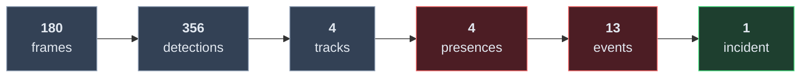
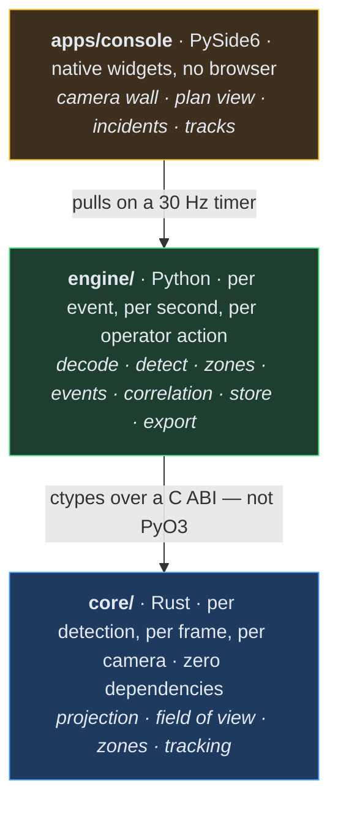

# Sentinel Vision

**Local-first AI multi-camera security & situational awareness platform.**
Repository codename: **VIGIL** — Vision Intelligence and Geospatial Incident Layer.

Sentinel Vision turns ordinary IP cameras into a local event intelligence system.
It runs entirely on your own hardware, on your own network, with the Internet
disconnected.

> The camera is a sensor. The AI is an analyst. The operator is the decision maker.

---

## What it is for

The system is built on the assumption that **nobody is watching the cameras**.
Its job is to extract signal from continuous video, attach spatial and temporal
context to it, correlate it across cameras into a small number of reviewable
incidents, and present each one with the evidence that produced it.


Everything before the red stages *reports*. Everything from `EVENT ANALYSIS`
onward makes a claim that will eventually interrupt a person, and has to justify
itself.

The measure of the system is how *few* incidents it raises, not how many
detections it makes. Three cameras seeing the same person produce **one**
incident, not three alerts.

It produces statements like:

> Three people entered Restricted Zone A after scheduled hours.

It never produces statements like "this is a criminal". Every conclusion carries
its timestamp, camera, evidence, confidence, triggering conditions, related
events and model version.

---

## Non-negotiables

These are design rules, not aspirations. Where one is currently enforced by
something other than intention, that is stated; where it is not yet, that is
stated too, because a rule everybody believes is enforced and isn't is worse than
no rule.

- **Zero WAN.** No feature requires the Internet. No cloud services, no telemetry,
  no external map tiles, no CDN assets, no auto-updater, no model downloads.
  Block all outbound traffic and the system keeps working.
  *Enforced by:* **three checks at three different times.** `python tasks.py
  audit` — the first CI job, before any toolchain runs — scans the shipped source
  for cloud SDKs, telemetry packages and hard-coded external hosts. The CI
  offline job drops all outbound traffic, *proves* the drop took effect, and then
  runs every suite. At runtime, every address a camera host resolves to must be
  loopback or RFC 1918 / 4193, or the connection is refused with the address
  named. A test asserts the plan view references no URL and no HTTP client of any
  kind, and onnxruntime's telemetry is switched off explicitly — the promise has
  to hold for every dependency, not just for this code.
  *Not yet:* a process-wide egress guard. Decode is the only path that opens an
  outbound socket today; each new one will need the same check at its own
  boundary.
- **Credentials never leak.** A camera password must not appear in logs, UI
  payloads, URLs, error reports or analytics.
  *Enforced by:* structure, not discipline. The raw URL lives in one private
  slot, is read in exactly one place — the call that opens the capture — and the
  object's `__repr__`/`__str__` render the redacted form, so interpolation, a
  `print`, a traceback and a debugger all fail safe. Every `DecodeError` is built
  from the redacted URL, because an exception is the escape route that catches
  most systems. Tests assert the password is unreachable through `repr`, `str`,
  display URL, source id and every error message — **including its length**.
  *Not yet:* keychain storage. No secret is persisted at all today.
- **No AI claim without evidence.** Every conclusion carries its timestamp,
  camera, evidence, confidence, triggering conditions and model version.
  *Enforced by:* the detector's own honesty — a motion blob is emitted as
  `UNCLASSIFIED` and the console will not label it with a class, asserted by test.
  *Not yet:* the analyst guardrail, which is designed but not rebuilt.
- **Privacy by default.** No facial recognition, no biometric identification, no
  identity database. Objects are tracked; people are not identified.
  *Enforced by:* absence. Nothing in the codebase does any of these things.
- **Graceful degradation.** Losing the GPU, the AI, the database, the map or the
  control node never stops recording. *Not yet:* recording does not exist.

---

## Current state

See **[STATUS.md](STATUS.md)** for a per-capability breakdown, honestly stated.
In short:

**The whole spine runs, end to end, on real video today.**

A file is decoded through a real H.264 decoder, run through a real detector,
tracked in the Rust core, projected onto the ground with an uncertainty that
travels with it, tested against zones and schedules, turned into events that
carry their own evidence, and correlated into incidents — then persisted,
displayed in a native Qt console, and exportable as a verifiable package.

### What happens to 180 frames



**13 events become 1 incident — 92% less for a person to read.** That reduction
is the product. Three people walked past; the tracker fragments them into four
tracks, and the incident says so rather than hiding it.

### The central claim is measured, not asserted

One person, two cameras rendered from **one world** through their real poses, two
pipelines that know nothing of each other:

| | |
|---|---|
| Distinct objects per camera | 1 and 1 |
| Position error vs world ground truth | median **0.08–0.11 m** |
| True position inside the stated 2σ disc | **100%** |
| Events raised by the two cameras | 4 |
| **Incidents an operator sees** | **1** |
| **Distinct objects in that incident** | **1** |

The renderer projects world → image; the pipeline projects image → world. They
are exact inverses, so the test is capable of failing: bad geometry anywhere in
that loop makes the cameras disagree and reports one person as two.

### The layers



The dividing line is **rate**, not importance.

### Scale

**492 tests** — 57 Rust, 395 engine, 40 console — plus two static checks that
run before any of them: an offline audit that fails the build if the shipped
source names any destination off the site, and a lint that fails it if any of the
36 diagrams in this documentation no longer parses. `cargo fmt` and
`clippy -D warnings` clean. The whole Python suite also runs inside a container
with `network_mode: none`, which is the offline claim tested the way an operator
would test it.

| Throughput, 640×480, idle machine | fps | ms/frame |
|---|---:|---:|
| Motion detector (0.75 scale) | 433 | 2.31 |
| Whole pipeline, one camera | ~190 | ~5.2 |
| Aggregate, 16 cameras | ~370 | — |

**One node handles 16 cameras** at the 15 fps a camera delivers, with headroom.
What limits that is not the GIL, not Python and not the Rust boundary — it is the
background model's per-pixel state, measured and written up in
[docs/OVERVIEW.md §15](docs/OVERVIEW.md). The Rust core is 0.4% of a frame.

### Not yet true, and stated as such

No physical camera has been contacted. No *trained* detection model has been run
— the ONNX path executes against a model built locally for the purpose, which
tests the machinery around a model and nothing about detection quality. All
footage is rendered, so none of this is an accuracy claim about the real world.
There is no authentication, no keychain storage, and no networking between
machines.

The system reports **4 distinct objects where 3 people walked past** on the
single-camera scene, inheriting the tracker's over-count. Background subtraction
finds the object that *stops moving* only 49% of the time — the loitering case,
the one a security system most needs.

Every known failure is bounded by a test so it cannot quietly get worse, and
recorded in [STATUS.md](STATUS.md). A visual walk-through of the whole system,
with the measurements behind each claim, is in
[docs/OVERVIEW.md](docs/OVERVIEW.md).

---

## Quick start

Requires **Python 3.12+** and a **Rust toolchain** (stable). Nothing else is
fetched at runtime, ever.

```bash
python -m pip install -e "engine[dev]" PySide6

python tasks.py build      # build the Rust engine core
python tasks.py audit      # no route off the site; every diagram parses
python tasks.py test       # 492 tests, no network
python tasks.py lint       # rustfmt + clippy
python tasks.py check      # all of the above — what CI runs
```

### Three ways to run it

```bash
python tasks.py console                    # the operator console
python tasks.py cli run gate.mp4 --place 33.8938,35.5018,6,180,-22
python tasks.py package                    # standalone executables in dist/
```

```bash
docker compose run --rm analyse run /media/gate.mp4 --place 33.8938,35.5018,6,180,-22
docker compose run --rm verify             # the whole suite, network_mode: none
```

`python tasks.py package` produces **three executables from one bundle**:
`SentinelVision` (the console), `SentinelVision-dev` (the same console with a
terminal and verbose logging — because a packaged Qt application on Windows has
nowhere to print, and *"it just closes"* is the least actionable bug report there
is), and `sentinel` (the headless analyser).

**Start with [docs/USAGE.md](docs/USAGE.md)** — install, first five minutes,
every command, how to read what it tells you, and what to do when it is wrong.

### See it work

```bash
python tasks.py console    # the operator console
```

Add one or more video files, place each camera, add a zone, and press Start. The
console shows the frame with its overlay, the ground beside it, and one table row
per tracked object carrying class, confidence, duration, speed, heading,
position, uncertainty and provenance.

**"Add a zone" is not yet "draw a zone."** *Add zone* places a square of the
radius you choose on the ground just beyond the near edge of what that camera can
actually see — the near end, because projection uncertainty grows
super-linearly, so a zone there is one the system can genuinely adjudicate rather
than one it will mostly report `UNCERTAIN`. Drawing an arbitrary polygon on the
plan view is `PLANNED`; the zone engine underneath already takes any polygon, so
what is missing is the editor, not the geometry.

Until a camera is placed, objects are tracked and reported as **not placed** —
there is deliberately no default position, because a nominal origin produces
coordinates indistinguishable from measured ones, and somebody gets sent to them.

The placement dialog tells you what a pose can actually see as you type it: a 6 m
mast tilted 22° with a 36° vertical field covers 7 m to 86 m and is **blind
closer than 7 m**, whatever range the camera claims.

---

## Development commands

Identical on Windows, Linux and macOS — everything routes through Python, so
there is one set of instructions and no shell-script pair to drift apart.

| Command | Does |
|---|---|
| `python tasks.py build` | Build the Rust engine core |
| `python tasks.py test` | Rust, engine and console suites |
| `python tasks.py lint` | `cargo fmt --check` and `clippy -D warnings` |
| `python tasks.py audit` | Prove the source has no route off the site, and that every diagram parses |
| `python tasks.py check` | Audit, lint, build, test — what CI runs |
| `python tasks.py console` | Run the operator console |
| `python tasks.py cli …` | Run the headless analyser; everything after `cli` is passed through |
| `python tasks.py package` | Build the standalone executables into `dist/` |
| `python tasks.py db` | Report the database's migration state |
| `python tasks.py db-migrate` | Apply pending migrations |
| `python tasks.py db-rollback` | Undo the most recent migration |

---

## Repository layout

```
core/               Rust engine core: geometry, projection, zones, tracking
  src/geometry.rs     geodesy, ground projection, field of view, polygons
  src/tracking.rs     track lifecycle, association, motion
  src/ffi.rs          the C ABI
engine/             Python engine
  sentinel/core.py       ctypes bindings to the core
  sentinel/decode.py     decode, credential redaction, live streams
  sentinel/detect.py     motion and ONNX detectors
  sentinel/zones.py      zones, schedules, presence with hysteresis
  sentinel/events.py     rules and events, each carrying its evidence
  sentinel/incidents.py  correlation, object identity, risk scoring
  sentinel/store.py      SQLite persistence, migrations, audit
  sentinel/evidence.py   verifiable evidence export
  sentinel/pipeline.py   the whole spine, per camera
  sentinel/cli.py        headless analysis: `python -m sentinel`
  sentinel/logs.py       logging, with a credential-redacting filter
  sentinel/redact.py     credential redaction — no dependencies, so the logger
                         does not have to import OpenCV to be safe
  sentinel/paths.py      one answer to "where does this keep my files"
apps/console/       PySide6 operator console — native widgets, no webview
packaging/          PyInstaller build: one analysis, three executables
tools/              guards that run before the tests
  offline_audit.py    no cloud SDK, no telemetry package, no external host
  docs_lint.py        every mermaid diagram in the documentation parses
models/             operator-imported models (never committed, never downloaded)
map-data/           operator-imported map packages (never committed)
```

Both guards in `tools/` are themselves tested — `engine/tests/test_offline_guarantee.py`
and `engine/tests/test_docs.py` feed each of them deliberately bad input and
require it to be caught, and feed each the input the repository legitimately
contains and require it to pass. A guard nobody has watched fail is a guard
nobody knows works; a guard that cries wolf is a guard somebody switches off.

### Why Rust behind a C ABI rather than PyO3

The hot path runs per detection, per frame, per camera, so it lives in Rust. It
sits behind a plain C ABI rather than Python-specific bindings for two reasons:
the core is built with the GNU toolchain while CPython on Windows is built with
MSVC, and PyO3 across that boundary is an ABI hazard; and a C ABI keeps the
engine loadable from anything, so nothing above it is welded to one runtime.

The cost is that struct layouts are maintained by hand on both sides. That is
guarded rather than trusted: the core exports its struct sizes and the Python
binding refuses to load on a mismatch, because a drifted layout does not crash —
it reads the wrong bytes and produces plausible, wrong geometry.

The Rust core has **no dependencies**. For a security appliance the dependency
list is part of the attack surface, and everything in it is arithmetic.

---

## Documentation

| Document | Covers |
|---|---|
| [docs/USAGE.md](docs/USAGE.md) | **How to use it.** Install, first run, the console screen by screen, every command-line option, Docker, cameras, logs, and a troubleshooting table |
| [ROADMAP.md](ROADMAP.md) | What is left between today and a system worth putting in front of a real site, in the order it should be built, with the reasoning |
| [docs/OVERVIEW.md](docs/OVERVIEW.md) | **Start here.** Diagrams of every layer, the spine, the boundary, threading, zones, projection, correlation, risk, persistence, export and test topology — with the measurements behind each |
| [ARCHITECTURE.md](ARCHITECTURE.md) | Components, processes, ERD, protocol, security model, data flow, AI and map architecture |
| [STATUS.md](STATUS.md) | What is actually built, per capability |
| [docs/DEVELOPMENT.md](docs/DEVELOPMENT.md) | Working on the codebase |
| [docs/SECURITY.md](docs/SECURITY.md) | Threat model and controls |
| [docs/CAMERAS.md](docs/CAMERAS.md) | Discovery, ONVIF, RTSP, and diagnosing a camera that will not add |
| [docs/PROTOCOL.md](docs/PROTOCOL.md) | Wire format between nodes |
| [docs/DATABASE.md](docs/DATABASE.md) | Schema and migration policy |
| [docs/AI.md](docs/AI.md) | Model pipeline and analyst guardrails |
| [docs/MAPS.md](docs/MAPS.md) | Offline map architecture |
| [docs/TESTING.md](docs/TESTING.md) | Testing strategy |
| [docs/DEPLOYMENT.md](docs/DEPLOYMENT.md) | Packaging and deployment |

---

## Licence

See `LICENSE`. Third-party model and map-data licences are tracked in the model
registry and map package metadata; nothing is redistributed without checking them.
