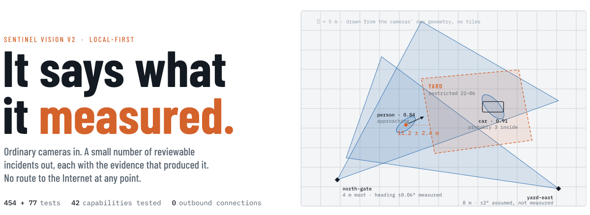
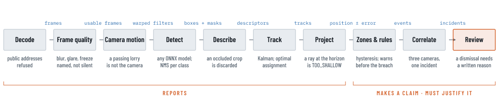
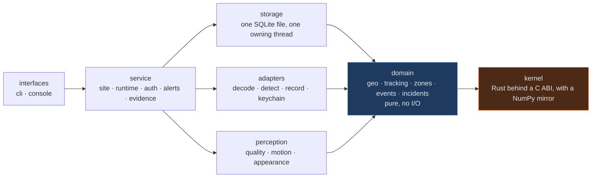

<picture>
  <source media="(prefers-color-scheme: dark)" srcset=".github/readme/hero-dark.svg">
  
</picture>

<p align="center">
  <a href="LICENSE"></a>
  
  
  
  
</p>

**Sentinel Vision** turns ordinary cameras into a small number of reviewable incidents, each carrying the evidence that produced it, on hardware you own, with the Internet disconnected. Repository codename **VIGIL** — *Vision Intelligence and Geospatial Incident Layer*.

> The camera is a sensor. The AI is an analyst. The operator is the decision maker.

<p align="center">
  <a href="#what-comes-out">What comes out</a> ·
  <a href="#how-it-works">How it works</a> ·
  <a href="#measured-on-one-laptop">Measured</a> ·
  <a href="#what-it-refuses-to-claim">What it refuses</a> ·
  <a href="#capabilities">Capabilities</a> ·
  <a href="#get-it">Get it</a> ·
  <a href="#where-it-stands">Where it stands</a> ·
  <a href="#the-repository">The repository</a>
</p>

---

## What comes out

Three cameras seeing the same person produce **one** incident, not three alerts. Every conclusion carries its camera, its frames, the rule that fired, the model that drew it and the number it rests on — in the console, on the command line, and in an exported package whose manifest verifies. This is one, in the words the console uses:

```text
HIGH   inc-7f3a · north-gate · 22:41:07

       A person entered the Yard after hours, apparently carrying something.

where      11.2 ± 2.4 m from the north gate, inside YARD (restricted 22–06)
rules      after-hours · zone entry · an approach warning 14 s earlier, at MEDIUM
carrying   inferred, never observed: 0.78 of the object's box lay within the
           person's for 21 frames — one camera cannot tell "carried" from "in front of"
model      yolov8n-seg · f828ccfa4b69 · person 0.84 · DmlExecutionProvider
evidence   clip 22:40:51–22:41:33 · sha256 9c1e…4b0f · 21 frames
risk 0.46  after hours 0.30 · restricted zone 0.25 · carried object 0.15 (inferred)
```

*An example, not a recording.* A distance is never printed without its error, a relation is never called a fact, and a dismissal needs a written reason — "dismissed" with no reason cannot be told from nobody having looked.

## How it works

<picture>
  <source media="(prefers-color-scheme: dark)" srcset=".github/readme/pipeline-dark.svg">
  
</picture>

Everything before the claim *reports*. Everything from the zones onward makes a claim that will eventually interrupt a person, and has to justify itself. Four association passes in the tracker — confirmed tracks against strong detections, then against weak ones (what recovers an object through an occlusion), then tentative tracks, then lost tracks by appearance across a gap — prevent a fragment rather than reconciling one afterwards.

One Python package in layers with a strict import direction, and a Rust core for the arithmetic that runs per pixel:



An arrow is an allowed import. `tests/test_layering.py` fails the build on any other edge, and on any module over 800 lines. `tests/test_native.py` holds the Rust and the NumPy to the same answers, which is what makes having two implementations safe.

### The rules, and what enforces each

| Rule | Enforced by |
|---|---|
| **Zero WAN.** No cloud, no telemetry, no tiles, no updater, no model downloads | `tools/offline_audit.py` fails the build on any address in shipped source; decode and the webhook refuse public addresses; CI runs the whole suite with outbound traffic dropped at the firewall |
| Secrets never persist | a schema test allows no credential-shaped column but `users.password_hash`; camera passwords live in the OS keychain under a random handle |
| The audit trail is append-only | the store has no update or delete on `audit`, asserted by AST |
| Every change to a site names who made it | every `SiteService` mutation takes a `Principal`, checked by signature scan |
| Nothing tested is unreachable | a capability manifest names the symbols and the tests; a service method no interface calls is a red test |
| A wrong number is caught, not trusted | the packaged binary is run on a real camera by the task runner, which refuses a bundle older than the source |

## Measured, on one laptop

Every figure below is from `python tasks.py bench` or a run against a real camera on 2026-09-06, on a machine at 33–40% background load. None of it is a product specification.

| Scenario | Before | Now | |
|---|---|---|---|
| One person, a detector that blinks, twenty seconds | 5 ids | **1 id** | appearance *during* association, not reconciled an hour later |
| Four people milling in a small space, eight runs — identity switches | 118 | **89** | optimal assignment 118→95; appearance and occlusion-awareness 95→89 |
| The ground raster, 230,400 cells per frame per camera | 79 ms | **0.62 ms** | NumPy to Rust; v1 sampled four frames a second because of this line |
| The detection session, CPU to the integrated GPU | 38.5 ms | **4.5 ms** | end to end 67.6→11.4 ms; the bottleneck moved to pre- and post-processing |
| Suppression, 300 proposals over 8 classes | 4.92 ms | **0.044 ms** | identical indices, ties included |
| Two people crossing head-on, twelve runs | 0 swaps | 0 swaps | **a null result, reported as one** — the filter keeps them apart, so this measures the filter, not the association |
| What real strangers score against the shipped re-identification gate | gate 0.35 | strangers **0.105** | the constant was wrong; the threshold is now measured live per scene |

That last row is the risk most likely to bite in the field, and the one measurement on real video said so. A scene whose own strangers look alike now declines to re-identify and lets a track fragment — visible on screen — rather than merging two people, which nobody can see.

## What it refuses to claim

| | |
|---|---|
| **A relation is inferred, never observed** | One camera cannot tell *inside* from *in front of*. Every relation carries the overlap, the frames and the distance it was drawn from, and the interface says "probably in the car", never "in the car" |
| **A distance never travels alone** | Two positions each known to ±1.4 m are eleven metres apart give or take about two. It is rendered as `11.2 ± 2.4 m` on the plan, in the track table, in the incident and in the exported report |
| **Nothing is a threat by default** | The shipped model names *knife* and *scissors*; a kitchen raising a critical alert every evening teaches an operator to ignore the word. A site names its own threat labels, and `vigil doctor` fails when the installed model cannot produce one |
| **A threshold is measured on this site** | Two tracks visible in one frame are different objects by construction — ground truth without labels — and the re-identification gate is set from that, per scene, live |
| **Faces and plates are off** | Built, behind one switch, off by default, audited, with no model shipped. Every threshold in them is a stated default with no measurement behind it, and each says so in its own docstring |
| **It will not name an intention** | It can say what it measured — speed, dwell, proximity, direction — and a rule can act on that. It will not say "fighting" or "loitering with intent" |

## Capabilities

The manifest in [`v2/vigil/capabilities.py`](v2/vigil/capabilities.py) names, for each capability, the symbols that implement it and the tests that exercise it. A test fails when a symbol does not exist, when a tested capability's tests never mention it, or when a service method is called by no interface. [`v2/CAPABILITIES.md`](v2/CAPABILITIES.md) is generated from it and never edited by hand.

**42 tested · 3 implemented · 0 planned**, as of 2026-09-07.

<details>
<summary>Every capability, by id</summary>

| Id | Capability | State |
|---|---|---|
| [`geo`](v2/CAPABILITIES.md) | A pinhole camera on one Earth, with the error propagated through it | TESTED |
| [`tracking`](v2/CAPABILITIES.md) | Kalman tracking with optimal association and appearance re-identification | TESTED |
| [`appearance`](v2/CAPABILITIES.md) | What a tracked thing looks like, during association rather than after it | TESTED |
| [`camera-motion`](v2/CAPABILITIES.md) | Whether the camera moved, told apart from whether the scene did | TESTED |
| [`frame-quality`](v2/CAPABILITIES.md) | A camera that is producing frames nobody could detect anything in | TESTED |
| [`mapping`](v2/CAPABILITIES.md) | The site's ground map and texture, built by the cameras that watch it | TESTED |
| [`coverage`](v2/CAPABILITIES.md) | Which ground the cameras reach, and — the useful half — which they do not | TESTED |
| [`dataset`](v2/CAPABILITIES.md) | The corpus running this product already writes, made readable | TESTED |
| [`detect-every`](v2/CAPABILITIES.md) | Detecting on a subset of frames and tracking through the rest | TESTED |
| [`suppression`](v2/CAPABILITIES.md) | Deciding which boxes to throw away, which was a third of detection | TESTED |
| [`engine-core`](v2/CAPABILITIES.md) | The arithmetic that runs per pixel, in Rust behind a C ABI | TESTED |
| [`distance`](v2/CAPABILITIES.md) | Distances that carry their own error, and never one without the other | TESTED |
| [`calibration`](v2/CAPABILITIES.md) | A pose that has been measured, and says what the measurement is worth | TESTED |
| [`triangulation`](v2/CAPABILITIES.md) | Two cameras instead of one assumed plane, and the ground solved from what they see | TESTED |
| [`cross-camera`](v2/CAPABILITIES.md) | One object followed between two cameras, with the threshold measured on this site | TESTED |
| [`detection-recall`](v2/CAPABILITIES.md) | Finding more, and being able to say what more cost | TESTED |
| [`relations`](v2/CAPABILITIES.md) | What tracked things are doing together: inside, carried, with, approaching | TESTED |
| [`detection-settings`](v2/CAPABILITIES.md) | What a site watches for and how sure it must be, kept with the site | TESTED |
| [`threats`](v2/CAPABILITIES.md) | Labels a site treats as dangerous, and what it refuses to claim | TESTED |
| [`zones`](v2/CAPABILITIES.md) | Zones with membership hysteresis and a watch list | TESTED |
| [`rules`](v2/CAPABILITIES.md) | Zone entry, loitering, after-hours and approach, each with its evidence | TESTED |
| [`incidents`](v2/CAPABILITIES.md) | Time-and-place correlation into incidents with risk | TESTED |
| [`decode`](v2/CAPABILITIES.md) | Files, local devices and RTSP behind the egress guard | TESTED |
| [`motion`](v2/CAPABILITIES.md) | Motion detection that says it does not classify | TESTED |
| [`onnx`](v2/CAPABILITIES.md) | ONNX detection and segmentation, model read once per process | TESTED |
| [`recording`](v2/CAPABILITIES.md) | Clips on disk with digests, retention with preservation | TESTED |
| [`store`](v2/CAPABILITIES.md) | SQLite with migrations that have a way back, integrity check, backup/restore | TESTED |
| [`auth`](v2/CAPABILITIES.md) | Accounts, scrypt, lockout, permission-based roles, principals | TESTED |
| [`site`](v2/CAPABILITIES.md) | Every site change through one service with a principal and an audit row | TESTED |
| [`runtime`](v2/CAPABILITIES.md) | Camera workers with bounded outboxes; poll persists, correlates, watches health | TESTED |
| [`alerts`](v2/CAPABILITIES.md) | Dark camera, stopped recording, retention shortfall, stuck thread, low disk leave the process | TESTED |
| [`review`](v2/CAPABILITIES.md) | Working the queue: acknowledge, or dismiss with a reason | TESTED |
| [`search`](v2/CAPABILITIES.md) | Finding what happened: by camera, zone, severity, time, state or text | TESTED |
| [`evidence`](v2/CAPABILITIES.md) | Incident export with clips, hashes and a verifiable manifest | TESTED |
| [`keychain`](v2/CAPABILITIES.md) | Camera passwords in the OS keychain under a random handle | TESTED |
| [`cli`](v2/CAPABILITIES.md) | One command for every service method | TESTED |
| [`console`](v2/CAPABILITIES.md) | Desktop console: every verb under the thing it acts on | TESTED |
| [`identity`](v2/CAPABILITIES.md) | Faces, plates and a subject register behind one identity switch | TESTED |
| [`evaluation`](v2/CAPABILITIES.md) | Precision and recall against corrected labels, and the split it refuses | TESTED |
| [`packaging`](v2/CAPABILITIES.md) | One bundle, camera-tested by the task runner, and an installer per platform | IMPL |
| [`observability`](v2/CAPABILITIES.md) | An unattended run is watchable: metrics in the log, JSON on demand, a crash file | TESTED |
| [`doctor`](v2/CAPABILITIES.md) | An installation check: every way a deployment fails quietly, asked out loud | TESTED |
| [`ci`](v2/CAPABILITIES.md) | Every suite on three platforms, and again with the network taken away | IMPL |
| [`public-page`](v2/CAPABILITIES.md) | The public page, rendered from this manifest so its numbers cannot drift | IMPL |
| [`supervise`](v2/CAPABILITIES.md) | Run unattended: restart on crash, a stop file, an OS service registration | TESTED |

</details>

## Get it

> [!WARNING]
> **Every installer is unsigned, and says so in its own metadata.** Signing needs a certificate this project does not have. A self-signed installer would teach an operator to click through the warning that is supposed to protect them, so there isn't one. Windows, macOS and Debian will each warn — and each warning is correct. Verify the download against its `SHA256SUMS-<platform>.txt`, install, then run `vigil doctor`.

| Platform | Files | Puts it |
|---|---|---|
| **Windows** | `vigil-<version>-windows-x64.msi` · `…-setup.exe` (NSIS) · `….zip` | Program Files, Start menu, PATH — or unpack the zip anywhere |
| **Linux** | `vigil-<version>-linux-x64.deb` · `….tar.gz` | `/opt/vigil`, `/usr/bin/vigil`, a desktop entry — `apt install ./…deb` resolves the Qt libraries |
| **macOS** | `vigil-<version>-macos-arm64.pkg` · `….dmg` · `….tar.gz` | `/usr/local/vigil`, `/usr/local/bin`, `Vigil.app` — Gatekeeper refuses a double-click on an unsigned package: right-click, *Open* |

Then `vigil doctor` — it checks the data directory, the database, the site clock, the model, the engine core, the execution provider, the keychain, free disk, accounts, cameras, zones and where alerts go, says what to do about each, and exits non-zero on any failure so it can be the last line of an install script. Or build it yourself:

```bash
git clone https://github.com/haidar-farhat/V.I.G.I.L._Vision_Intelligence_and_Geospatial_ncident_Layer
cd V.I.G.I.L._Vision_Intelligence_and_Geospatial_ncident_Layer/v2
pip install -e ".[dev]"
python tasks.py check        # the Rust core, the offline audit, every suite
python -m vigil console      # the operator window
python tasks.py package      # dist/vigil — then exetest runs it on a real camera
python tasks.py installer    # dist/installers, for this platform, unsigned
```

The workflow in [`.github/workflows/v2.yml`](.github/workflows/v2.yml) builds each installer on its own platform's runner, installs it there, and asks the installed product to run `doctor` and find its engine core. The Windows MSI has been built and checked on a developer machine; the Linux and macOS packages exist as code and tests until that workflow has run, and the documents say so rather than implying otherwise.

## Where it stands

> [!IMPORTANT]
> **The software is measured. The site it will run at is not.** These are the things that stop this being deployable, in the order they pay off, and none of them is a code problem. The full account, written to be argued with, is [`v2/PRODUCTION_READINESS.md`](v2/PRODUCTION_READINESS.md).

1. **There is no labelled dataset.** The model is an ONNX file the operator supplies; the shipped one is stock COCO weights that have never seen the site. `vigil dataset export` writes the corpus and `vigil eval` scores it — and refuses a validation set that shares a day with training, because consecutive frames leak. What is missing is the labels, and that needs a person.
2. **It has never run on a physical IP camera.** Every run so far is a laptop webcam; the longest is ten minutes. RTSP reconnection, packet loss and H.264 corruption are handled in code and exercised by nothing real. The gate that asked for an hour on a real camera was waived, and [`v2/DECISIONS.md`](v2/DECISIONS.md) records by whom and what is therefore unproven.
3. **The appearance thresholds are provisional.** Measured live per scene now, but the only real footage measured is one indoor clip. `tools/calibrate.py` reads the constants off unlabelled video and should run on a night from each camera first.
4. **Throughput is measured on one integrated GPU.** Nobody has run this on a deployment machine, and the multi-camera claim rests on that number.

## The repository

```text
v2/                  the product — Python package `vigil`, Rust core, tests, installers, site
  vigil/               domain · perception · adapters · storage · service · interfaces
  core/                Rust: camera, geodesy, lens, assign, track, ortho, triangulate, ffi
  tests/               454 Python tests; `tasks.py check` runs them with the core and the offline audit
  packaging/           PyInstaller entry points, and the MSI / NSIS / deb / pkg builders
  site/                the public page, rendered from the capability manifest
  tasks.py             core · test · check · package · exetest · installer · site · capabilities
engine/  apps/  core/  v1 — kept as reference, not developed; its README is docs/README-v1.md
docs/                  v1 documents: overview, cameras, security, protocol, database, maps, …
.github/               workflows (v2 CI, installers, Pages) and this page's figures, drawn as outlines
```

| Read | For |
|---|---|
| [`v2/README.md`](v2/README.md) | Running it, every command, what each option refuses, and the log of camera runs on this machine — passes and failures both |
| [`v2/ARCHITECTURE.md`](v2/ARCHITECTURE.md) | The layers, the threads, identity and permission, the invariants and what enforces each |
| [`v2/DECISIONS.md`](v2/DECISIONS.md) | One entry per decision that shapes v2 — including the ones reversed, with a trace |
| [`v2/ROADMAP.md`](v2/ROADMAP.md) | What comes next, what each step needs, and what it will refuse to claim |
| [`v2/CAPABILITIES.md`](v2/CAPABILITIES.md) | Generated: every capability, its symbols, its tests, its note |
| [`v2/PRODUCTION_READINESS.md`](v2/PRODUCTION_READINESS.md) | What the audit found, what was built, what it measures, and what still stops it being deployable |
| [`v2/REVIEW_OF_V1.md`](v2/REVIEW_OF_V1.md) | Why the rewrite exists and what v1 taught |
| [`docs/README-v1.md`](docs/README-v1.md) | The previous front page, for the v1 tree |

## Licence

[MIT](LICENSE). The detection model, and any face, plate or re-identification model an operator adds, is theirs to supply and theirs to license; nothing is downloaded and nothing is redistributed.

<p align="center"><sub>Sentinel Vision · Romisys · it says what it measured, and how sure it is.</sub></p>
