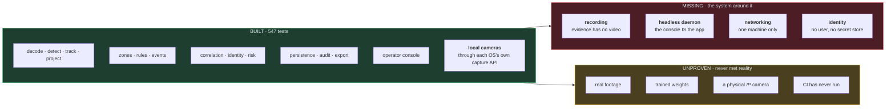
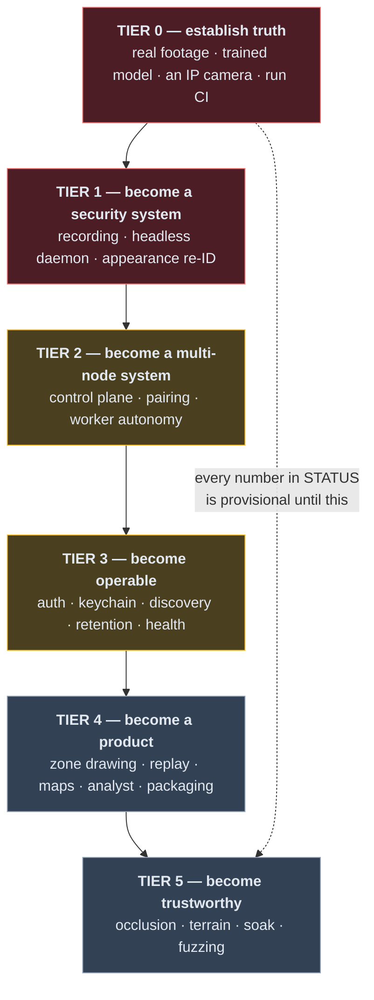

# Roadmap

[STATUS.md](STATUS.md) records what is true today. This file records what I think
is still between that and a system I would be willing to put in front of a real
site, in the order I would build it and with the reason each item comes when it
does.

It is an opinion, not a specification. Where it disagrees with
[ARCHITECTURE.md](ARCHITECTURE.md) the architecture document is the design and
this is the sequencing.

[FEATURES.md](FEATURES.md) is the product definition — every capability the
system is meant to have, with its state. Nothing below is displaced by it, and
five items here turn out to gate the large majority of everything still marked
`PLAN` there: **recording** (1.1), **appearance features** (1.3), **the headless
daemon** (1.2), **accounts** (3.1) and **offline GIS** (4.3).

---

## 1. Where the line actually falls

The spine is built and the perimeter is not. Everything that turns pixels into a
justified conclusion works and is tested; everything that makes it a *system* —
running unattended, on more than one machine, with video to show for it — is
absent.

**The one-sentence version:** this is a very well-tested analysis library with a
demo application on top of it, and the gap to a product is recording, a headless
runtime, and having pointed it at something real. It has now been pointed at one
real thing — a camera attached to the machine — and that immediately produced
two surprises local reasoning had not, which is the argument for the rest of
Tier 0.

---

## 2. What I consider genuinely done

Listed only where I would defend the claim, not merely where code exists.

| Area | Why I count it done |
|---|---|
| Ground projection with uncertainty | The mathematics is derived, tested against hand arithmetic, round-trips with the inverse to 1e-6, and refuses rather than guessing when the ray misses the ground. Uncertainty is part of the position, never separated from it. |
| Field of view as an annular sector | A downward-tilted camera cannot see its own mast, and the footprint says so. The buffer is sized for what the core produces and a truncated ring is refused. |
| Three-state semantics, everywhere | Motion is unknown / stationary / moving. Zone membership is inside / outside / uncertain. Position is projected / fallback. Nothing collapses an unknown into a zero. |
| Tracking | Elliptical gating on per-axis extents, coasting with a gap budget, motion withheld until it spans 1.2 s. Its failures — 4 objects for 3 people, 7 identity switches — are measured and bounded by tests. |
| Event → incident correlation | Union-find object identity, transitive across cameras, deterministic ids so replay is idempotent. 13 events become 1 incident on the reference scene. |
| Persistence and evidence | WAL SQLite, forward migrations each with a reversal, append-only audit, and an export folder verifiable by somebody who has only the folder. |
| The C ABI boundary | Version-checked and layout-checked before a single call, with round-trip tests that catch a same-width field swap the size guard cannot. |
| Credential handling | Structural, not procedural: one private slot, one read, everything downstream given the redacted form — including every exception. Nine awkward URLs that each caused a real leak are now tests. |
| Zero WAN | Three enforcement points at three different times, all three tested, and the static one tested against deliberately bad source. |
| Local camera capture | Each platform's own device interface and capture API, with no third-party dependency. Enumeration opens nothing; an index nothing has opened is reported as *assumed*, because there is no supported mapping from an OS device to a capture index. Run end to end against a real webcam. |

---

## 3. The list

Ordered by what I would actually do next, not by size.

### Tier 0 — establish truth

Nothing below this tier means what it appears to mean until this tier is done.
Every accuracy number in STATUS.md is currently a statement about generated
geometry.

- [ ] **0.1 · Run the pipeline over real footage.** One hour of genuine CCTV,
      operator-supplied, kept out of version control. Re-measure recall, mean
      IoU, fragments per frame, identity switches and object count against it,
      and record both numbers side by side rather than replacing the synthetic
      ones. *Done when:* STATUS.md's detection and tracking tables have a
      "real footage" column, however bad it reads.
- [ ] **0.2 · Run a trained ONNX detector.** A person/vehicle model the operator
      exports themselves — nothing downloaded. This exercises class handling,
      confidence calibration and NMS against a model that actually classifies,
      all of which are currently tested against a brightness fixture.
      *Done when:* `class_label` in a stored event names something a model
      believed, not `UNCLASSIFIED`.
- [x] **0.3a · Contact a camera attached to the machine.** Done. `device:N`,
      through each platform's own capture API. The first real hardware this
      system has touched, and it immediately produced two surprises local
      reasoning had not: Media Foundation refuses the development machine's
      integrated camera and DirectShow opens it, and a Windows Hello infrared
      sensor lists as a camera and opens on nothing.
- [ ] **0.3b · Contact one physical IP camera.** RTSP is still a code path, not
      a capability. Expect to find: timestamps that jump, streams that reconnect
      with a different resolution, ONVIF that lies about profiles, and at least
      one credential-handling assumption that is wrong.
      *Done when:* a real IP camera runs for an hour without a reconnect storm.
- [ ] **0.4 · Push once and let CI run.** The workflow targets three platforms
      and Python 3.12; development is on Windows and 3.14. It has never executed.
      *Done when:* the offline job is green on Linux.

### Tier 1 — become a security system

- [x] **1.1 · Continuous recording.** **Done at the engine level, 2026-09-02.**
      Segmented `mp4v` per camera on its own writer thread; pre-event footage by
      construction (continuous + a lead window at export, which made a ring
      buffer unnecessary); retention by age, size and free space, audited, with
      preserved evidence untouchable; an exported incident folder contains its
      clips, the manifest hashes them, and `footage.json` times every gap.
      *Still open from this item:* the console toggle (recording is CLI-only),
      scheduled retention, and true decode/analytic independence — the last is
      1.2's job, and the recorder is already shaped for it (fed before analysis,
      behind a bounded queue).
- [~] **1.2 · A headless engine daemon.** **The engine half is done,
      2026-09-03.** `sentinel node` runs cameras unattended, correlates across
      all of them on a cadence, records, persists and audits, with **no Qt
      import anywhere in the process** — asserted by two tests that import the
      node, and then every engine module, in a subprocess and fail if `PySide`
      appears in `sys.modules`.
      **And the console is now a client of it, same day.** `ConsoleWindow` owns
      no store, no zones, no rule set, no correlation loop and no analysis
      thread; it owns widgets and calls `node.poll()` on a 33 ms repaint. As
      predicted it was a deletion: 623 lines removed against 307 added, and
      `worker.py` — the whole 240-line `QThread` adaptor — is gone.

      *Still open from this item:* true decode/analytic independence. Recording
      survives a slow analytic but not a dead decode, because both still share
      one loop. That needs the decode thread to fan out to a recorder queue and
      an analytic queue separately, and it is the last piece.
- [ ] **1.3 · Appearance-based association.** The tracker reports 4 objects for
      3 people and switches identity 7 times in 388 observations, because
      position and box geometry are all it has. A small appearance descriptor —
      even a colour histogram over the box, before reaching for a re-ID model —
      would fix both, and would make cross-camera association something better
      than "same place, near enough in time".
      *Done when:* object count matches ground truth on the reference scene and
      identity switches drop, both measured.
- [ ] **1.4 · A detector that sees a stationary object.** Background subtraction
      loses the loiterer — 0.49 recall against 0.74 and 0.65 — which is the case
      a security system most needs. Tier 0.2 is the real answer; the interim is a
      hybrid that runs a full-frame detector on a slow cadence and uses motion
      only for proposals between passes.
      *Done when:* the loiterer's recall is the best of the three, not the worst.

### Tier 2 — become a multi-node system

The architecture's whole premise is cameras on several machines correlated
centrally. None of it exists; `services/` is an empty directory left by the
TypeScript prototype.

- [ ] **2.1 · Control plane.** REST for state, WebSocket for the live stream of
      events and track updates, over mTLS, bound to the LAN only. The egress
      guard must be hoisted out of `decode.py` into something every outbound path
      routes through before this lands, or the zero-WAN guarantee quietly becomes
      decode-only in fact as well as in the documentation.
- [ ] **2.2 · Node discovery and human-approved pairing.** mDNS announce, a
      six-word fingerprint the operator compares off-channel, and a pinned node
      identity afterwards. *Treat the LAN as hostile* is the rule; possession of
      a LAN address must grant nothing.
- [ ] **2.3 · Worker autonomy and reconciliation.** A worker keeps decoding,
      detecting, recording and raising events when the control node is gone, and
      reconciles on reconnect. Deterministic event ids already make the
      reconciliation an upsert rather than a merge — that was the point of them.
- [ ] **2.4 · Replay protection and rate limits** on every accepted message,
      bounded so an attacker cannot drive the replay window into exhaustion.

### Tier 3 — become operable

- [ ] **3.1 · Authentication and authorization.** Permission-based, never role
      name checks. The audit half is built and currently attributes every action
      to the literal string `"console"` — there is nobody to name.
- [ ] **3.2 · Secret storage in the OS keychain.** No secret is persisted at all
      today, which is only safe because no camera can be saved with credentials.
      The moment 3.3 lands, this is required, not optional. The `credentials_ref`
      column already exists and holds nothing.
- [ ] **3.3 · Camera discovery (ONVIF / mDNS).** An operator should not be typing
      RTSP URLs. Discovery is also where a hostile camera first touches the
      system, so the parser needs to be treated as such. Local devices are
      already discovered this way — through the operating system rather than the
      network — and `sentinel.devices` is the shape the network version should
      follow: enumerate without connecting, confirm by opening, and never claim
      an identity that has not been established.
- [ ] **3.4 · Retention, disk budget and health.** A node that fills its disk
      stops being a security system. Needs a disk watermark, an eviction policy
      that is audited, per-camera health (frames, drops, reconnects, last-seen)
      and an alert when a camera has been dark long enough to matter — the
      absence of events is itself a signal, and nothing currently reports it.
- [ ] **3.5 · Packaging.** There is no way for an operator to install this. A
      signed installer per platform, with the core shipped as a built library so
      no Rust toolchain is required.

### Tier 4 — become a product

- [ ] **4.1 · Draw a zone on the plan view.** *Add zone* currently places a
      square at a computed radius and the README says so. The zone engine already
      takes any polygon; what is missing is the editor — click to place vertices,
      drag to adjust, snap to a footprint edge, with the live count of how much
      of the polygon each camera can actually adjudicate.
- [ ] **4.2 · Incident replay.** Scrub an incident's timeline with its video and
      its events on the same axis, across every camera that saw it. This is the
      screen an operator actually lives in, and it depends on 1.1.
- [ ] **4.3 · Map package import.** Sandboxed to its directory, offline, with the
      georeferencing checked rather than trusted. A site plan under the metric
      grid is worth more than the grid alone.
- [ ] **4.4 · The grounded AI analyst.** The third pillar — *"the AI is an
      analyst"* — is entirely unbuilt. When it lands it must be structurally
      incapable of asserting anything not present in the evidence it was given,
      it must cite the events it reasoned from, and it must never touch a camera
      or a security action. Local inference only. I would build this **last**,
      because an analyst reasoning over a system that cannot record and has never
      seen a real object would be generating confident prose about nothing.

### Tier 5 — become trustworthy

- [ ] **5.1 · Occlusion and visibility.** Coverage today is a geometric upper
      bound: it models what a camera can *reach*, not what it can *see*. Nothing
      occludes anything. A building on the plan should subtract from the
      footprint, and a zone behind it should report `UNCERTAIN`, not covered.
- [ ] **5.2 · Non-flat ground and lens distortion.** Projection assumes a plane
      and a perfect pinhole. Real sites have slopes and real lenses have
      distortion, and both bias position in ways the current uncertainty model
      does not account for — it is honest about its inputs, and its inputs are
      ideal.
- [ ] **5.3 · A 72-hour soak.** Memory, file handles, thread count, database
      size, disk. The statistics are now bounded; nothing else has been watched
      over a long run.
- [ ] **5.4 · Fuzz the hostile paths.** A malformed stream, a malicious map
      package, an ONVIF response designed to break a parser. *Hostile camera* is
      in the threat model and nothing has been fuzzed.

---

## 4. Things I would change about what exists

Not gaps — decisions I think are wrong, or right-for-now and about to stop being.

| What | Why it bothers me | What I would do |
|---|---|---|
| `apps/console/sentinel_console/app.py`, 963 lines | It owns the store, the rule set, the session lifecycle, the correlation loop and the layout. A `QMainWindow` should not be the orchestrator. | Extract a `Node` object that owns cameras, rules, correlation and persistence with no Qt import. This *is* item 1.2 — the refactor and the daemon are the same work. |
| The egress guard lives inside `VideoSource` | It is correct and it is decode-only. The documentation now says so plainly, but the first non-decode outbound path will silently escape it. | Hoist it before Tier 2, not during. |
| `ZONE_EXIT` and `PERIMETER_BREACH` declared but unraised | Labelled and test-pinned, so it is honest — but two of six event types being reserved is a smell. | Either write the line-crossing predicate `PERIMETER_BREACH` needs, or drop it from the design. |
| Risk scoring weights are constants in source | They are explainable and reproducible, which is the important half. But every site is different, and a weight nobody can change is a weight somebody works around. | Make them a stored, audited, per-site configuration once there is a site to configure. |
| `models/` and `map-data/` are empty directories with READMEs | Correct — nothing may be committed or downloaded. But there is no *import* path either, so an operator has nowhere to put a file from inside the application. | Sandboxed import with digest recording, alongside 0.2 and 4.3. |
| The reference scene is the only scene | It is a good one and it is one. Every measurement is a measurement of it. | A second scene with different geometry, before trusting any tuning decision made against the first. |

---

## 5. If I could only do three things

1. **Recording (1.1).** A security system that does not record is not one. It is
   also the dependency under the screen an operator would actually use.
2. **Real footage and a trained model (0.1, 0.2).** Not because the numbers will
   look good — they will look worse — but because every claim in STATUS.md is
   provisional until then, and the project's own rule is that a capability is not
   complete because it demonstrates.
3. **The headless daemon (1.2).** Everything multi-node is blocked behind it, and
   it is a refactor of code that already exists rather than new territory.

Everything else is real work and none of it changes what this is until those are
done.

---

## Map, zones and control — the build order

The operator's verdict on the console was that detection is acceptable and the
map, the zones and the controls around them are not. This is the order in which
that gets fixed. Each slice ships on its own and is photographed before it is
called done; earlier slices carry the most operator value for the least
dependency, and several reuse what the engine already has (blind-spot analysis,
recording, correlation, the audit log). Produced by a four-lens design pass and
a synthesis against FEATURES.md; the rows each slice moves to `TESTED` are named.

### 1. Zone adjudicability: what the cameras can rule on, shown before a zone is armed — M

`coverage.zone_report()` and per-pose cached 1σ bands; bands shaded inside every footprint with a legend; a live 'covered · confident · area' readout in the draw/reshape band; a Covered column and warning glyph in the Zones list; a 'What the cameras can rule on' group and the schedule-clock label in the properties panel; the interim fix that evaluates schedules in the machine's clock instead of UTC. Not in this slice: presets, snapping, the site record, any migration.

*Why here:* The prescribed first slice (polygon drawing, vertex editing, properties panel) is already TESTED in the working tree. Roadmap 4.1 names the live adjudicability count as the remaining half, it reuses `coverage`, `field_of_view` and `project_to_ground`, needs no migration, and fixes the most dangerous honesty gap: a zone that will never fire looking exactly like one that will.

*Rows:* Zone validation against what the cameras can actually adjudicate · Iso-uncertainty bands on every footprint · Zone properties panel · Reshape a zone on the map

### 2. One selection, honest modes, and a map you can read by hovering — M

The `Selection` bus across map, panes, track table and incidents with one highlight colour and Esc clearing; checkable mutually exclusive map modes with the band; Monitor/Configure with the idle timeout, audited; hover inspection and provenance glyphs completing the legend; the cursor ground readout in the status bar. Not in this slice: dragging cameras, undo, shortcuts beyond Esc.

*Why here:* Every later control feature hangs on knowing what is selected and what the next click does; this is the cheapest fix to 'control is so bad' and needs no engine change.

*Depends on:* Zone adjudicability: what the cameras can rule on, shown before a zone is armed

*Rows:* Selection bus: one selected thing across map, video wall, track table and incidents · Map modes with a visible mode band; Escape always returns to Select · Monitor and Configure modes with a layout lock · Uncertainty legend, provenance glyphs and hover readout · Cursor ground readout and copy-to-clipboard

### 3. Cameras you can see and move — M

The camera list panel with the per-camera status strip via `Node.camera_health()`, replacing the combo box; drag a placed camera with live footprint, heading handle and Shift-click aim, committing once on release; 'Place here…' pre-filling position only; dark cameras hatched on the map and excluded from coverage; the recording checkbox and indicator; the far-edge solid/dashed distinction. Not in this slice: undo, pose versions.

*Why here:* Placing eight cameras through a dialog and a blind click is the friction the user means; the health strip, recording toggle and dark-footprint rule are checkboxes and drawing in front of finished engine work.

*Depends on:* One selection, honest modes, and a map you can read by hovering

*Rows:* Camera list panel with per-camera status strip · Drag a placed camera on the map, with a live footprint and heading handle · Camera map placement · Footprint and coverage reflect camera health · Camera recording enable/disable · Footprint far edge: range clamp or horizon, drawn differently

### 4. The site record: one frame, a boundary, the blind spots on the map — M

Migration v4 `sites` with `site_id` defaults; one `SiteFrame` replacing `MapView._to_local` and `coverage._Frame`; 'Set site boundary…' drawn or promoted; coverage gaps hatched on the plan view with the CLI's caveat; a minimal layer toggle set (footprints, bands, discs, trails, zone kinds, gaps) in `QSettings`; the declared IANA site time zone completing the schedule fix. Not in this slice: any import, layer provenance.

*Why here:* Blind-spot analysis is one of 'the ten' and finished at the engine yet invisible in the product; the site record is what basemaps, plans, exports and indoor levels all stand on, and it stops the map re-anchoring when the first camera is removed.

*Depends on:* Zone adjudicability: what the cameras can rule on, shown before a zone is armed

*Rows:* Site record with boundary, origin, frame kind and time zone · Real geographic map · Coverage gaps drawn on the plan view · covered % per zone · Site time zone, declared and used by schedules

### 5. Versions: zones and poses that history can point at — L

Migration v5 `zone_versions` and `pose_versions`; `Event`/`Incident` referencing versions; `canonical.py`; structured before/after audit JSON with the Audit tab; the immutability list enforced by a store grep test; `save_incident` narrowed. Not in this slice: undo, export.

*Why here:* The reshape that already ships overwrites geometry past events were measured against; nothing built on top of editing (undo, incident focus, export, replay) is honest until the version tables exist.

*Depends on:* The site record: one frame, a boundary, the blind spots on the map

*Rows:* Versioned zone geometry — an edit creates a new version, never overwrites the ring · Camera configuration history · rule changes · model changes · Events and incidents reference the exact zone and camera-pose versions that produced them · Structured before/after audit records for every map, zone and camera edit · Canonical JSON serialisation for everything that is hashed · Immutable incident history

### 6. The plan under the grid — L

Site-plan image import with world file / GeoTIFF tags via `tifffile` or control points with residuals and the 'add a fourth' rule; north from the georeference; the measure tool with scale checks recorded; the full layer panel with provenance rows; plan fingerprinting. Not in this slice: tiles, GeoJSON.

*Why here:* A metric grid tells the operator nothing about where the loading bay is; a plan under the footprints is the single largest readability gain, and it can be done with OpenCV and numpy already in the bundle.

*Depends on:* The site record: one frame, a boundary, the blind spots on the map

*Rows:* Site-plan image import with world file or control points · Measure tool and scale verification · Layer panel with provenance for every layer · Basemap and plan-image fingerprinting on every render

### 7. Undo, keys and labels — M

`QUndoStack` with compensating audited node calls and `undo_of`; the confirmation policy and toast; every action a `QAction` with the shortcut sheet and the digits-to-cameras rule; label collision pass; the weakening confirmation in the properties panel. Not in this slice: incidents.

*Why here:* Under pressure people mis-click; undo lets them act fast and take it back without rewriting history, which the version tables now make possible.

*Depends on:* Versions: zones and poses that history can point at; One selection, honest modes, and a map you can read by hovering

*Rows:* Undo and redo as compensating, audited edits — never a deletion from history · Keyboard shortcuts and a shortcut sheet · Map labels that never collide · Weakening a zone asks for confirmation and records it

### 8. Working incidents — M

Migration v6 `incident_actions` ledger with derived status, dismissal vocabulary, `claimed_by`; A/D/E keys; pulsing unacknowledged HIGH/CRITICAL zones; incident focus on the map with the zone version in force; event markers with decay and correlated-event links; zone health columns. Not in this slice: video replay.

*Why here:* An incident list that only grows cannot be worked and re-creates the alert fatigue the 92 % reduction exists to prevent; every input is already persisted and TESTED.

*Depends on:* One selection, honest modes, and a map you can read by hovering; Versions: zones and poses that history can point at

*Rows:* Incident acknowledgement · investigation workflow · escalation · resolution · Incident status · False-positive classification · Map-based incident investigation · Event markers with decay · correlated-event links for the selected incident · Zone health in the list: last fired, events in 24 h, open presences, silent zones

### 9. Zone shapes, dry-runs and disarming — M

Rectangle and circle presets retiring the square and spinbox; snapping; the labelled footprint copy; the dry-run against the ring buffer; zones drawn by arming state; timed disarm with reason and auto re-arm; the overlap report wording. Not in this slice: tripwires.

*Why here:* Finishes the zone editor the user was promised, and tests a zone against recent movement before it goes live — the question every operator asks after drawing one.

*Depends on:* Zone adjudicability: what the cameras can rule on, shown before a zone is armed; Undo, keys and labels

*Rows:* Rectangle · circle · line-crossing · corridor zones · Dry-run a zone against recent tracks before arming it · Zones drawn by their arming state · Disarm a zone temporarily, with a reason and an automatic re-arm · Nested zones

### 10. The site travels: export, import and evidence context — L

`sentinel site export／import` and the console flow with manifest, redaction scan, diff preview and Review mode; `site_context/` in the evidence package; the labelled console-rendered map snapshot; hash-chained audit with `verify` and the chain head in exports; clock provenance; the audit excerpt and site diff reports. Not in this slice: signing.

*Why here:* A site laid out over a shift must survive a reinstall and move to the next machine, and an evidence folder must carry the polygon and pose it was judged against; both need the version tables first.

*Depends on:* Versions: zones and poses that history can point at; The plan under the grid

*Rows:* Site configuration export and import · Evidence package carries site_context/: zone versions, poses, map fingerprint and calibration as they were · Map snapshots · Hash-chained audit log with `sentinel audit verify` · Clock provenance on every audited action and geometry version · Audit report · system health · camera health · AI performance report

### 11. Time on the map — M

The console ring buffer with pause, scrub and Live drawing the zone and pose versions in force; the freshness stamp; follow the selected track; the map as a floating dock for a second monitor. Not in this slice: recorded video.

*Why here:* When something happened fifteen seconds ago the operator needs to see where it came from; the version tables make the rewound map honest, and no store change is needed.

*Depends on:* Versions: zones and poses that history can point at; One selection, honest modes, and a map you can read by hovering

*Rows:* Pause, rewind and scrub the live plan view — analysis, not footage · Map freshness stamp · Follow the selected track · Multi-monitor command-centre layouts

### 12. Basemaps and GeoJSON, offline by proof — L

MBTiles via sqlite3 and PMTiles via the file source only, validated as docs/MAPS.md specifies, vector tiles listed but labelled not rendered; GeoJSON overlays with CRS handling and promote-to-zone; pyproj imported with the network disabled and asserted; `offline_audit.py` and the fetch-nothing test extended. Not in this slice: vector rendering.

*Why here:* Outdoor sites expect a satellite or street raster under the plan; the package format is already documented and the fetch-nothing guarantee must be proven over the new reader before it ships.

*Depends on:* The plan under the grid

*Rows:* Offline raster basemap from MBTiles or PMTiles · GeoJSON overlay import and promote-to-zone · Offline guarantee extended to GIS: no GDAL, PROJ network off, audit covers the tile reader

### 13. The picture as the truth — L

Zone rings projected into every pane and drawn on the video with σ bands; pose fit from picture-to-map pairs via `solvePnP` writing an ordinary `CameraPose`, stored as a versioned calibration artifact with residuals and frame hash; intrinsics file import; the walk test; coordinate entry in DMS/UTM/metres. Not in this slice: homography projection.

*Why here:* Nobody knows a camera's pitch to the degree but the picture does, and the operator knows where the bay is in the frame, not on a grid; all of it uses the two FFI calls that exist.

*Depends on:* One selection, honest modes, and a map you can read by hovering; Versions: zones and poses that history can point at

*Rows:* Zone outlines in the camera image, and zones drawn on the video · Camera calibration · camera matrix · distortion · extrinsics · Walk test: projected position against a marked truth · Camera position entry in decimal degrees, DMS, UTM or site metres

### 14. Tripwires and direction — L

LINE geometry, direction, the σ-aware crossing predicate with hysteresis, `PERIMETER_BREACH` raised, corridors as buffered polylines, the arrow on the map. Not in this slice: the ABI move to Rust unless profiling demands it.

*Why here:* A perimeter is a line and 'crossed inbound' is the question; the reserved event type has been declared-but-unraised long enough, and the semantics are new enough to deserve their own slice.

*Depends on:* Versions: zones and poses that history can point at; Zone shapes, dry-runs and disarming

*Rows:* Tripwire (line-crossing) and directional zones · corridors

### 15. Levels, elevation and shadows — L

LOCAL-frame sites with floor plans as levels, the NOT GEOGRAPHIC badge and metres-only display; per-camera ground elevation and the second-pass zone elevation; obstruction polygons casting shadows in footprints and coverage. Not in this slice: slopes, cross-floor correlation.

*Why here:* Indoor sites are most sites and every real site has a wall; both are honesty fixes to coverage the operator already trusts too much.

*Depends on:* The plan under the grid; Basemaps and GeoJSON, offline by proof

*Rows:* Outdoor · indoor · building / floor maps · Ground-plane configuration · Obstruction polygons cast shadows in the footprint

### 16. Samples, heatmaps, replay and the ellipse — XL

`track_samples` at 1 Hz with preservation inside incident windows; the heatmap layer labelled by source; incident replay with recorded clips and events on one axis; the Jacobian-propagated uncertainty ellipse in the core (ABI change). Not in this slice: anything the analyst pillar needs.

*Why here:* These are the largest items and each rests on everything before it — recording toggle, ledger, versions — and the ellipse is the one geometry change that touches the ABI, so it goes last where it can be measured against a walk test.

*Depends on:* Cameras you can see and move; Working incidents; Versions: zones and poses that history can point at

*Rows:* Track position samples persisted at 1 Hz for replay and heatmaps · Site activity heatmaps · track density maps · Incident replay · Uncertainty as an ellipse from the pinhole Jacobian
