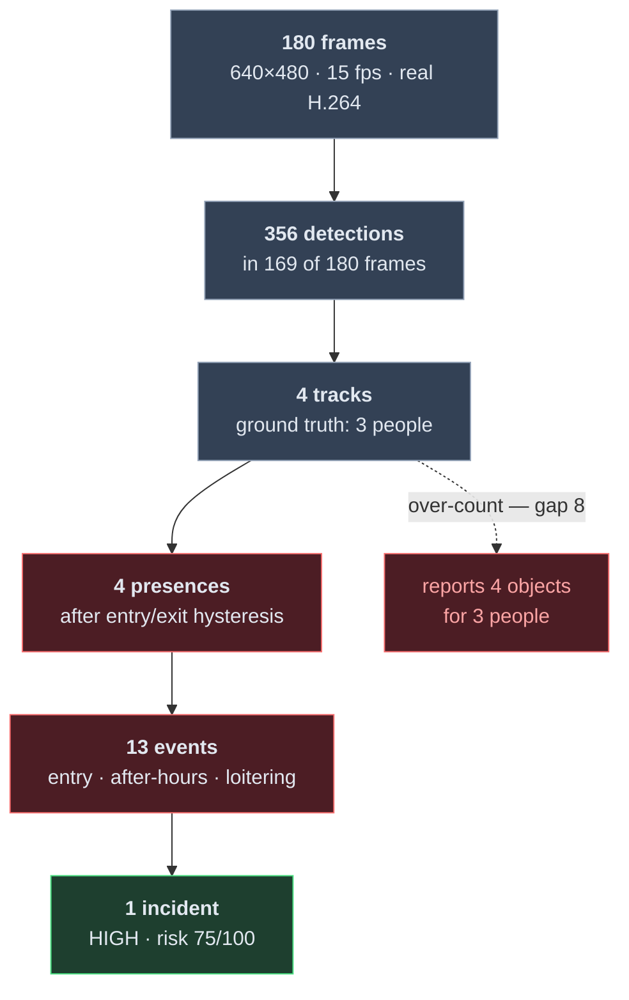
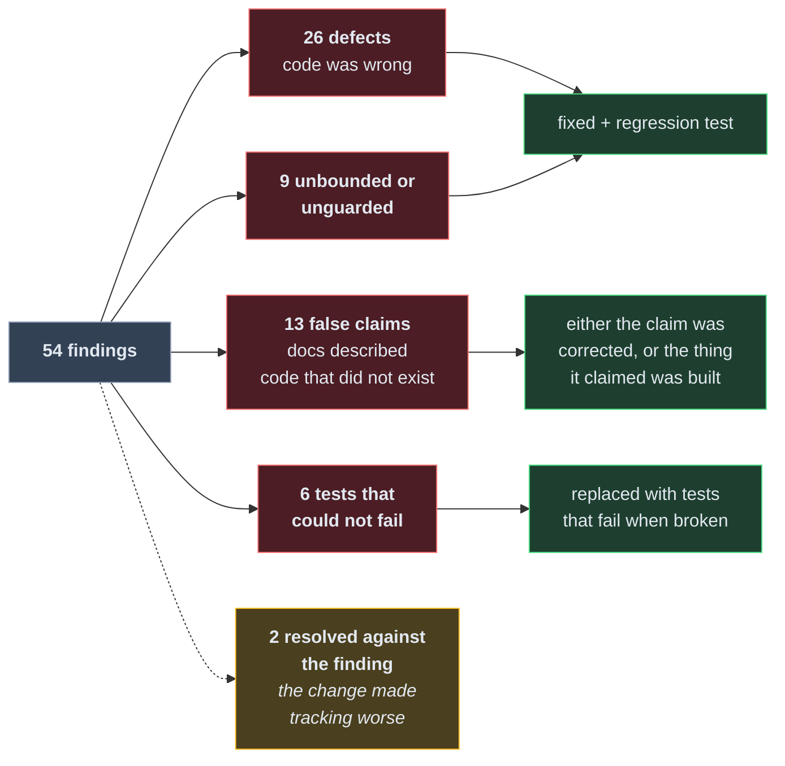
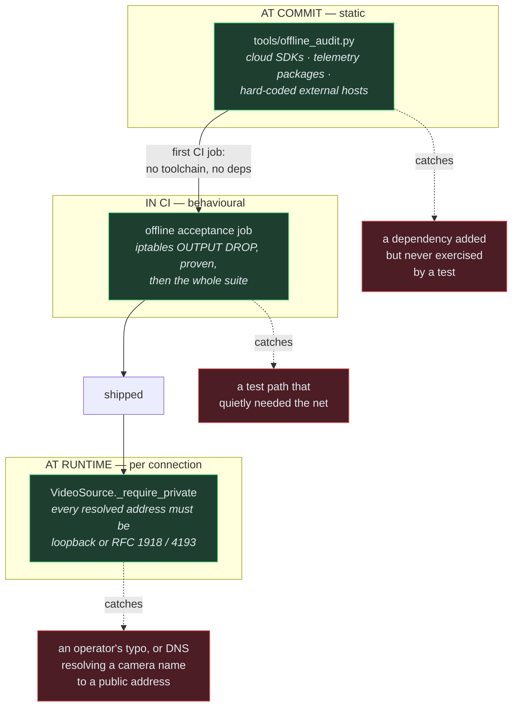
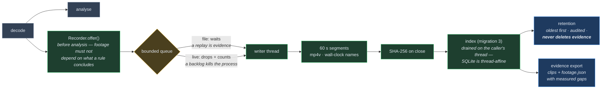
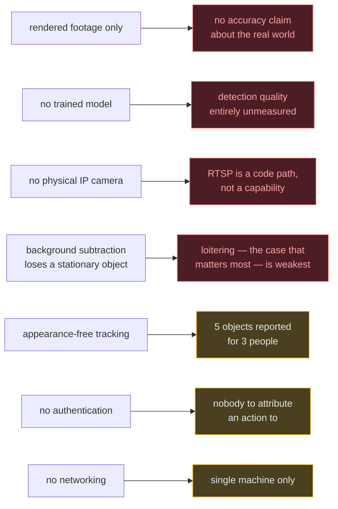

# Implementation status

This file exists because a UI existing is not the same as a feature working, and
a system that overstates its own readiness is dangerous in exactly the domain
this one operates in. Every capability carries one of five states:

| State | Meaning |
|---|---|
| `PLANNED` | Designed in ARCHITECTURE.md. No code. |
| `SKELETON` | Types, interfaces or scaffolding exist. Does not do the job yet. |
| `IMPLEMENTED` | Works. Not yet covered by tests that would catch a regression. |
| `TESTED` | Works, and tests fail if it stops working. |
| `PRODUCTION-READY` | Tested, hardened, documented, and exercised against real hardware. |

**Nothing in this repository is `PRODUCTION-READY`.** No part of this system has
been run against a physical **IP** camera, a GPU, a real detection model, or a
multi-machine LAN. A camera attached to the machine — USB or built-in, through
the operating system's own capture API — has been run end to end, which is the
first piece of real hardware this system has ever touched. Everything else
marked `TESTED` is tested against generated fixtures, which is a real bar but
not the same bar.

**The codebase was rewritten in Python and Rust.** The previous TypeScript
implementation was removed in `582d0a8`; its architecture documents were kept
because the thinking in them carried over, and are being brought up to date.
Anything below that is not yet re-established after the rewrite says so.

Current suite: **648 tests** — 57 Rust, 543 engine, 48 console — plus two static
checks that run before any of them: an offline audit that fails the build if the
shipped source names any destination off the site, and a lint that fails it if
any of the 36 diagrams in this documentation no longer parses. `cargo fmt` and
`clippy -D warnings` clean. Run everything with `python tasks.py check`, or the
Python half of it inside a container with no network at all:
`docker compose run --rm verify`. One of them opens a real camera and is skipped unless
`SENTINEL_TEST_CAMERA=1` is set, because a suite that switches on the
developer's webcam is a suite people stop running.

**What the product is** is [FEATURES.md](FEATURES.md) — 356 capabilities, each
with its state. **How to use what exists** is [docs/USAGE.md](docs/USAGE.md).
**What to build next** is [ROADMAP.md](ROADMAP.md).

A visual walk-through of everything below — the layers, the boundary, threading,
projection, correlation, persistence and export — is in
[docs/OVERVIEW.md](docs/OVERVIEW.md).

## The map at a glance

```mermaid
flowchart LR
    subgraph built["BUILT AND TESTED"]
        direction TB
        B1["decode · detect · track · project"]
        B2["zones · schedules · rules · events"]
        B3["correlation · object identity · risk"]
        B4["persistence · audit · evidence export"]
        B6["continuous recording · retention<br/><i>engine + CLI; no console toggle yet</i>"]
        B5["multi-camera Qt console"]
    end

    subgraph partial["CODE PATH ONLY"]
        direction TB
        P1["RTSP ingest<br/><i>no camera ever contacted</i>"]
        P2["ONNX inference<br/><i>no trained weights ever run</i>"]
    end

    subgraph planned["DESIGNED, NOT BUILT"]
        direction TB
        N1["REST + WebSocket control plane"]
        N2["node discovery · pairing · mTLS"]
        N3["worker autonomy · reconciliation"]
        N4["camera discovery (ONVIF/mDNS)"]
        N6["map package import"]
        N7["authentication · keychain"]
        N8["grounded AI analyst"]
    end

    built --> partial --> planned

    style built fill:#1e3f2f,stroke:#4ade80,color:#e2e8f0
    style partial fill:#4a3f1e,stroke:#fbbf24,color:#e2e8f0
    style planned fill:#334155,stroke:#94a3b8,color:#e2e8f0
```

Nothing in the right two columns is described below as working. Where a document
elsewhere in this repository describes one of them, it carries a banner saying so.

---

## Engine core (Rust)

Geometry, projection, zones and tracking, behind a C ABI.

| Capability | State | Notes |
|---|---|---|
| Ground projection with uncertainty | `TESTED` | `d = h/tan(θ)`. Uncertainty is 1σ and grows super-linearly toward the horizon. An unprojectable ray returns nothing — never a clamped guess. |
| Field-of-view footprint | `TESTED` | An annular sector. A tilted camera is blind at its own mast, and the geometry says so rather than drawing a pie slice. |
| Coverage test (`camera_sees`) | `TESTED` | Bounded by the vertical field of view, not only the stated range — a camera claiming 90 m may cover 7 m to 19 m. |
| Point-in-polygon zones | `TESTED` | Does not chatter on an edge; a degenerate ring contains nothing. |
| Multi-object tracking | `TESTED` | Constant-velocity prediction, globally-sorted greedy association, two-tier scoring. |
| Anisotropic association gate | `TESTED` | An ellipse, not a circle: vertical image motion is depth, so the vertical axis is the tight one. See "measured behaviour" below. |
| Motion (speed, heading) | `TESTED` | Three states, not two: unknown, standing still, moving. Speed is withheld until it spans 1.2 s, because dividing a distance by one frame interval amplifies position error fivefold. |
| Uncertainty-aware zones | `TESTED` | Three states again: inside, outside, and *uncertain* when the position's own error disc straddles the boundary. |
| C ABI | `TESTED` | Every entry point checks its pointers, is marked `unsafe`, and carries a `# Safety` contract. `panic = "abort"`, so no unwind crosses the boundary. |
| Inverse projection | `TESTED` | Where a world point appears in an image. Round-trips with the forward projection to within 1e-6. |
| Struct-layout guard | `TESTED` | The core exports its struct sizes; the Python binding refuses to load on a mismatch. |

## Engine (Python)

| Capability | State | Notes |
|---|---|---|
| ctypes bindings | `TESTED` | ABI version and every struct size checked at load. |
| Video decode (file) | `TESTED` | Real H.264 through OpenCV/FFmpeg. Timestamps come from container PTS, never from a nominal frame rate. |
| Video decode (RTSP) | `SKELETON` | The code path exists and is shaped correctly. **No camera has ever been contacted.** |
| Local camera capture | `TESTED` | `device:N`, through each platform's own capture API: Media Foundation (falling back to DirectShow) on Windows, V4L2 on Linux, AVFoundation on macOS. Exercised against a real webcam on Windows — 224 frames in 12 s through DirectShow, after Media Foundation refused the device. |
| Local camera enumeration | `TESTED` | The PnP registry, the V4L2 tree, the system profiler. Opens nothing to list; `--probe` is a separate, deliberate act. An index that has not been opened is reported as *assumed*, because there is no supported mapping from an OS device to a capture index and two identical webcams are indistinguishable by name. |
| Bounded live runs | `TESTED` | `--for SECONDS` and `--frames N`. A live source has no end, and on Windows an external interrupt does not reach a Python process — measured — so an unbounded headless run cannot be stopped without killing it. |
| Reachability pre-check | `TESTED` | A socket probe bounds the connect. OpenCV's own RTSP timeout is a hard-coded 30 s that its documented FFmpeg options do not change — measured, not assumed. |
| Live-stream frame dropping | `TESTED` | Newest-wins with a count of what was dropped. Refuses to wrap a file, because that would make replay non-deterministic. |
| Credential redaction | `TESTED` | A password is unreachable through `repr`, `str`, display URL, source id, or any error message — including its length. |
| Motion detection | `TESTED` | MOG2 with a resolution-scaled vertical morphology kernel. Emits `UNCLASSIFIED` and never claims otherwise. |
| ONNX detection | `TESTED` | Letterboxing, per-class NMS, layout inference, model digest recorded — all now executed against a real ONNX graph. **No trained weights have been run** — see gap 2. |
| Zones, schedules, presence | `TESTED` | Hysteresis on both edges; exit slower than entry. Schedules wrap midnight. |
| Rules and events | `TESTED` | Deterministic ids for idempotent replay. Every event carries its own evidence and the conditions that fired. |
| Correlation and incidents | `TESTED` | Union-find object identity, transitive across cameras. Exercised through two independent pipelines over two rendered views of one world — see "the central claim" below. |
| Pipeline | `TESTED` | decode → detect → track → project → zones → events → incidents. Deterministic: the same file twice gives identical output. |
| Persistence | `TESTED` | SQLite in WAL, forward migrations with a reversal each, idempotent upserts on deterministic ids. No column holds a credential — asserted by walking the schema. |
| Audit log | `TESTED` | Append-only. There is deliberately no method to edit one, and a test fails if somebody adds it. |
| Evidence export | `TESTED` | A folder per incident: the full record, a report a person can read without tooling, and a SHA-256 for every file. Verifiable by somebody who has only the folder. |
| Export a *stored* incident | `TESTED` | `Store.incident()` rebuilds one from the database — events and reasoning included, nothing recomputed. Until this existed an incident could only be exported while the process that raised it was still running. |
| Headless analysis (`python -m sentinel`) | `TESTED` | The same pipeline with no window: run, incidents, export, coverage, where. Not a daemon — it processes what it is given and exits. |
| Logging | `TESTED` | Rotating file plus console, two formats. Every record passes a redacting filter — message, arguments and traceback — so a log line cannot carry a camera password. No network handler exists, asserted against the parsed module. |
| One data directory | `TESTED` | Database, logs and evidence under one root, overridable with `SENTINEL_DATA_DIR`. Never beside the code: a packaged install lives somewhere the running account cannot write. |
| Bounded statistics | `TESTED` | Per-track detail is capped; the distinct-object count is counted on arrival so trimming cannot deflate it, and a track still on screen is never trimmed. |
| Live-thread fault reporting | `TESTED` | The decode thread cannot die silently: any exception becomes a reported fault naming the exception *type*, never its text. |
| Continuous recording | `TESTED` | Segmented mp4v on a writer thread; a file loses no frames, a camera never builds a backlog; every clip hashed on close. **CLI only — the console cannot enable it yet.** |
| Recording index and retention | `TESTED` | Migration 3. Oldest-first by age, size and free space; every deletion audited; **a segment an incident depends on is never deleted**. Dry-run by default. |
| Footage in evidence | `TESTED` | Clips copied into the package with a pre-incident lead; `footage.json` states per-camera coverage and times every gap. |

## Repository guards

Neither of these is a feature. Both exist because a claim this system makes about
itself was found to be false, and rewording it would have been the cheaper fix.

| Guard | State | What it does | Watched failing by |
|---|---|---|---|
| `tools/offline_audit.py` | `TESTED` | Scans 26 shipped source files for cloud SDKs, telemetry packages and hard-coded external hosts. First CI job, no toolchain. | `test_offline_guarantee.py` · 29 |
| `tools/docs_lint.py` | `TESTED` | Parses all 32 mermaid diagrams. A broken one renders as raw text with no error anywhere. | `test_docs.py` · 12 |

## Operator console (PySide6)

| Capability | State | Notes |
|---|---|---|
| Native window, no webview | `TESTED` | Asserted by test: no module may reference QtWebEngine. |
| Camera view with overlay | `TESTED` | Detections, confirmed tracks and coasting tracks drawn distinctly. |
| Plan view | `TESTED` | Metric grid, annular footprint, per-object uncertainty discs, trails, zoom and pan. Fetches nothing — asserted by test. |
| Track table | `TESTED` | One row per object with class, confidence, duration, motion, position, uncertainty and provenance. |
| Camera placement | `TESTED` | Reports the ground band a pose actually covers as it is typed. No default placement exists. Persisted, so it survives a restart. |
| Off-thread analysis | `TESTED` | Asserted by test that `run()` executes on the worker's own thread. |
| Fault reporting | `TESTED` | In place, not modal — twenty cameras drop together when a switch loses power. |
| Incident panel | `TESTED` | One row per incident, expandable into its risk factors, cross-camera links and timeline. Sorted by severity, not arrival. |
| Zones on the plan view | `TESTED` | Drawn distinctly from evidence: a zone is a rule someone wrote, not something observed. |
| Multi-camera wall | `TESTED` | A pane per camera, a pipeline per camera, and correlation above them — never inside one. |
| Incident replay and export | `PLANNED` | Export exists on the command line and in the console; replay does not. |

## Packaging and deployment

| Capability | State | Notes |
|---|---|---|
| Standalone executables | `TESTED` | `python tasks.py package` → three executables from one PyInstaller analysis. `onedir`, not `onefile`: unpacking 300 MB per launch is slow, leaves debris, and can be blocked outright. No UPX — a packed binary looks exactly like malware to every endpoint product an operator runs. |
| Developer executable | `TESTED` | `SentinelVision-dev` is the same code with a terminal and `--verbose` forced on. A packaged Qt application on Windows has nowhere to print, so an exception before the window appears leaves no trace at all. |
| Container image | `IMPLEMENTED` | Multi-stage: Rust builder, slim runtime, and a test stage carrying the dev extras. Runs the full Python suite with `network_mode: none`. Not root. No port is opened, because there is nothing to open one for. |
| Installer | `PLANNED` | MSI/NSIS, `.deb`/`.rpm`/AppImage, signed `.dmg`. What exists is a folder to copy. |
| Code signing | `PLANNED` | Unsigned binaries will be flagged on Windows and refused on macOS. |

## Measured behaviour

Every number here is produced by re-running the reference scenes, not remembered.
The scenes are rendered (`engine/tests/scene.py`, `engine/tests/world.py`); see
gap 1 for what that does and does not establish. A visual walk-through of all of
it is in [docs/OVERVIEW.md](docs/OVERVIEW.md).

### The funnel — 180 frames to one incident

**13 events become 1 incident — 92% less for a person to read.** That reduction
is the product, not a side effect.

### Detection

| Measurement | Value |
|---|---|
| Recall (IoU > 0.3), overall | 0.71 |
| — `approaching`, walks the full depth | 0.89 |
| — `crossing`, crosses the scene | 0.70 |
| — `loiterer`, **stops moving** | **0.49** |
| Mean overlap with ground truth | 0.51 |
| Fragments per frame | 0.42 |
| Spurious detections not on any object | **0** |

The per-walker split is the important part. The worst case is the object that
stops, which is the loitering case — the one a security system most needs. That
is not a bug to be tuned away; it is what background subtraction is.

### Tracking and correlation

| Measurement | Value |
|---|---|
| Distinct objects reported | **4**, for 3 people |
| Identity switches | **7** over 388 unambiguous observations |
| Events raised | 13 |
| Incidents after correlation | **1** |
| Reduction in what a person must read | **92%** |

The first two are honest failures, bounded by tests so they cannot quietly get
worse. They are the appearance-free tracking limit: when two people cross, box
geometry alone cannot tell which is which. An appearance model is the identified
next step.

### Spatial accuracy, against a world position

Not against a box in a picture — against where the person actually was, in
metres. The renderer projects world to image; the pipeline projects image back to
world.

| Distance from camera | Mean 1σ uncertainty reported |
|---|---|
| 0–8 m | 0.44 m |
| 8–10 m | 0.59 m |
| 10–12 m | 0.70 m |
| 12–15 m | 1.02 m |
| 15–25 m | 1.52 m |

Distance and reported uncertainty correlate at **r = 0.991**, and uncertainty
grows super-linearly, as `|dd/dθ| = h / sin²(θ)` requires.

### The central claim, measured

One person, one world, two cameras rendered from it through their real poses and
processed by two pipelines that know nothing of each other
(`engine/tests/test_multicamera.py`).

| Measurement | Value |
|---|---|
| Distinct objects per camera | 1 and 1 |
| Position error vs **world** ground truth | median **0.08 m** (cam-08), **0.11 m** (cam-07) |
| Position error, 90th percentile | 0.24 m and 0.51 m |
| True position inside the stated 2σ disc | **100%** |
| Events from both cameras | 4 |
| Cross-camera associations made | 4 |
| **Incidents after correlation** | **1** |
| **Distinct objects in that incident** | **1** |
| Risk | 62.5/100 (HIGH) |

This is the strongest available check short of hardware, and it is capable of
failing: if the geometry were wrong anywhere in that loop the cameras would
disagree about where the person was, the association would fail, and one person
would be reported as two.

The 2σ coverage matters as much as the error. A radius nobody verifies is
decoration that invites false confidence; the stated disc has to actually contain
the truth, and it does.

### Throughput

Median of five runs on an **idle** machine, 640×480.

| | fps | ms/frame |
|---|---:|---:|
| Motion detector, 0.75 scale | 433 | 2.31 |
| Whole pipeline, one camera | ~190 | ~5.2 |
| Aggregate across 4 cameras | ~380 | — |
| Aggregate across 16 cameras | ~370 | — |

**One node handles 16 cameras** at the 15 fps a camera delivers, with roughly
1.7× headroom each.

What limits it is not what anyone would guess. Per frame, detection is 93.6% of
the cost, decode 6.0%, and **the Rust core 0.4%**. Aggregate throughput plateaus
at about 2× a single camera however many are added — and it plateaus identically
whether they are threads or separate OS processes, so the GIL is not the
constraint either. It is MOG2's per-pixel model state evicting itself from cache.
The full measurement, and the six frameworks it rules out, are in
[docs/OVERVIEW.md §15](docs/OVERVIEW.md).

> **Correction.** Earlier revisions of this file quoted 87 fps and 68 fps. Those
> were measured while other test processes were running and were wrong by a
> factor of four. A performance claim without its conditions is not a
> measurement, so the conditions are stated above.

### Two changes with measured effect

Kept here because both were counter-intuitive and neither was predicted by
design review — both were found by building the thing and measuring it.

**The morphology kernel is tall and narrow, not square.** Every spurious
detection turned out to be a fragment of a real object rather than noise, so the
problem was never false positives — it was one person becoming three boxes.

| | square 9×9 | vertical 3×31 |
|---|---|---|
| Recall @ IoU > 0.3 | 0.64 | **0.69** |
| Mean overlap | 0.40 | **0.50** |
| Fragments per frame | 1.20 | **0.42** |

**Detecting at 0.75 scale.** The background model's per-pixel state is what stops
this system scaling across cameras, and it shrinks quadratically with the frame.
0.75 is better on both axes at once — 1.7× the throughput *and* better detection,
because the downscale is a mild denoise:

| | full scale | 0.75 scale |
|---|---|---|
| Recall @ IoU > 0.3 | 0.690 | **0.707** |
| Mean overlap | 0.503 | **0.511** |
| Throughput, 8 cameras | 455 fps | **784 fps** |
| Objects reported for 3 people | 5 | **4** |

**The association gate is an ellipse, not a circle.** A camera looking at the
ground maps vertical image motion to *depth*. A circular gate scaled by an
upright object's height permits a one-frame leap of tens of metres in world
terms, which is how a track hands its identity to somebody who has just walked
into shot 100 px above it.

### Defects that only appeared once it ran

Each of these passed review and failed reality:

| Symptom | Cause | Fix |
|---|---|---|
| "An object moved at **53.2 m/s**" | Speed from two frames 200 ms apart amplifies position error fivefold | Withhold speed below 1.2 s of observation |
| A track leapt 100 px to a newly-appeared object | Circular gate sized by an upright box's *height* | Elliptical gate; vertical axis is the tight one |
| 30 s stall per unreachable camera | OpenCV's RTSP timeout is hard-coded; all four documented FFmpeg options measured to do nothing | Socket probe before the decoder is involved |
| A failed migration could leave a partial schema | `executescript` commits the open transaction before running | Execute statement by statement inside the transaction |
| `db-rollback` silently undone | Opening the store auto-migrated unconditionally | Auto-migrate for the application, off for maintenance |
| A test hung forever | A modal dialog on camera failure — exactly what an operator would have experienced | Report faults in place, not modally |
| A zone landed beyond everything the camera could see | Placed by *stated range*, which is not coverage | Place just past the near edge of the real footprint |

### Milestone — the adversarial audit

The system was reviewed against its own claims rather than against a style guide:
every sentence in the documentation was treated as an assertion, and every
assertion was checked against the code that was supposed to implement it. 54
findings; 51 acted on, 2 resolved *against* the finding by measurement, 1 kept as
a documented limit.

**Two findings were resolved against the audit, by measurement.** Both proposed
changes were defensible on paper and both made the system worse when run:

| Proposed change | Rationale | Measured result | Outcome |
|---|---|---|---|
| Make `min_hits_to_confirm` literally consecutive | The name says consecutive; the code counts cumulatively | 3 people → **5 tracks became 8 tracks** | Behaviour kept, comment corrected |
| Scale the vertical gate by *width*, so its stated tightness is real | The comment claims the vertical axis is the tight one; scaling by height undoes that | 3 people → **5 tracks became 8 tracks**; sweep 0.35→5, 0.25→6, 0.20→7, 0.15→8 | Behaviour kept, comment corrected, sweep recorded |

A comment that describes the code is worth more than code that matches the
comment. Both comments were wrong; neither behaviour was.

**The thirteen false claims are the part worth dwelling on.** Every one of them
would have read as a working feature to somebody deciding whether to trust this
system. Two examples, both now real rather than reworded:

- SECURITY.md said the CI offline job "fails the build on a cloud SDK import, an
  analytics package, or a hard-coded external URL anywhere in the source." It did
  not — it blocked outbound traffic and ran the suite, which proves the *tested*
  paths need no network and says nothing about a path no test reaches. Rather
  than soften the sentence, the check was built (below).
- SECURITY.md's entire credentials section described `Secret<T>`, `toJSON`, the
  Node inspection hook and `buildRtspUrl` — the TypeScript prototype, deleted in
  `582d0a8`. It has been rewritten to describe the mechanism that exists.

### Zero WAN, now enforced three ways

The guarantee is checked at three different times, and each catches what the
others cannot.

| Mechanism | State | What it scans / does | Tested by |
|---|---|---|---|
| `tools/offline_audit.py` | `TESTED` | `engine/sentinel`, `apps/console/sentinel_console`, `core/src`, `tasks.py`, `tools` — 26 files | `engine/tests/test_offline_guarantee.py`, 29 tests |
| Offline CI job | `TESTED` | Drops outbound traffic, *proves* the drop works, runs all three suites | The job's own `curl` gate |
| `VideoSource._require_private` | `TESTED` | Every address a camera host resolves to | `engine/tests/test_decode.py` |

The audit is itself tested against deliberately bad source — every class of
finding is fed to it and required to be caught, and every URL the product
legitimately contains (`rtsp://admin:pw@192.168.1.64`, `https://node.local:8443`,
`http://[::1]:9000`, `https://[fd00::1]:8443`) is required to pass. A guard that
cries wolf is a guard somebody switches off; a guard nobody has watched fail is a
guard nobody knows works.

What it deliberately does **not** scan: the documentation, the tests, and the CI
definition. All three name external hosts on purpose — the offline job proves it
cannot reach `example.com` — and a scanner that forbade writing that down would
forbid the proof.

**Stated honestly:** the runtime guard is on the decode path, which is the only
place this build opens an outbound socket. It is not a process-wide socket
filter. When the control plane and node pairing are built, each needs the same
check at its own boundary, and the static audit is what makes a new dependency
that skips it visible.

### Boundaries that were unbounded

Four collections grew for as long as the process ran. On a demonstration this is
invisible; on a node left running for a month it is the reason it dies.

| Where | Grew by | Now |
|---|---|---|
| `PipelineStats.track_ids` | one entry per track ever seen | capped, with the distinct-object count kept exact by counting on arrival rather than by `len()` |
| `PipelineStats.observations` | one entry per track ever seen | capped, trimmed with its id |
| `PipelineStats.spans` | one entry per track ever seen | capped, trimmed with its id |
| `field_of_view` output buffer | sized from the *requested* segment count, not the clamped one | sized from what the core will actually produce; truncation refused rather than discarded |

The trimming had to be careful in one specific way: dropping the oldest ids would
drop a **long-lived track that is still on screen**, and the next frame would
count it as a new object — a stationary loiterer inflating the object count once
per frame, forever. Live ids are skipped, and a test walks a loiterer through
8192 frames of churn to prove it.

### Failures that could not be seen

| Symptom | Cause | Fix |
|---|---|---|
| A camera silently stops; the interface still shows it | The live decode thread caught only `DecodeError`. Anything else unwound it and left the capture open | Catch everything; report the exception *type*, never its text, because that text may have been built from a URL |
| A stale core dies on `AttributeError: sentinel_field_of_view` | `_bind` touched every symbol before the ABI version was read | Version read first; a mismatch says which rebuild to run |
| A camera footprint drawn open, claiming coverage it does not have | Buffer sized for 0 segments, core clamped to 2, ring truncated to fit, status discarded | Size for the clamp; refuse a truncated footprint outright |
| An event kind in the API that nothing raises | `ZONE_EXIT` and `PERIMETER_BREACH` are declared but no rule produces them | Labelled reserved with the reason; three tests assert the labels against the rules that exist |
| onnxruntime telemetry left at the library default | Zero-WAN was enforced on this code, not on its dependencies | `disable_telemetry_events()` called explicitly, guarded for builds without it |

Sequencing for everything below — what I would build next and why — is in
[ROADMAP.md](ROADMAP.md).

### Milestone — continuous recording

The largest hole in the product, closed at the engine level. Before this,
`evidence.py` wrote a SHA-256 manifest for video that did not exist.

**The decisions, and why they fell the way they did:**

| Decision | Why |
|---|---|
| `mp4v`, not H.264 | Asking OpenCV for H.264 prints a download link. Zero-WAN wins; the ~4× size cost is documented next to the storage numbers rather than discovered when a disk fills |
| Segments, not one file | Retention deletes whole units; export copies whole units; **a power cut costs at most one segment** (a container killed mid-write may not play) |
| Continuous first, event-triggered later | With continuous recording, pre-event footage is *already on disk* — the simpler mechanism is the one that gets evidence right |
| File waits, camera drops | A replay is evidence and loses nothing (measured before the rule: 130 of 180 frames dropped). A camera cannot be slowed down, so drops are taken — and counted |
| `measured_fps` beside `nominal_fps` | A live camera's real rate is only revealed by its frames. The header carries the assumption, the index carries the measurement — and an early version derived the "measurement" from the assumption, caught by test |
| Coverage reports gaps | A package holding 42% of the requested window says **42%, with each gap timed** — a package that plays and verifies clean can still mislead by omission |
| Preserved segments are untouchable | Retention that cannot meet its policy without deleting evidence leaves the policy unmet and says so, non-zero exit and all |

**Measured:** ~12.7 MiB/min → **~17.5 GB/day/camera** at 640×480/15fps
(~280 GB/day for sixteen); encoding ~800 fps, so the writer never limits
throughput. Storage numbers and the retention command are in
[docs/USAGE.md §7](docs/USAGE.md).

**Found by building it, fixed, and pinned by test:** a file source losing 130 of
180 frames to the drop policy; `on_segment` firing on the writer thread against
thread-affine SQLite (every segment of the first recording was written and none
indexed); `str(Path(...))` path-spelling divergence making `preserve_segments`
a silent no-op on Windows — the failure mode being *retention deletes the
evidence*; `measured_fps` echoing the nominal rate; incident windows queried in
media time against a wall-clock index (asked for footage from 1970, correctly
found none).

**Then reviewed adversarially, which found more.** Six dimensions over the
diff, three independent refuters per finding. Three survived, and one of them
was the whole feature:

| Found | Why it mattered |
|---|---|
| **Neither CLI export path attached footage or preserved anything** | Recording worked, coverage worked, preservation worked, and *nothing called any of them*. Every package came out with no video, `preserved` was never set on any segment, and retention was free to delete the exact footage an incident depended on. Every part was tested; the wire between them was not — so the tests now test the wire |
| `offer()` documented "the image is copied" and did not | `np.ascontiguousarray` returns *the same object* for an already-contiguous array, which every OpenCV frame is — verified. The queued frame aliased the caller's, so a viewer drawing track boxes would bake its overlay into the evidence, and a reused capture buffer would make each frame mutate into a later moment while its timestamp and hash described the earlier one |
| A second run silently overwrote the first | `cv2.VideoWriter` truncates, and every part of a segment's name is deterministic for a file source. Re-analysing the same clip destroyed the previous run's segments — including *preserved* ones, whose index row then vouched for the replacement with a freshly computed hash |
| `RecorderStats.fault` was surfaced by nobody | Its own docstring said "the pipeline surfaces it". A writer that died in minute one of an overnight run ended with the same cheerful summary as a healthy one. Now an ERROR line, a line on stdout, and a non-zero exit |

Each is pinned by a test that was watched failing with the defect restored.

**The review was cut short** — it ran out of session budget with 115 of 132
agents unfinished, so several raised findings were never verified either way.
The export-wiring defect above came from that unverified pile and was confirmed
by hand; the rest are unexamined.

**Stated honestly:** recording is engine/CLI only — the console cannot switch it
on yet. No playback inside the application. No event-triggered mode. Retention
runs when invoked, not on a schedule. Decode and analysis still share one loop,
so recording survives a slow analytic but not a dead decode — full independence
is the headless daemon's job (ROADMAP 1.2).

## Not yet rebuilt after the rewrite

These existed in the TypeScript and have not been re-established. They are listed
separately from `PLANNED` because the design is settled and tested thinking
exists for them in `docs/`.

| Capability | State | Notes |
|---|---|---|
| Grounded AI analyst | `PLANNED` | |
| REST and WebSocket control plane | `PLANNED` | |
| Node discovery and pairing | `PLANNED` | |
| Worker autonomy and reconciliation | `PLANNED` | |
| Camera discovery (ONVIF/mDNS) | `PLANNED` | |
| Map package import | `PLANNED` | |
| Authentication | `PLANNED` | The audit half is built; there is nobody to attribute an action to yet. |
| Secret storage in the OS keychain | `PLANNED` | No secret is stored at all today. |

## What each gap blocks

## Honest gaps worth naming

1. **The scene is synthetic, so nothing here establishes real-world behaviour.**
   The *file* is real — a genuine container written by a real encoder and read
   back by a real decoder, so the decode path under test is the one a camera
   exercises. The *content* is generated geometry. A synthetic scene is easy on a
   detector; every measurement above should be read as "the pipeline carries
   frames, detections, tracks and positions end to end without lying about them",
   not as an accuracy claim. Nothing stronger is possible without footage.

2. **No *trained* detection model has been run.** The ONNX path now executes
   end to end against a real model — `engine/tests/onnx_fixture.py` builds one
   locally with genuine ONNX operators, since none may be downloaded. It is a
   brightness detector: it reduces the image to luminance, pools it into a 20×20
   grid, and emits one candidate per cell scored by that cell's brightness.
   Crude, but its output is a real function of its input, so the tests can fail —
   move the object and the box must move, which is what catches a transposed
   output or a dropped letterbox offset.

   That establishes the machinery *around* a model: preprocessing, session
   execution, layout inference, coordinate un-letterboxing, per-class NMS,
   provenance, and that the two detectors are interchangeable everywhere
   downstream. It establishes **nothing** about detection quality, classes, or
   real-world behaviour. Trained weights remain untried.

3. **No physical *network* camera has ever been contacted.** RTSP support is a
   code path, not a verified capability. Real IP cameras deviate from the
   specifications in ways no amount of local testing anticipates.

   A camera *attached to the machine* has been, and the first contact with real
   hardware immediately produced two things local reasoning had not:

   - **Media Foundation refused the integrated camera outright** and DirectShow
     opened it. The Windows fallback is not defensive coding; it is the only
     reason there is a working camera on the development machine at all.
   - **A Windows Hello infrared sensor lists as a camera and opens on nothing.**
     "The operating system says it is a camera" and "it produces images" are
     different claims, and only probing distinguishes them.

   Both are exactly the class of surprise expected from an IP camera, which is
   the argument for getting one.

4. **Background subtraction cannot see a stationary object.** This is not a bug
   to be tuned away; it is what background subtraction is. On the reference
   scene the object that stops moving has the worst recall of the three — 0.49
   against 0.74 and 0.65 — and that is the loitering case, the one a security
   system most needs. The tracker's gap budget bridges it partially. A real
   detector is the actual answer.

5. **Spatial accuracy assumes flat ground and a perfectly known pose.** Real
   deployments have slopes, mis-surveyed masts and lens distortion. The
   uncertainty model is honest about its inputs; its inputs are currently ideal.
   Coverage is a geometric upper bound — it models what a camera can *reach*, not
   what it can usefully *see*, and nothing occludes anything.

6. **CI has never run.** The workflow is written for Rust and Python across three
   platforms and keeps the offline acceptance job, but no push has exercised it.
   The suites it runs all pass locally on Windows with Python 3.14; CI targets
   3.12, which has not been tried.

7. **Multi-camera correlation works, on rendered footage.** Two pipelines over
   two views of one world produce one incident containing one object, and the
   console shows it: two panes, two footprints overlapping on one plan view, and
   a single incident row reading "1 object in Restricted Area A (2 cameras)".
   What has still never happened is two *physical* cameras — the geometry is
   exercised, the optics and the disagreements real hardware brings are not.

   The association itself is deliberately weak and says so. Without appearance
   features, position and time are all there is, so it will merge two people who
   crossed the same spot ten seconds apart and will fail to merge one person
   whose two cameras disagree about where they were. Both failures are visible in
   the association's own score and reasons rather than buried in a threshold.

8. **The object count inherits the tracker's over-count.** On the reference scene
   the single incident correctly collapses 13 events into one — but reports **4
   objects where 3 people walked past**, because that is what the tracker
   believes. Correlation deliberately does not second-guess a tracker within one
   camera: doing so from positions alone would discard the tracker's own stronger
   evidence. The fix belongs upstream, in appearance-based association.
