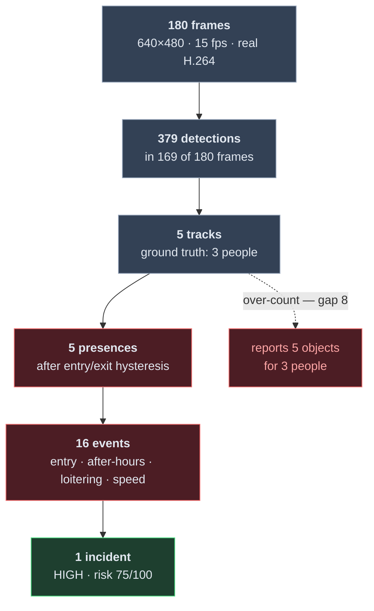
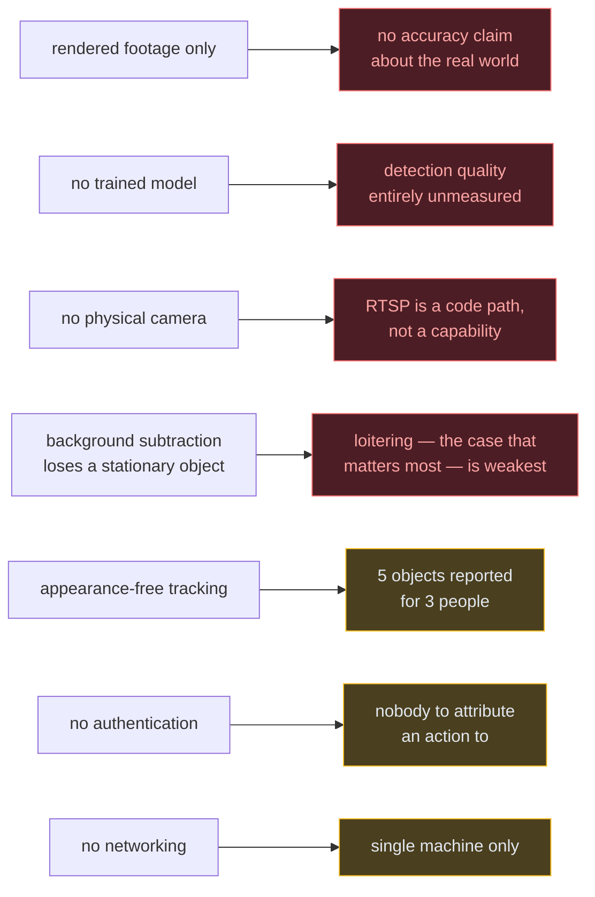

# Implementation status

This file exists because a UI existing is not the same as a feature working, and
a system that overstates its own readiness is dangerous in exactly the domain
this one operates in. Every capability carries one of five states:

| State | Meaning |
|---|---|
| `PLANNED` | Designed in ARCHITECTURE.md. No code. |
| `SKELETON` | Types, interfaces or scaffolding exist. Does not do the job yet. |
| `IMPLEMENTED` | Works. Not yet covered by tests that would catch a regression. |
| `TESTED` | Works, and tests fail if it stops working. |
| `PRODUCTION-READY` | Tested, hardened, documented, and exercised against real hardware. |

**Nothing in this repository is `PRODUCTION-READY`.** No part of this system has
been run against a physical IP camera, a GPU, a real detection model, or a
multi-machine LAN. Everything marked `TESTED` is tested against generated
fixtures, which is a real bar but not the same bar.

**The codebase was rewritten in Python and Rust.** The previous TypeScript
implementation was removed in `582d0a8`; its architecture documents were kept
because the thinking in them carried over, and are being brought up to date.
Anything below that is not yet re-established after the rewrite says so.

Current suite: **331 tests** — 44 Rust, 247 engine, 40 console. `cargo fmt` and
`clippy -D warnings` clean. Run everything with `python tasks.py check`.

A visual walk-through of everything below — the layers, the boundary, threading,
projection, correlation, persistence and export — is in
[docs/OVERVIEW.md](docs/OVERVIEW.md).

## The map at a glance

```mermaid
flowchart LR
    subgraph built["BUILT AND TESTED"]
        direction TB
        B1["decode · detect · track · project"]
        B2["zones · schedules · rules · events"]
        B3["correlation · object identity · risk"]
        B4["persistence · audit · evidence export"]
        B5["multi-camera Qt console"]
    end

    subgraph partial["CODE PATH ONLY"]
        direction TB
        P1["RTSP ingest<br/><i>no camera ever contacted</i>"]
        P2["ONNX inference<br/><i>no trained weights ever run</i>"]
    end

    subgraph planned["DESIGNED, NOT BUILT"]
        direction TB
        N1["REST + WebSocket control plane"]
        N2["node discovery · pairing · mTLS"]
        N3["worker autonomy · reconciliation"]
        N4["camera discovery (ONVIF/mDNS)"]
        N5["continuous recording"]
        N6["map package import"]
        N7["authentication · keychain"]
        N8["grounded AI analyst"]
    end

    built --> partial --> planned

    style built fill:#1e3f2f,stroke:#4ade80,color:#e2e8f0
    style partial fill:#4a3f1e,stroke:#fbbf24,color:#e2e8f0
    style planned fill:#334155,stroke:#94a3b8,color:#e2e8f0
```

Nothing in the right two columns is described below as working. Where a document
elsewhere in this repository describes one of them, it carries a banner saying so.

---

## Engine core (Rust)

Geometry, projection, zones and tracking, behind a C ABI.

| Capability | State | Notes |
|---|---|---|
| Ground projection with uncertainty | `TESTED` | `d = h/tan(θ)`. Uncertainty is 1σ and grows super-linearly toward the horizon. An unprojectable ray returns nothing — never a clamped guess. |
| Field-of-view footprint | `TESTED` | An annular sector. A tilted camera is blind at its own mast, and the geometry says so rather than drawing a pie slice. |
| Coverage test (`camera_sees`) | `TESTED` | Bounded by the vertical field of view, not only the stated range — a camera claiming 90 m may cover 7 m to 19 m. |
| Point-in-polygon zones | `TESTED` | Does not chatter on an edge; a degenerate ring contains nothing. |
| Multi-object tracking | `TESTED` | Constant-velocity prediction, globally-sorted greedy association, two-tier scoring. |
| Anisotropic association gate | `TESTED` | An ellipse, not a circle: vertical image motion is depth, so the vertical axis is the tight one. See "measured behaviour" below. |
| Motion (speed, heading) | `TESTED` | Three states, not two: unknown, standing still, moving. Speed is withheld until it spans 1.2 s, because dividing a distance by one frame interval amplifies position error fivefold. |
| Uncertainty-aware zones | `TESTED` | Three states again: inside, outside, and *uncertain* when the position's own error disc straddles the boundary. |
| C ABI | `TESTED` | Every entry point checks its pointers, is marked `unsafe`, and carries a `# Safety` contract. `panic = "abort"`, so no unwind crosses the boundary. |
| Inverse projection | `TESTED` | Where a world point appears in an image. Round-trips with the forward projection to within 1e-6. |
| Struct-layout guard | `TESTED` | The core exports its struct sizes; the Python binding refuses to load on a mismatch. |

## Engine (Python)

| Capability | State | Notes |
|---|---|---|
| ctypes bindings | `TESTED` | ABI version and every struct size checked at load. |
| Video decode (file) | `TESTED` | Real H.264 through OpenCV/FFmpeg. Timestamps come from container PTS, never from a nominal frame rate. |
| Video decode (RTSP) | `SKELETON` | The code path exists and is shaped correctly. **No camera has ever been contacted.** |
| Reachability pre-check | `TESTED` | A socket probe bounds the connect. OpenCV's own RTSP timeout is a hard-coded 30 s that its documented FFmpeg options do not change — measured, not assumed. |
| Live-stream frame dropping | `TESTED` | Newest-wins with a count of what was dropped. Refuses to wrap a file, because that would make replay non-deterministic. |
| Credential redaction | `TESTED` | A password is unreachable through `repr`, `str`, display URL, source id, or any error message — including its length. |
| Motion detection | `TESTED` | MOG2 with a resolution-scaled vertical morphology kernel. Emits `UNCLASSIFIED` and never claims otherwise. |
| ONNX detection | `TESTED` | Letterboxing, per-class NMS, layout inference, model digest recorded — all now executed against a real ONNX graph. **No trained weights have been run** — see gap 2. |
| Zones, schedules, presence | `TESTED` | Hysteresis on both edges; exit slower than entry. Schedules wrap midnight. |
| Rules and events | `TESTED` | Deterministic ids for idempotent replay. Every event carries its own evidence and the conditions that fired. |
| Correlation and incidents | `TESTED` | Union-find object identity, transitive across cameras. Exercised through two independent pipelines over two rendered views of one world — see "the central claim" below. |
| Pipeline | `TESTED` | decode → detect → track → project → zones → events → incidents. Deterministic: the same file twice gives identical output. |
| Persistence | `TESTED` | SQLite in WAL, forward migrations with a reversal each, idempotent upserts on deterministic ids. No column holds a credential — asserted by walking the schema. |
| Audit log | `TESTED` | Append-only. There is deliberately no method to edit one, and a test fails if somebody adds it. |
| Evidence export | `TESTED` | A folder per incident: the full record, a report a person can read without tooling, and a SHA-256 for every file. Verifiable by somebody who has only the folder. |

## Operator console (PySide6)

| Capability | State | Notes |
|---|---|---|
| Native window, no webview | `TESTED` | Asserted by test: no module may reference QtWebEngine. |
| Camera view with overlay | `TESTED` | Detections, confirmed tracks and coasting tracks drawn distinctly. |
| Plan view | `TESTED` | Metric grid, annular footprint, per-object uncertainty discs, trails, zoom and pan. Fetches nothing — asserted by test. |
| Track table | `TESTED` | One row per object with class, confidence, duration, motion, position, uncertainty and provenance. |
| Camera placement | `TESTED` | Reports the ground band a pose actually covers as it is typed. No default placement exists. Persisted, so it survives a restart. |
| Off-thread analysis | `TESTED` | Asserted by test that `run()` executes on the worker's own thread. |
| Fault reporting | `TESTED` | In place, not modal — twenty cameras drop together when a switch loses power. |
| Incident panel | `TESTED` | One row per incident, expandable into its risk factors, cross-camera links and timeline. Sorted by severity, not arrival. |
| Zones on the plan view | `TESTED` | Drawn distinctly from evidence: a zone is a rule someone wrote, not something observed. |
| Multi-camera wall | `TESTED` | A pane per camera, a pipeline per camera, and correlation above them — never inside one. |
| Incident replay and export | `PLANNED` | |

## Measured behaviour

Every number here is produced by re-running the reference scenes, not remembered.
The scenes are rendered (`engine/tests/scene.py`, `engine/tests/world.py`); see
gap 1 for what that does and does not establish. A visual walk-through of all of
it is in [docs/OVERVIEW.md](docs/OVERVIEW.md).

### The funnel — 180 frames to one incident

**16 events become 1 incident — 94% less for a person to read.** That reduction
is the product, not a side effect.

### Detection

| Measurement | Value |
|---|---|
| Recall (IoU > 0.3), overall | 0.69 |
| — `approaching`, walks the full depth | 0.86 |
| — `crossing`, crosses the scene | 0.68 |
| — `loiterer`, **stops moving** | **0.49** |
| Mean overlap with ground truth | 0.50 |
| Fragments per frame | 0.42 |
| Spurious detections not on any object | **0** |

The per-walker split is the important part. The worst case is the object that
stops, which is the loitering case — the one a security system most needs. That
is not a bug to be tuned away; it is what background subtraction is.

### Tracking and correlation

| Measurement | Value |
|---|---|
| Distinct objects reported | **5**, for 3 people |
| Identity switches | **8** over ~410 unambiguous observations |
| Events raised | 16 |
| Incidents after correlation | **1** |
| Reduction in what a person must read | **94%** |

The first two are honest failures, bounded by tests so they cannot quietly get
worse. They are the appearance-free tracking limit: when two people cross, box
geometry alone cannot tell which is which. An appearance model is the identified
next step.

### Spatial accuracy, against a world position

Not against a box in a picture — against where the person actually was, in
metres. The renderer projects world to image; the pipeline projects image back to
world.

| Distance from camera | Mean 1σ uncertainty reported |
|---|---|
| 0–8 m | 0.44 m |
| 8–10 m | 0.59 m |
| 10–12 m | 0.70 m |
| 12–15 m | 1.02 m |
| 15–25 m | 1.52 m |

Distance and reported uncertainty correlate at **r = 0.991**, and uncertainty
grows super-linearly, as `|dd/dθ| = h / sin²(θ)` requires.

### The central claim, measured

One person, one world, two cameras rendered from it through their real poses and
processed by two pipelines that know nothing of each other
(`engine/tests/test_multicamera.py`).

| Measurement | Value |
|---|---|
| Distinct objects per camera | 1 and 1 |
| Position error vs **world** ground truth | median **0.32 m** |
| Position error, 90th percentile | 0.96 m (cam-08), 1.34 m (cam-07) |
| True position inside the stated 2σ disc | **100%** |
| Events from both cameras | 3 |
| Cross-camera associations made | 2 |
| **Incidents after correlation** | **1** |
| **Distinct objects in that incident** | **1** |
| Risk | 62.5/100 (HIGH) |

This is the strongest available check short of hardware, and it is capable of
failing: if the geometry were wrong anywhere in that loop the cameras would
disagree about where the person was, the association would fail, and one person
would be reported as two.

The 2σ coverage matters as much as the error. A radius nobody verifies is
decoration that invites false confidence; the stated disc has to actually contain
the truth, and it does.

### Throughput

Median of five runs on an **idle** machine, 640×480.

| | fps | ms/frame |
|---|---:|---:|
| Motion detector, 16 threads | 385 | 2.60 |
| Motion detector, **1 thread** | **230** | **4.34** |
| Whole pipeline (decode → incident), 16 threads | 319 | 3.14 |

The single-threaded figure is the one that matters for capacity: a worker runs
one pipeline per camera and they compete for cores, so this is roughly **15
cameras at 15 fps per core** — before any real detection model, which will
dominate the budget entirely.

> **Correction.** Earlier revisions of this file quoted 87 fps and 68 fps. Those
> were measured while other test processes were running and were wrong by a
> factor of four. A performance claim without its conditions is not a
> measurement, so the conditions are stated above.

### Two changes with measured effect

Kept here because both were counter-intuitive and neither was predicted by
design review — both were found by building the thing and measuring it.

**The morphology kernel is tall and narrow, not square.** Every spurious
detection turned out to be a fragment of a real object rather than noise, so the
problem was never false positives — it was one person becoming three boxes.

| | square 9×9 | vertical 3×31 |
|---|---|---|
| Recall @ IoU > 0.3 | 0.64 | **0.69** |
| Mean overlap | 0.40 | **0.50** |
| Fragments per frame | 1.20 | **0.42** |

**The association gate is an ellipse, not a circle.** A camera looking at the
ground maps vertical image motion to *depth*. A circular gate scaled by an
upright object's height permits a one-frame leap of tens of metres in world
terms, which is how a track hands its identity to somebody who has just walked
into shot 100 px above it.

### Defects that only appeared once it ran

Each of these passed review and failed reality:

| Symptom | Cause | Fix |
|---|---|---|
| "An object moved at **53.2 m/s**" | Speed from two frames 200 ms apart amplifies position error fivefold | Withhold speed below 1.2 s of observation |
| A track leapt 100 px to a newly-appeared object | Circular gate sized by an upright box's *height* | Elliptical gate; vertical axis is the tight one |
| 30 s stall per unreachable camera | OpenCV's RTSP timeout is hard-coded; all four documented FFmpeg options measured to do nothing | Socket probe before the decoder is involved |
| A failed migration could leave a partial schema | `executescript` commits the open transaction before running | Execute statement by statement inside the transaction |
| `db-rollback` silently undone | Opening the store auto-migrated unconditionally | Auto-migrate for the application, off for maintenance |
| A test hung forever | A modal dialog on camera failure — exactly what an operator would have experienced | Report faults in place, not modally |
| A zone landed beyond everything the camera could see | Placed by *stated range*, which is not coverage | Place just past the near edge of the real footprint |

## Not yet rebuilt after the rewrite

These existed in the TypeScript and have not been re-established. They are listed
separately from `PLANNED` because the design is settled and tested thinking
exists for them in `docs/`.

| Capability | State | Notes |
|---|---|---|
| Grounded AI analyst | `PLANNED` | |
| REST and WebSocket control plane | `PLANNED` | |
| Node discovery and pairing | `PLANNED` | |
| Worker autonomy and reconciliation | `PLANNED` | |
| Camera discovery (ONVIF/mDNS) | `PLANNED` | |
| Continuous recording | `PLANNED` | Export exists; there is no recorded video to attach to it yet. |
| Map package import | `PLANNED` | |
| Authentication | `PLANNED` | The audit half is built; there is nobody to attribute an action to yet. |
| Secret storage in the OS keychain | `PLANNED` | No secret is stored at all today. |

## What each gap blocks

## Honest gaps worth naming

1. **The scene is synthetic, so nothing here establishes real-world behaviour.**
   The *file* is real — a genuine container written by a real encoder and read
   back by a real decoder, so the decode path under test is the one a camera
   exercises. The *content* is generated geometry. A synthetic scene is easy on a
   detector; every measurement above should be read as "the pipeline carries
   frames, detections, tracks and positions end to end without lying about them",
   not as an accuracy claim. Nothing stronger is possible without footage.

2. **No *trained* detection model has been run.** The ONNX path now executes
   end to end against a real model — `engine/tests/onnx_fixture.py` builds one
   locally with genuine ONNX operators, since none may be downloaded. It is a
   brightness detector: it reduces the image to luminance, pools it into a 20×20
   grid, and emits one candidate per cell scored by that cell's brightness.
   Crude, but its output is a real function of its input, so the tests can fail —
   move the object and the box must move, which is what catches a transposed
   output or a dropped letterbox offset.

   That establishes the machinery *around* a model: preprocessing, session
   execution, layout inference, coordinate un-letterboxing, per-class NMS,
   provenance, and that the two detectors are interchangeable everywhere
   downstream. It establishes **nothing** about detection quality, classes, or
   real-world behaviour. Trained weights remain untried.

3. **No physical camera has ever been contacted.** RTSP support is a code path,
   not a verified capability. Real cameras deviate from the specifications in
   ways no amount of local testing anticipates.

4. **Background subtraction cannot see a stationary object.** This is not a bug
   to be tuned away; it is what background subtraction is. On the reference
   scene the object that stops moving has the worst recall of the three — 0.49
   against 0.74 and 0.65 — and that is the loitering case, the one a security
   system most needs. The tracker's gap budget bridges it partially. A real
   detector is the actual answer.

5. **Spatial accuracy assumes flat ground and a perfectly known pose.** Real
   deployments have slopes, mis-surveyed masts and lens distortion. The
   uncertainty model is honest about its inputs; its inputs are currently ideal.
   Coverage is a geometric upper bound — it models what a camera can *reach*, not
   what it can usefully *see*, and nothing occludes anything.

6. **CI has never run.** The workflow is written for Rust and Python across three
   platforms and keeps the offline acceptance job, but no push has exercised it.
   The suites it runs all pass locally on Windows with Python 3.14; CI targets
   3.12, which has not been tried.

7. **Multi-camera correlation works, on rendered footage.** Two pipelines over
   two views of one world produce one incident containing one object, and the
   console shows it: two panes, two footprints overlapping on one plan view, and
   a single incident row reading "1 object in Restricted Area A (2 cameras)".
   What has still never happened is two *physical* cameras — the geometry is
   exercised, the optics and the disagreements real hardware brings are not.

   The association itself is deliberately weak and says so. Without appearance
   features, position and time are all there is, so it will merge two people who
   crossed the same spot ten seconds apart and will fail to merge one person
   whose two cameras disagree about where they were. Both failures are visible in
   the association's own score and reasons rather than buried in a threshold.

8. **The object count inherits the tracker's over-count.** On the reference scene
   the single incident correctly collapses 16 events into one — but reports **5
   objects where 3 people walked past**, because that is what the tracker
   believes. Correlation deliberately does not second-guess a tracker within one
   camera: doing so from positions alone would discard the tracker's own stronger
   evidence. The fix belongs upstream, in appearance-based association.
