# Visual overview

One page that shows how Sentinel Vision is put together and what it does with a
frame. Every number here is measured on the reference scenes by
`engine/tests/scene.py` and `engine/tests/world.py`; see [STATUS.md](../STATUS.md)
for what those measurements do and do not establish.

---

## 1. The three layers

The dividing line between them is **rate**, not importance. Anything called per
detection, per frame, per camera goes into Rust. Anything called per event, per
second, or per operator action stays in Python.

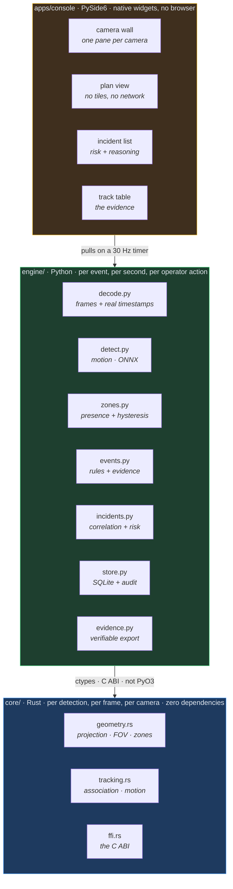

**Why a C ABI and not PyO3.** The core is built with the GNU toolchain; CPython
on Windows is built with MSVC. PyO3 links against CPython's ABI and inherits that
mismatch. The C ABI does not. It also keeps the core loadable from anything, so
the engine is not welded to one runtime.

The cost is that struct layouts are maintained by hand on both sides. That cost
is *guarded* rather than absorbed — see §5.

---

## 2. The spine

Each stage answers a different question. The value is in the sequence, not in any
one stage.


| Stage | Asks | Fails how |
|---|---|---|
| Decode | *What did the camera see, and when?* | An invented timestamp makes every speed and every hand-off subtly wrong |
| Detect | *What is in this frame?* | Frame-local, no memory — wrong intermittently by nature |
| Track | *Is this the same thing as before?* | Without it, one person is a new intruder every frame |
| Place | *Where on the ground is this?* | A position without its uncertainty is false precision |
| Zones | *Does the place mean anything?* | A boundary without hysteresis manufactures alarms |
| Events | *Is this worth saying?* | An assertion without evidence cannot be reviewed |
| Correlate | *Is this the same situation?* | Six alerts for one intrusion trains the operator to skim |
| Risk | *How much attention?* | A score without reasoning gets ignored |

**The red stages are where observation becomes assertion.** Everything before
them reports; everything from `EVENT ANALYSIS` on makes a claim that will
eventually interrupt a person.

---

## 3. What actually happens to 180 frames

Measured on the single-camera reference scene: 12 seconds, 3 people, one
restricted zone, after-hours schedule active.

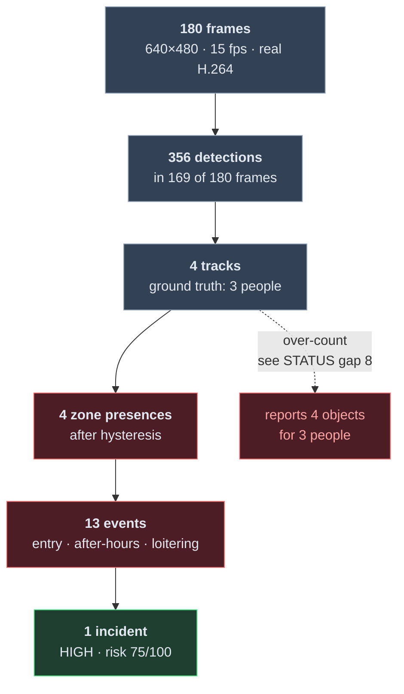

**13 events become 1 incident — 92% less for a person to read.** That reduction
is the product. An operator who receives six alerts for one intrusion learns to
skim, and the skimming is what loses the seventh alert that mattered.

The dotted branch is an honest failure, bounded by a test so it cannot silently
worsen: the tracker fragments 3 people into 4 tracks, and correlation
deliberately does not second-guess a tracker within one camera.

---

## 4. The central claim, measured

*Three cameras seeing one person is one incident, not three alerts.*

Tested with two cameras rendered from **one world** through their real poses, and
two pipelines that know nothing of each other.

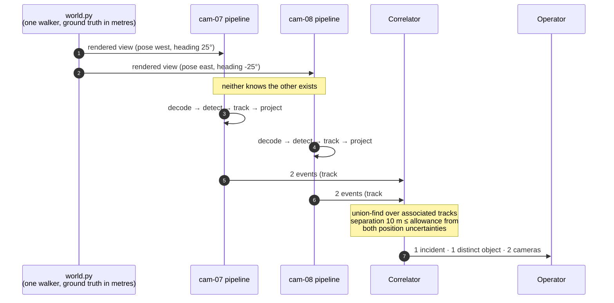

| Measurement | Value |
|---|---|
| Distinct objects, per camera | 1 and 1 |
| Position error vs **world** ground truth | median **0.08–0.11 m** |
| Position error, 90th percentile | 0.24 m and 0.51 m |
| True position inside the stated 2σ disc | **100%** |
| Events raised by both cameras | 4 |
| Cross-camera associations made | 4 |
| **Incidents an operator sees** | **1** |
| **Distinct objects in that incident** | **1** |
| Risk | 62.5/100 (HIGH) |

**Why this test can fail.** The renderer projects world → image using
`sentinel_image_coordinates`; the pipeline projects image → world using
`sentinel_project_to_ground`. They are exact inverses. If the geometry were wrong
anywhere in that loop, the two cameras would disagree about where the person was,
the association would fail, and one person would be reported as two.

---

## 5. The boundary, and how it is guarded

A hand-written binding that drifts does not crash. It reads the wrong bytes and
produces geometry that looks entirely reasonable.

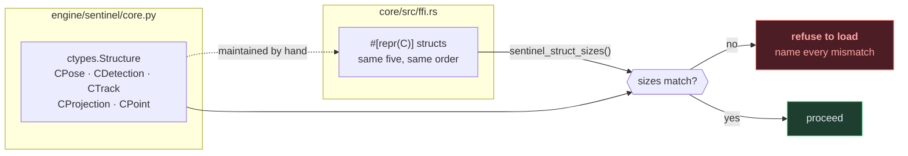

Four rules hold the boundary:

| Rule | Because |
|---|---|
| Struct sizes exported and checked at load | A drifted layout produces plausible, wrong geometry rather than a crash |
| `ABI_VERSION` checked, mismatch refused | Calling a function whose signature moved corrupts everything downstream |
| Every pointer checked before dereference | A caller's bug must be a defined failure, not a segfault in a security appliance |
| Every pointer-taking export is `unsafe` with a `# Safety` contract | Null-checking cannot establish that a non-null pointer is live |
| `panic = "abort"` | Unwinding into C is undefined behaviour |

---

## 6. Threading — why the interface pulls

Qt's queued signal delivery is unbounded. A pipeline producing at 300 fps in
front of a display repainting at 30 would build a backlog of already-stale frames
until the process died.

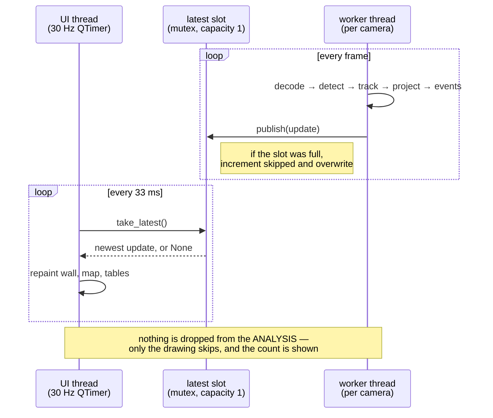

Latest-wins is not a compromise. A control room needs to see *now*, not a slow
replay of the last minute. What was skipped is counted and displayed, because a
viewer showing a third of the frames while reporting nothing unusual is worse
than one that says so.

---

## 7. Zone presence — the state machine that stops false alarms

Somebody walking a fence line clips it repeatedly as their position estimate
jitters. Without hysteresis on both edges, one person produces forty events.

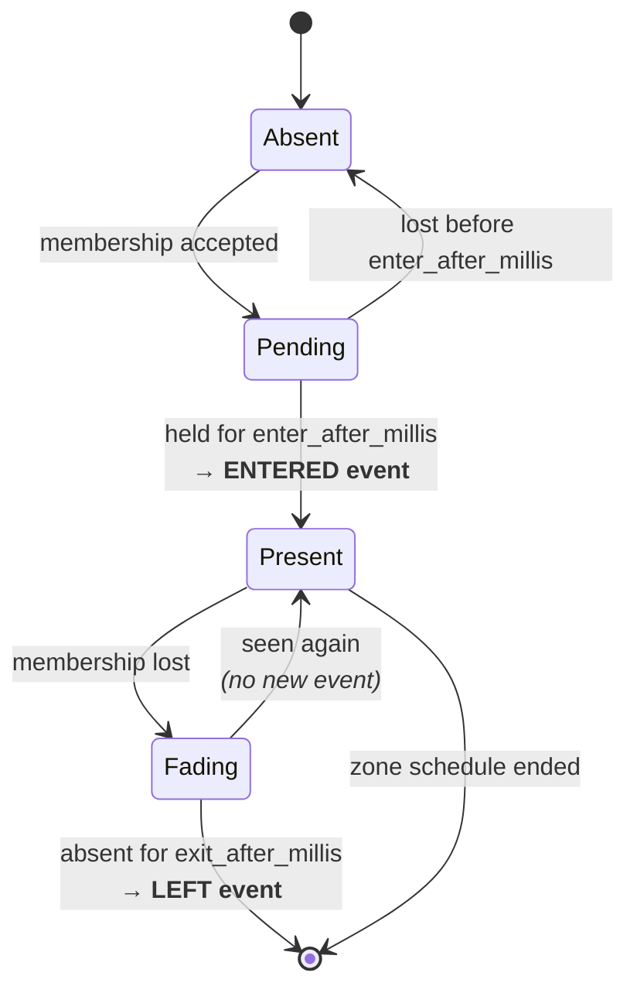

Exit is **slower** than entry on purpose. A detector that loses an object for two
frames has not seen it leave, and treating it as if it had turns one person
loitering for four minutes into eight two-minute intrusions.

### Membership is three states, not two

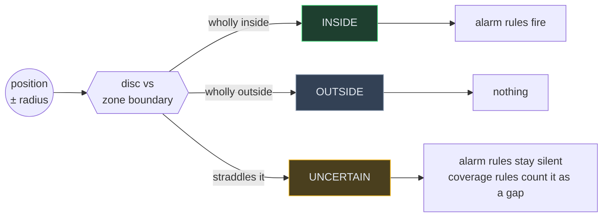

An object 3 m outside a fence, known to ±8 m, is neither in nor out. Calling it
"outside" is a guess dressed as a measurement; calling it "inside" is an alarm
nobody can justify.

---

## 8. Ground projection, and why uncertainty is not optional

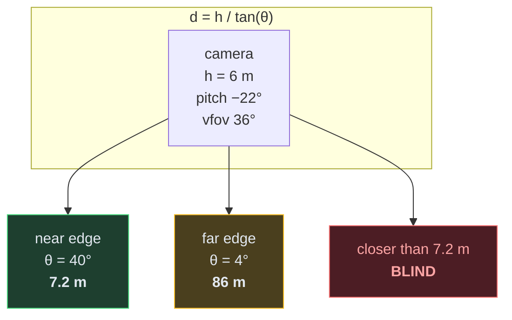

A camera claiming 90 m of range covers **7 m to 86 m** and is blind at its own
mast. The footprint is therefore an *annular sector*, not a pie slice — and the
placement dialog says so as an installer types the pose, because the alternative
is finding out from an intrusion nobody was alerted to.

Uncertainty grows **super-linearly** with distance, because
`|dd/dθ| = h / sin²(θ)`:

| Distance from camera | Mean 1σ uncertainty |
|---|---|
| 0–8 m | 0.44 m |
| 8–10 m | 0.59 m |
| 10–12 m | 0.70 m |
| 12–15 m | 1.02 m |
| 15–25 m | 1.52 m |

Distance and uncertainty correlate at **r = 0.991**. That is why a detection near
the horizon must never be drawn like one at the camera's feet, and why the plan
view draws every object as a disc whose radius is its actual error.

---

## 9. Detection — two detectors, one contract

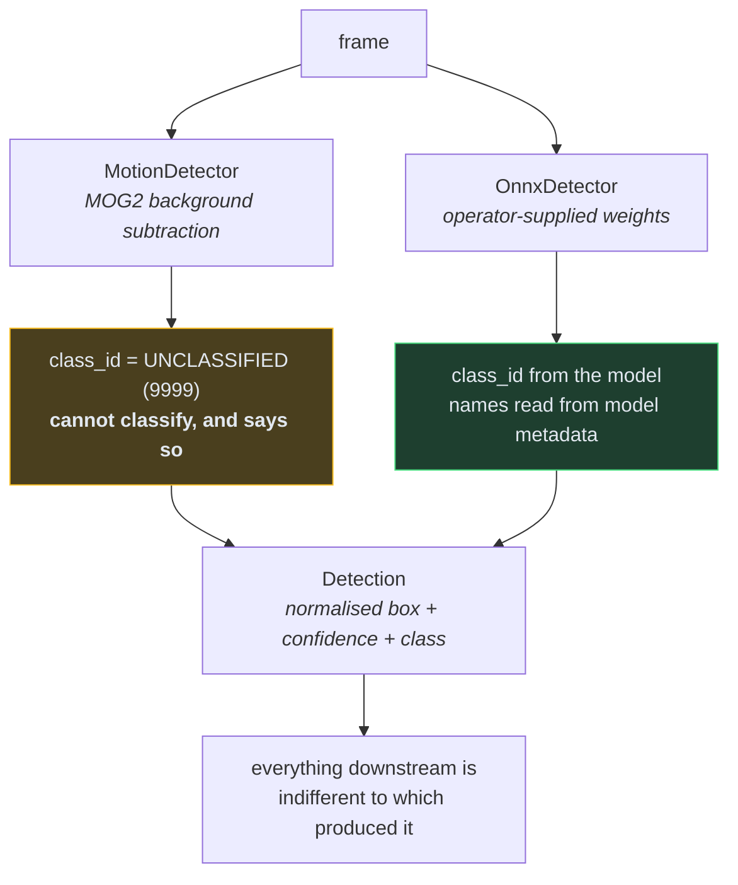

`UNCLASSIFIED = 9999` is deliberately **not** 0 — 0 is "person" in essentially
every detection model, and a motion blob silently inheriting that id is exactly
the confusion the constant exists to prevent.

### Two tuning decisions, both counter-intuitive, both measured

**The morphology kernel is tall and narrow, not square.** Every spurious
detection on the reference scene turned out to be a *fragment of a real object*,
never noise. A vertical kernel rejoins an upright body while leaving two people
side by side as two objects.

| | square 9×9 | vertical 3×31 |
|---|---|---|
| Recall @ IoU > 0.3 | 0.64 | **0.71** |
| Mean overlap with truth | 0.40 | **0.51** |
| Fragments per frame | 1.20 | **0.42** |

**The association gate is an ellipse, not a circle.** A camera looking at the
ground maps vertical image motion to *depth*. A circular gate scaled by an
upright object's height permits a one-frame leap of tens of metres in world
terms — which is how a track hands its identity to somebody who just walked into
shot 100 px above it.

### What background subtraction genuinely cannot do

| Reference walker | Recall |
|---|---|
| `approaching` — walks the full depth | 0.89 |
| `crossing` — crosses the scene | 0.70 |
| `loiterer` — **stops moving** | **0.49** |

This is not a bug to be tuned away; it is what background subtraction *is*. The
worst case is the object that stops — which is the loitering case, the one a
security system most needs. The tracker's gap budget bridges it partially. A real
detector is the actual answer.

---

## 10. Correlation — object identity must be transitive

If camera 7 and 8 saw the same person, and 8 and 9 saw the same person, then all
three saw **one** person, even though 7 and 9 never overlapped.

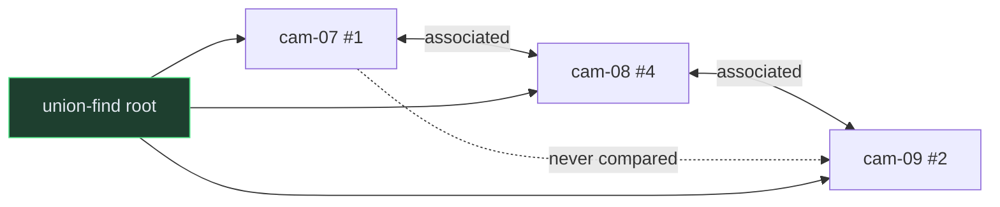

A pairwise implementation reports *two* objects here and the failure is silent.
The symptom is an incident that says "three people" about one — a visible error
that would undermine trust in everything else on the screen.

### Association accounts for uncertainty

```
allowance = 40 m + min(25 m, σ_a + σ_b)
```

Two positions 50 m apart, each known to ±20 m, are consistent with one object.
The same two known to ±1 m are not. The uncertainty allowance is **capped**, so
one badly-placed camera reporting ±60 m cannot swallow the whole site into a
single incident.

---

## 11. Risk — a score with its reasoning attached

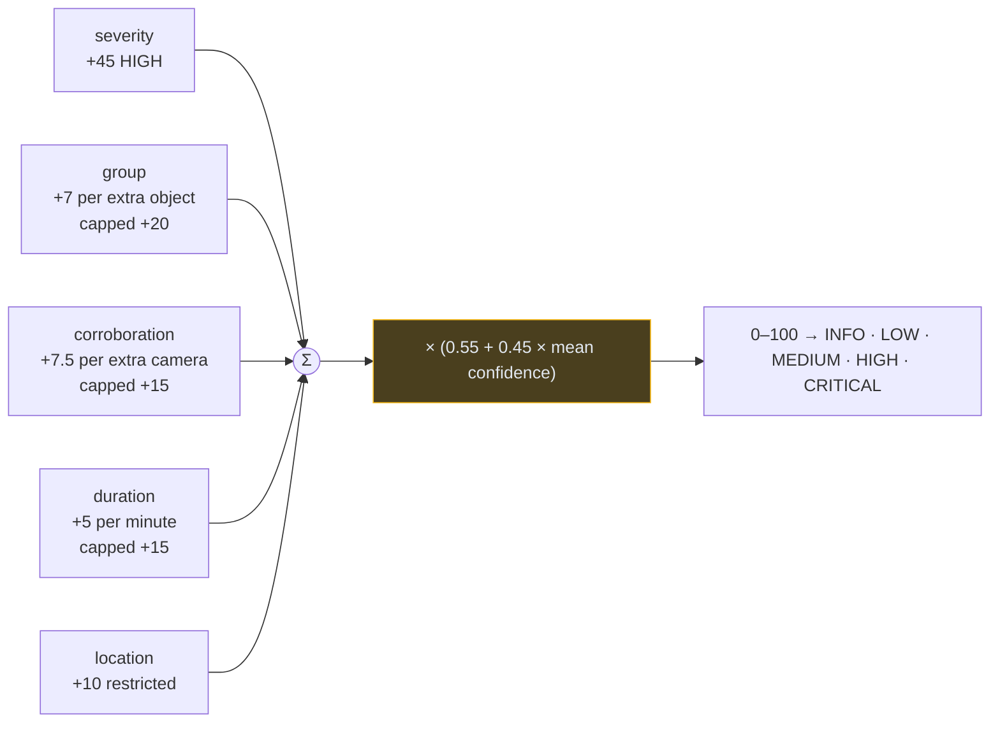

Confidence **scales** the total rather than adding to it, so an incident built
from weak observations cannot reach the top band by accumulating circumstances —
the evidence has to carry it.

The score is never shown without its factors. A number an operator cannot
interrogate is a number they eventually learn to ignore.

---

## 12. Persistence

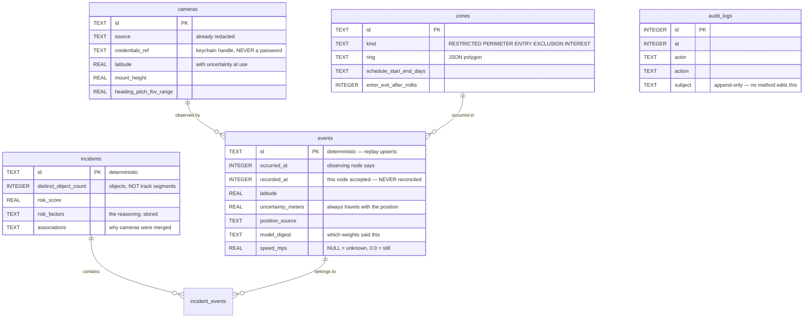

Six conventions, each a decision rather than a habit:

| Convention | Because |
|---|---|
| Timestamps are integer ms UTC | A timezone is a display setting, not a storage format |
| `occurred_at` and `recorded_at` never reconciled | A drifting camera clock is evidence about the deployment |
| No column holds a credential | A test walks the schema and fails on anything credential-shaped |
| A position never stored without its uncertainty | False precision in a map becomes a decision about where to send somebody |
| Writes idempotent on deterministic ids | The console re-correlates every 1.5 s; without upserts a 10-minute run leaves hundreds of copies |
| Foreign keys ON | SQLite defaults them off, silently permitting orphaned evidence |

---

## 13. Evidence export — what leaves the machine

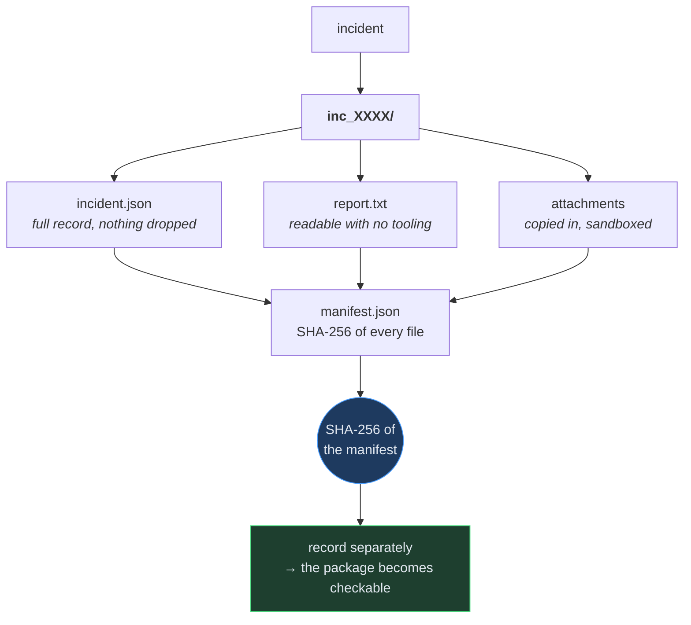

`verify_export()` needs **only the folder** — a package has to be checkable by
somebody with no access to the system that made it. It detects an altered file, a
removed file, *and* a file added afterwards.

What the export refuses to do:

- A position that was never determined is written `NOT DETERMINED`, not omitted.
  An absent line reads as an oversight; a stated one is a fact about what was
  knowable.
- Motion that could not be measured is written `UNKNOWN`, never `0.0`.
- A detector that cannot classify is labelled *"does not classify"*, and nothing
  in the package names what it found.
- A path escaping the destination is **refused**, not sanitised — quietly
  rewriting it hides both the bug and the attack.

---

## 14. Test topology

**585 tests**, plus two static checks that run before any of them. Where they
sit and what only they can catch:

```mermaid
flowchart TB
    subgraph gate["BEFORE ANY TEST — static"]
        AU["tools/offline_audit.py<br/><i>35 files scanned for cloud SDKs,<br/>telemetry packages, external hosts</i>"]
        DL["tools/docs_lint.py<br/><i>41 diagrams; a broken one renders<br/>as raw text with no error</i>"]
    end
    subgraph rust["core · 57 tests"]
        G["geometry.rs · 26<br/><i>the mathematics</i>"]
        T["tracking.rs · 20<br/><i>identity and motion</i>"]
        F["ffi.rs · 11<br/><i>null tolerance, layout, truncation</i>"]
    end
    subgraph eng["engine · 480 tests"]
        C["test_core · 36<br/><i>does the boundary lie?</i>"]
        DE["test_decode · 41<br/><i>credentials, timestamps, thread death</i>"]
        OG["test_offline_guarantee · 29<br/><i>watches the guard fail</i>"]
        DC["test_docs · 12<br/><i>watches the lint fail</i>"]
        DV["test_devices · 33<br/><i>each OS's device query,<br/>parsed from its own output</i>"]
        CL["test_cli · 43 · test_logs · 16 · test_packaging · 23"]
        DT["test_detect · 25 · test_onnx · 18"]
        Z["test_zones · 20 · test_events · 26"]
        IN["test_incidents · 29"]
        P["test_pipeline · 25 · test_multicamera · 11"]
        ST["test_store · 33 · test_evidence · 26"]
        RE["test_recording · 35<br/><i>a file loses no frames; retention<br/>never deletes evidence; a package<br/>says what it lacks</i>"]
    end
    subgraph con["console · 48 tests"]
        CO["placement · honesty · threading<br/>redaction · persistence · export"]
    end

    gate --> rust --> eng --> con

    style gate fill:#3f1e3f,stroke:#c084fc,color:#e2e8f0
    style rust fill:#1e3a5f,stroke:#4a9eff,color:#e2e8f0
    style eng fill:#1e3f2f,stroke:#4ade80,color:#e2e8f0
    style con fill:#3f2f1e,stroke:#fbbf24,color:#e2e8f0
```

### Tests that watch their own guard fail

Three suites exist not to test a feature but to test a *check*, because a check
nobody has watched fail is a check nobody knows works:

| Suite | Feeds it | Requires |
|---|---|---|
| `test_offline_guarantee` | source naming `boto3`, `sentry_sdk`, `https://api.some-vendor.com`, an OTLP exporter | each is caught — **and** `rtsp://admin:pw@192.168.1.64`, `https://node.local`, `http://[::1]:9000`, `https://[fd00::1]` all pass, because a guard that cries wolf gets switched off |
| `test_decode` (redaction) | nine URLs that each caused a real leak — a password containing `@`, a password with no username, an IPv6 literal, a non-numeric port, a credential in the query, no scheme at all | the secret is unreachable through `repr`, `str`, source id, display URL and every error message, asserted with `contains_credential`, which extracts the secrets from *that* URL rather than matching one hard-coded sentinel |
| `test_core` (loader) | a library that loads but exports no `sentinel_abi_version`; one that reports the wrong version | `CoreError` naming the rebuild — never `AttributeError` naming whichever symbol was looked up first |
| `test_docs` | a label split across lines, a literal `\n`, an unbalanced bracket, a `style` naming a node that does not exist | each is caught — **and** an ER diagram's `\|\|--o{` cardinality and a state diagram's composite braces pass, because both are unbalanced per line and both are correct |

The mathematics is tested in Rust, where it lives. The Python tests over the same
area deliberately do **not** re-test it — they test what only a caller can break:
struct layouts, ownership, buffer limits, and whether a value correct in Rust is
still correct after it crosses. Read them as *"does the boundary lie?"* rather
than *"is the maths right?"*.

### Code size

| Component | Files | Lines |
|---|---:|---:|
| `core/src` (Rust) | 4 | 3,621 |
| `engine/sentinel` (Python) | 10 | 5,526 |
| `engine/tests` | 19 | 5,865 |
| `apps/console/sentinel_console` | 9 | 2,494 |
| `apps/console/tests` | 2 | 836 |
| `tools` (offline audit, docs lint) | 2 | 419 |
| **Total** | **46** | **18,761** |

Tests are **36%** of the tree, and the two guards in `tools/` are themselves
tested. For a system whose output is evidence, that ratio is the point rather
than a statistic.

---

## 15. Throughput, and what actually limits it

"Make it scale" is a question that cannot be answered by adding a framework and
hoping. It needs two measurements first: what fraction of a frame each stage
costs, and what happens when cameras run side by side.

### Where the time goes

Per frame, 640×480, measured separately:

| Stage | Cost | Share |
|---|---:|---:|
| decode | 0.198 ms | 6.0% |
| **detect** | **3.117 ms** | **93.6%** |
| track + project (the Rust core) | 0.015 ms | 0.4% |

**The Rust core is 0.4% of the budget.** Any effort spent making it faster —
`rayon`, SIMD, a batched FFI — would be effort spent on four thousandths of the
problem. This is why the C ABI's per-call overhead has never mattered and why no
async runtime appears anywhere in this codebase.

### What happens with several cameras

Eight workers, each running the stage in its own thread, `cv2` limited to one
thread each so they compete for cores the way a real node would:

| Workload | Speedup with 8 workers | |
|---|---:|---|
| memory-only loop | **14.5×** | `██████████████` |
| Gaussian blur | **6.8×** | `███████` |
| **MOG2 detection** | **2.1×** | `██` |
| decode | 1.1× | `█` |

A Gaussian blur scales 6.8×. A memory-only loop scales 14.5×. **MOG2 plateaus at
2.1×** — and the plateau is the same whether the cameras are threads or separate
OS processes (measured: processes were 0.75–0.87× as fast, start-up included).

So the constraint is **not** the GIL, not Python, and not the FFI boundary. It is
MOG2's per-pixel mixture-of-Gaussians state, read and written every frame. Four
detectors at 640×480 keep tens of megabytes of model hot, and they evict each
other from cache.

### The lever that actually applies

Shrinking the frame the background model sees shrinks that state quadratically:

| `detect_scale` | 1 worker | 8 workers | recall | mean IoU |
|---|---:|---:|---:|---:|
| 1.00 | 236 fps | 455 fps | 0.690 | 0.503 |
| **0.75 (default)** | **349 fps** | **784 fps** | **0.707** | **0.511** |
| 0.50 | 1018 fps | 1927 fps | 0.652 | 0.460 |
| 0.35 | 900 fps | 4189 fps | 0.616 | 0.419 |

**0.75 is better on both axes** — 1.7× the throughput *and* slightly better
detection, because the downscale is a mild denoise. It also reduced fragmentation
on the reference scene from 5 tracks to 4 for three people. 0.5 buys 4.2× for a
real cost in recall, and is the right choice for a node carrying more cameras
than it has cores.

Nothing downstream needed changing: every threshold in the detector is a fraction
of the frame and every box is normalised, so a detection means the same thing at
any scale. A test pins that.

### Capacity, stated honestly

| | fps | ms/frame |
|---|---:|---:|
| Motion detector, 16 threads, 0.75 scale | 433 | 2.31 |
| Whole pipeline, 1 camera | ~190 | ~5.2 |
| Aggregate, 4 cameras | ~380 | — |
| Aggregate, 16 cameras | ~370 | — |

At 16 cameras each pipeline still runs at ~25 fps, comfortably above the 15 fps a
camera delivers. **One node handles 16 cameras today** — with one caveat that
dominates everything above: a real detection model will take far more than 3 ms
a frame, and will become the entire budget. Optimising MOG2 further would be
optimising something that is about to be replaced.

> Reproduce all of this with `python engine/tests/bench_scaling.py`. It prints
> its own conditions, because a throughput claim without them is not a
> measurement.

### Why no framework was added

| Candidate | Verdict |
|---|---|
| `rayon` in the Rust core | The core is 0.4% of the frame. Nothing to win. |
| `tokio` | No network path exists yet; when one does, it is per-event, not per-frame. |
| Batched FFI across cameras | Per-call overhead is already invisible inside 0.015 ms. |
| `multiprocessing` per camera | **Measured**: 0.75–0.87× of threads. The GIL was not the constraint. |
| Free-threaded Python (PEP 703) | Would remove a limit that measurement shows is not binding. |
| Downscaling the background model | **Adopted.** 1.7× throughput, better recall, no dependency. |

The framework that would have helped is the one that was not needed. That is
worth recording, because the next person to ask this question deserves the
measurements rather than the conclusion.

## 16. Bounded, and how

Four collections grew for as long as the process ran. On a demonstration that is
invisible; on a node left running for a month it is the reason it dies.

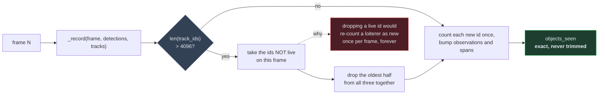

The distinct-object count is the number that matters — it is what a fragmenting
tracker inflates and what the whole funnel is measured against — so it is counted
as ids arrive rather than derived from `len()` of a set that gets trimmed.
Trimming can then be as aggressive as it needs to be without touching the answer.

The fourth was on the other side of the FFI boundary: `field_of_view` sized its
output buffer from the segment count it was *asked* for, while the core clamps to
a minimum of two. Below that the ring was truncated to fit and the truncation
status discarded — measured at `arc_segments=0`, 4 of 6 points came back. An open
polygon drawn on the map claims coverage that does not exist, which is the same
class of error as an invented position.

---

## 17. What this does not establish

Every measurement above comes from **rendered footage**. The files are real —
genuine containers written by a real encoder and read by a real decoder, so the
decode path under test is the one a camera exercises. The *content* is generated
geometry.

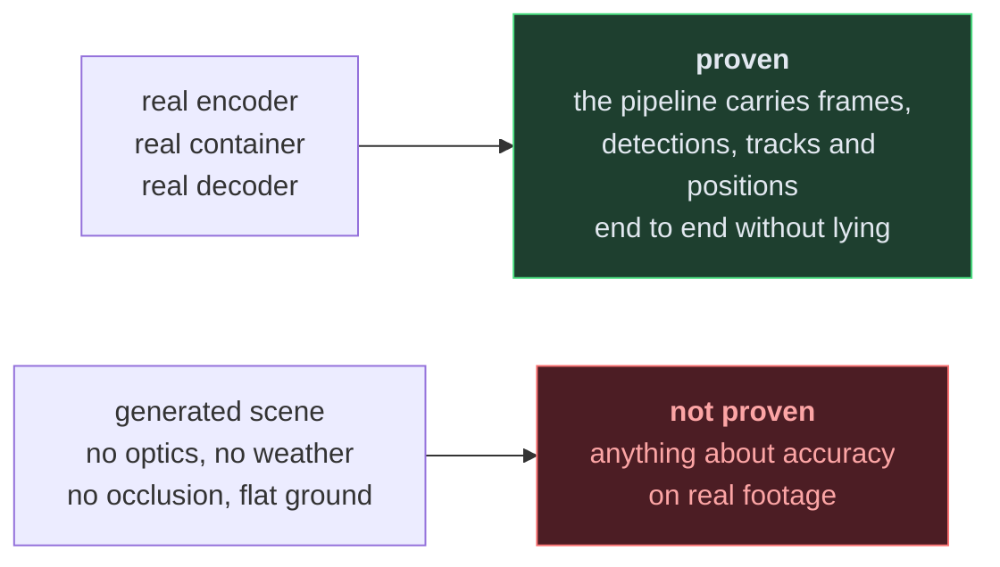

See [STATUS.md](../STATUS.md) for the full list of gaps, each stated plainly.
