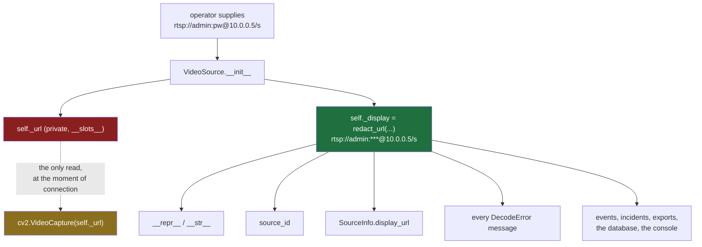
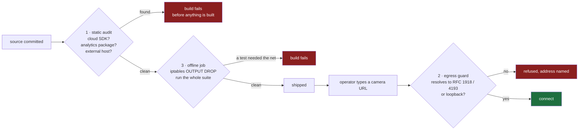

# Security

> **Status.** Implemented and tested today: credential redaction (through every
> escape route, including leaking a password's *length*), the camera-URL egress
> guard, the static offline source audit, and the CI offline job that proves the
> network is actually blocked before it runs anything. Designed here and **not
> built**: authentication, authorisation, audit log, mTLS pairing, keychain
> storage, and a process-wide egress guard covering paths other than decode —
> **no secret is persisted at all today**, because nothing yet persists one. Each
> section below carries its own state; where a control is described in the future
> tense it is not there yet. See [STATUS.md](../STATUS.md).

## Threat model

The system holds continuous video of a physical site, the credentials to every
camera on it, and a map of where those cameras cannot see. An attacker who
obtains any of those gains more than they would from most databases.

### Assumed adversaries

| Adversary | Capability | Primary controls |
|---|---|---|
| **LAN attacker** | On the same subnet. Can send arbitrary traffic to any node and impersonate an unpaired device. | mTLS, pinned node identity, explicit human-approved pairing, replay protection, rate limits |
| **Hostile camera** | A compromised or counterfeit device on a trusted address. Sends malformed RTSP/ONVIF. | Decoder isolation, bounded queues, restart-on-wedge, no parsing in a privileged process |
| **Curious insider** | A valid low-privilege account. | Permission-based authorization, audit on every privileged action, confirmation on destructive ones |
| **Evidence tamperer** | Wants a recording to disappear or change. | Content-addressed evidence, SHA-256 manifests, append-only audit and notes |
| **Supply chain** | A malicious or compromised dependency. | Zero third-party runtime dependencies in core packages; egress guard; no auto-update |
| **Physical thief** | Takes the machine. | Secrets in the OS keychain rather than in files; disk encryption is the operator's responsibility and is documented as such |

### Explicitly out of scope

- A compromised control node with an authenticated admin session. At that point
  the attacker *is* the operator.
- Host operating system compromise.
- Coercion of an authorised operator.

## The LAN is hostile

The single most common mistake in this product category is treating the local
network as a trust boundary. It is not. Possession of a LAN address grants
nothing.

```
 worker                                     control
   |  discovery announce (node_id, pubkey fingerprint, caps)
   |------------------------------------------>
   |                     operator sees a pending node and compares a six-word
   |                     fingerprint off-channel before approving
   |  <---- pairing challenge (nonce, control cert) ----
   |  ---- signed response + CSR ------------->
   |  <---- signed worker cert, trust anchor ----------
   |
   |  === mTLS 1.3 from here; certificates pinned by node_id ===
```

`node_id` is **derived from the node's public key**, so a node cannot rename
itself into another node's trust slot.

Every message carries a request id and a timestamp. `ReplayGuard` refuses a
message outside a narrow time window or with a request id it has already seen, and
bounds its own memory to that window so an attacker cannot drive it into
exhaustion.

## Credentials — **IMPLEMENTED / TESTED**

**A camera password never enters the database, a log, an event payload, a URL
that reaches interface code, an error, or an export.**

The enforcement is structural rather than procedural, because "remember not to
log the URL" is not a control. There is exactly one place the credential lives
and one moment it is used:



- **The URL is private and the object cannot print it.** `VideoSource` uses
  `__slots__`, keeps the raw URL in `_url`, and defines `__repr__` — with
  `__str__` aliased to it — to render the redacted form. Interpolation into an
  f-string, a `print`, a `repr` in a traceback and a debugger all fail safe.
  `_url` is read in exactly one place: the call that opens the capture.
- **Everything downstream is given the redacted form and never the raw one.**
  `source_id` defaults to it, `SourceInfo.display_url` carries it, and every
  `DecodeError` is built from it — so an exception cannot become the leak, which
  is the escape route that catches most systems.
- **`redact_url` is string surgery, not URL parsing.** It never round-trips
  through a parser, because a parser normalises, and a URL that fails to parse is
  precisely the one carrying an awkward password. It splits on `://`, takes the
  netloc, and uses `rpartition("@")` — not `partition` — because *the password
  may itself contain `@`*. Credential-bearing query parameters
  (`password`, `pwd`, `pass`, `token`, `auth`, `secret`, `key`, …) are replaced
  by value, so `?password=hunter2` is covered as well as `user:pass@host`.
- **The replacement is a fixed `***`,** never a run of stars matching the
  password's length. Leaking a password's length is leaking part of the password.

**How this is tested.** `engine/tests/test_decode.py` asserts the secret is
absent from the repr, the str, the source id, the display URL, every error
message, and the frame metadata — and does it with `contains_credential(text,
url)`, which extracts the secrets from *that* URL rather than matching one
hard-coded sentinel, so a leak through a path nobody anticipated still fails.
Each awkward case in the table below was a real leak found by writing the test:

| Case | URL |
|---|---|
| a password containing `@` | `rtsp://admin:p@ss:w0rd@10.0.0.5/s` |
| a password but no username | `rtsp://:onlypass@10.0.0.5/s` |
| an IPv6 literal | `rtsp://user:pw@[2001:db8::1]:554/s` |
| a non-numeric port | `rtsp://user:pw@host:notaport/s` |
| a credential in the query | `http://cam/stream?user=admin&password=…` |
| no scheme at all | `admin:pw@10.0.0.5/s` |

### Persistence — **PLANNED**

Nothing persists a camera password today, so nothing can leak one from storage.
When it does, the design is: the database stores `credentials_ref`, an opaque
handle into the OS keychain (Windows Credential Manager, macOS Keychain, Linux
Secret Service), and never the secret. The `cameras` table already carries the
`credentials_ref` column and no password column, so the shape is in place ahead
of the mechanism. A schema test walks every column looking for anything
credential-shaped, which is what will keep it that way.

## Zero WAN, enforced

The offline guarantee is only worth something if something other than good
intentions enforces it. Three mechanisms do, at three different times, and each
catches what the others cannot.

| # | Mechanism | Where | When it fires | State |
|---|---|---|---|---|
| 1 | Static source audit | `tools/offline_audit.py` | Commit / CI, before any toolchain runs | **TESTED** |
| 2 | Runtime egress guard | `VideoSource._require_private` | Before a camera socket opens | **TESTED** |
| 3 | Offline acceptance job | `.github/workflows/ci.yml` | Whole suite, outbound traffic dropped | **TESTED** |



**1 — the static audit.** Scans the shipped source (`engine/sentinel`,
`apps/console/sentinel_console`, `core/src`, `tasks.py`, `tools`) and fails the
build on a cloud SDK import, an analytics or crash-reporting package, or a
hard-coded host that is not loopback, RFC 1918/4193, link-local or a
documentation-reserved name. It runs as the **first** CI job, with no toolchain
and no dependencies, because if the source names a destination off the site then
nothing else is worth running. Documentation, tests and the CI definition are
deliberately *not* scanned: all three name external hosts on purpose — the
offline job proves it cannot reach `example.com` — and a scanner that forbade
writing that down would forbid the proof.

The audit is itself tested (`engine/tests/test_offline_guarantee.py`): every
class of finding is fed to it as deliberately bad source and required to be
caught, and every URL the product legitimately contains is required to pass. A
guard nobody has watched fail is a guard nobody knows works.

**2 — the runtime egress guard.** A camera URL is the one string an operator
types that the software then *connects to*, which makes it the natural way the
promise gets broken — by a typo, by a misconfigured DNS entry resolving to a
public address, or deliberately. Every address a camera host resolves to must be
loopback or inside RFC 1918 / RFC 4193; one public answer refuses the whole
connection. A name that does not resolve is refused rather than resolved
onward — the system will not reach the Internet to find out whether it is
allowed to reach the Internet.

The error names the address, because an operator who genuinely means to reach a
routable host needs to know exactly what stopped them and that it was deliberate:

> Refused to contact "…". Sentinel Vision operates without Internet access by
> design and never falls back to an online service.

**Scope, stated honestly.** The guard is on the decode path, which is the only
place this build opens an outbound socket. It is *not* a process-wide socket
filter: when the control plane and node pairing are built, each will need the
same check at its own boundary, and the static audit is what makes a new
dependency that skips it visible. `PLANNED`: hoisting all three into one
`EgressGuard` that every outbound path must route through.

**3 — the offline acceptance job.** Blocks all outbound traffic except loopback,
*proves the block works* by requiring `curl https://example.com` to fail, and
only then runs the Rust, engine and console suites. Mechanisms 1 and 2 are
claims about code; this is the claim about the product, tested the way an
operator would test it — by unplugging the cable.

## Authorization

Checks are always against a **permission**, never a role name, so adding or
widening a role cannot accidentally open a door elsewhere.

| Role | Can |
|---|---|
| `VIEWER` | See cameras, zones, events, incidents, recordings |
| `OPERATOR` | The above, plus acknowledge/resolve incidents, edit zones, control PTZ, export |
| `ANALYST` | Review, export, and read the audit log; cannot operate cameras |
| `ADMIN` | Everything |

An inactive account holds no permissions regardless of its roles.

Authorization failures state what was required, never what the caller holds —
enumerating a user's permissions to an unauthorised caller is itself a leak.

### High-risk actions

Delete camera, delete evidence, export incident, change retention, control PTZ,
modify node, change rules, edit users. Holding the permission is not sufficient:
the UI requires explicit confirmation, and the action is audited whether it
succeeds, is denied, or errors.

## Audit

`audit_logs` is append-only. Each record carries timestamp, user, node, request
id, action, target, redacted before/after snapshots, and outcome. There is no code
path that updates or deletes a row: a trail that can be rewritten after the fact
is not a trail.

## Privacy by design

- No facial recognition. No biometric identification. No identity database.
- Tracking is appearance-based and identity-free; the optional embedding used for
  cross-camera association is a similarity vector, not an identifier, and is never
  matched against any enrolled set.
- Detection classes are physical and non-biometric.
- The AI analyst is forbidden from asserting identity, inferring protected traits,
  or claiming criminality, and reports violating that are rejected before display.
- Optional face blurring for exported evidence.

## Reporting a vulnerability

This is a portfolio and reference implementation, not a deployed product. If you
find a flaw, open an issue describing the impact and the reproduction. Do not
include real credentials, real footage, or a real site's camera topology.
