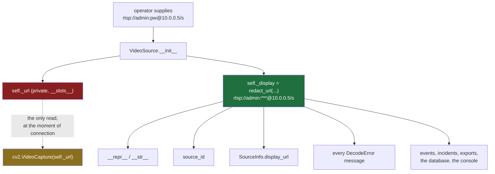
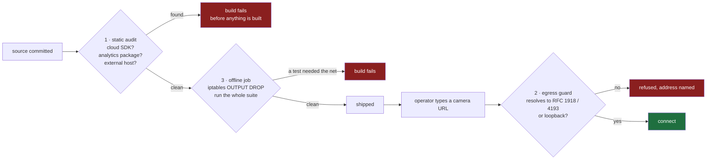

# Security

> **Status.** Implemented and tested today: credential redaction (through every
> escape route, including leaking a password's *length*), the camera-URL egress
> guard, the static offline source audit, and the CI offline job that proves the
> network is actually blocked before it runs anything. Designed here and **not
> built**: authentication, authorisation, audit log, mTLS pairing, keychain
> storage, and a process-wide egress guard covering paths other than decode —
> **no secret is persisted at all today**, because nothing yet persists one. Each
> section below carries its own state; where a control is described in the future
> tense it is not there yet. See [STATUS.md](../STATUS.md).

## Threat model

The system holds continuous video of a physical site, the credentials to every
camera on it, and a map of where those cameras cannot see. An attacker who
obtains any of those gains more than they would from most databases.

### Assumed adversaries

| Adversary | Capability | Primary controls |
|---|---|---|
| **LAN attacker** | On the same subnet. Can send arbitrary traffic to any node and impersonate an unpaired device. | mTLS, pinned node identity, explicit human-approved pairing, replay protection, rate limits |
| **Hostile camera** | A compromised or counterfeit device on a trusted address. Sends malformed RTSP/ONVIF. | Decoder isolation, bounded queues, restart-on-wedge, no parsing in a privileged process |
| **Curious insider** | A valid low-privilege account. | Permission-based authorization, audit on every privileged action, confirmation on destructive ones |
| **Evidence tamperer** | Wants a recording to disappear or change. | Content-addressed evidence, SHA-256 manifests, append-only audit and notes |
| **Supply chain** | A malicious or compromised dependency. | Every dependency must be offline at runtime, enforced by a static source audit and an offline CI job; no auto-update; the Rust core has none at all. See [Dependencies](#dependencies) — including what is *not* yet enforced |
| **Physical thief** | Takes the machine. | Secrets in the OS keychain rather than in files; disk encryption is the operator's responsibility and is documented as such |

### Explicitly out of scope

- A compromised control node with an authenticated admin session. At that point
  the attacker *is* the operator.
- Host operating system compromise.
- Coercion of an authorised operator.

## The LAN is hostile

The single most common mistake in this product category is treating the local
network as a trust boundary. It is not. Possession of a LAN address grants
nothing.

```
 worker                                     control
   |  discovery announce (node_id, pubkey fingerprint, caps)
   |------------------------------------------>
   |                     operator sees a pending node and compares a six-word
   |                     fingerprint off-channel before approving
   |  <---- pairing challenge (nonce, control cert) ----
   |  ---- signed response + CSR ------------->
   |  <---- signed worker cert, trust anchor ----------
   |
   |  === mTLS 1.3 from here; certificates pinned by node_id ===
```

`node_id` is **derived from the node's public key**, so a node cannot rename
itself into another node's trust slot.

Every message carries a request id and a timestamp. `ReplayGuard` refuses a
message outside a narrow time window or with a request id it has already seen, and
bounds its own memory to that window so an attacker cannot drive it into
exhaustion.

## Credentials — **IMPLEMENTED / TESTED**

**A camera password never enters the database, a log, an event payload, a URL
that reaches interface code, an error, or an export.**

The enforcement is structural rather than procedural, because "remember not to
log the URL" is not a control. There is exactly one place the credential lives
and one moment it is used:



- **The URL is private and the object cannot print it.** `VideoSource` uses
  `__slots__`, keeps the raw URL in `_url`, and defines `__repr__` — with
  `__str__` aliased to it — to render the redacted form. Interpolation into an
  f-string, a `print`, a `repr` in a traceback and a debugger all fail safe.
  `_url` is read in exactly one place: the call that opens the capture.
- **Everything downstream is given the redacted form and never the raw one.**
  `source_id` defaults to it, `SourceInfo.display_url` carries it, and every
  `DecodeError` is built from it — so an exception cannot become the leak, which
  is the escape route that catches most systems.
- **`redact_url` is string surgery, not URL parsing.** It never round-trips
  through a parser, because a parser normalises, and a URL that fails to parse is
  precisely the one carrying an awkward password. It splits on `://`, takes the
  netloc, and uses `rpartition("@")` — not `partition` — because *the password
  may itself contain `@`*. Credential-bearing query parameters
  (`password`, `pwd`, `pass`, `token`, `auth`, `secret`, `key`, …) are replaced
  by value, so `?password=hunter2` is covered as well as `user:pass@host`.
- **The replacement is a fixed `***`,** never a run of stars matching the
  password's length. Leaking a password's length is leaking part of the password.

**How this is tested.** `engine/tests/test_decode.py` asserts the secret is
absent from the repr, the str, the source id, the display URL, every error
message, and the frame metadata — and does it with `contains_credential(text,
url)`, which extracts the secrets from *that* URL rather than matching one
hard-coded sentinel, so a leak through a path nobody anticipated still fails.
Each awkward case in the table below was a real leak found by writing the test:

| Case | URL |
|---|---|
| a password containing `@` | `rtsp://admin:p@ss:w0rd@10.0.0.5/s` |
| a password but no username | `rtsp://:onlypass@10.0.0.5/s` |
| an IPv6 literal | `rtsp://user:pw@[2001:db8::1]:554/s` |
| a non-numeric port | `rtsp://user:pw@host:notaport/s` |
| a credential in the query | `http://cam/stream?user=admin&password=…` |
| no scheme at all | `admin:pw@10.0.0.5/s` |

### Persistence — **IMPLEMENTED / TESTED** (2026-09-06)

The database stores `credentials_ref`, a random opaque handle; the secret goes
to the operating system's keychain through `keyring` — Windows Credential
Manager, the macOS Keychain, Secret Service on Linux — under that handle
(`sentinel.secrets`). Adding a network camera files the password there and the
stored source is the redacted form; a restarted node reads the handle, asks the
keychain, and rebuilds the URL in memory (`redact.with_password`, the exact
inverse of `redact_url`, tested on the awkward URLs above). Removing a camera
forgets the entry. `sentinel password CAMERA` prompts for a password — it is
never an argument, because an argument is in every process listing — and
`run`/`node` warn when a source on the command line carries one. A machine
with no usable keychain (a container without D-Bus) is detected: nothing is
stored, the camera needs its password again after a restart, and the log says
so. A backup of the database contains handles, not secrets.

## Zero WAN, enforced

The offline guarantee is only worth something if something other than good
intentions enforces it. Three mechanisms do, at three different times, and each
catches what the others cannot.

| # | Mechanism | Where | When it fires | State |
|---|---|---|---|---|
| 1 | Static source audit | `tools/offline_audit.py` | Commit / CI, before any toolchain runs | **TESTED** |
| 2 | Runtime egress guard | `VideoSource._require_private` | Before a camera socket opens | **TESTED** |
| 3 | Offline acceptance job | `.github/workflows/ci.yml` | Whole suite, outbound traffic dropped | **TESTED** |



**1 — the static audit.** Scans the shipped source (`engine/sentinel`,
`apps/console/sentinel_console`, `core/src`, `tasks.py`, `tools`) and fails the
build on a cloud SDK import, an analytics or crash-reporting package, or a
hard-coded host that is not loopback, RFC 1918/4193, link-local or a
documentation-reserved name. It runs as the **first** CI job, with no toolchain
and no dependencies, because if the source names a destination off the site then
nothing else is worth running. Documentation, tests and the CI definition are
deliberately *not* scanned: all three name external hosts on purpose — the
offline job proves it cannot reach `example.com` — and a scanner that forbade
writing that down would forbid the proof.

The audit is itself tested (`engine/tests/test_offline_guarantee.py`): every
class of finding is fed to it as deliberately bad source and required to be
caught, and every URL the product legitimately contains is required to pass. A
guard nobody has watched fail is a guard nobody knows works.

**2 — the runtime egress guard.** A camera URL is the one string an operator
types that the software then *connects to*, which makes it the natural way the
promise gets broken — by a typo, by a misconfigured DNS entry resolving to a
public address, or deliberately. Every address a camera host resolves to must be
loopback or inside RFC 1918 / RFC 4193; one public answer refuses the whole
connection. A name that does not resolve is refused rather than resolved
onward — the system will not reach the Internet to find out whether it is
allowed to reach the Internet.

The error names the address, because an operator who genuinely means to reach a
routable host needs to know exactly what stopped them and that it was deliberate:

> Refused to contact "…". Sentinel Vision operates without Internet access by
> design and never falls back to an online service.

**There is one override, and it is loud.** `SENTINEL_ALLOW_PUBLIC_SOURCES=1`
in the environment of the process lets a camera that resolves to a routable
address through — for a camera on a routed private WAN, not for the Internet.
It is an environment variable rather than a setting so that it cannot be
ticked by accident; the product never sets it; `logs.configure` says at
WARNING on every start that it is set; and `VideoSource._require_private` logs
every connection it allows, with the address. An earlier version of this
document and of USAGE said there was no override. There was, in the code and
in the refusal's own message, and a control described wrongly is worse than one
described not at all.

**Scope, stated honestly.** The guard is on the decode path, which is the only
place this build opens an outbound socket. It is *not* a process-wide socket
filter: when the control plane and node pairing are built, each will need the
same check at its own boundary, and the static audit is what makes a new
dependency that skips it visible. `PLANNED`: hoisting all three into one
`EgressGuard` that every outbound path must route through.

**3 — the offline acceptance job.** Blocks all outbound traffic except loopback,
*proves the block works* by requiring `curl https://example.com` to fail, and
only then runs the Rust, engine and console suites. Mechanisms 1 and 2 are
claims about code; this is the claim about the product, tested the way an
operator would test it — by unplugging the cable.

## Dependencies

**Third-party packages are allowed. The network is available when the system is
installed, and never again.**

That is the whole rule, and it is a deliberate change from an earlier position of
"zero third-party runtime dependencies", which was a supply-chain control bought
by writing everything by hand. The cost of that was not paying for itself: a
security platform needs an ONVIF client, a certificate library, a keychain
binding, a geometry library and a local inference runtime, and hand-rolling any
of those produces something worse than the maintained version — including
security-worse, which is the opposite of what the rule was for.

| | Network |
|---|---|
| `pip install`, `cargo build` | **Allowed.** Resolves from an index like any other software |
| Everything after that | **Never.** The product works with the cable unplugged |

### What that means when choosing a package

A package is disqualified, however good it is, if at *runtime* it:

- downloads models, weights, tiles, fonts or schemas on first use — this is the
  common one, and it disqualifies several otherwise-obvious choices;
- sends telemetry or analytics of any kind;
- checks for updates, checks a licence, or calls home for any reason;
- requires a cloud service or an account;
- resolves an external hostname.

A package that *can* be used offline but does not by default is acceptable only
with the configuration that makes it so written down at the point of use — the
way `onnxruntime`'s telemetry is switched off explicitly in `detect.py` rather
than assumed to be off.

### Installing with no Internet at all

An air-gapped site never gets the install step either. That is supported and is
the reason the rule is about *runtime* rather than about the package list:

```bash
# On a connected machine, once:
pip download -d wheelhouse -r requirements.txt
cargo vendor

# Carry the wheelhouse in, then on the appliance:
pip install --no-index --find-links wheelhouse -r requirements.txt
```

Nothing about the product changes; the packages simply arrive on a disk instead
of over a wire.

### The dependency that was already phoning home

Written down because it is the case this whole section exists for, and because
it was found *after* the policy was written rather than before.

**onnxruntime — a dependency this project has shipped from the beginning —
contains a Microsoft 1DS telemetry uploader in its Linux and macOS wheels.**
Verified by downloading the manylinux wheel and scanning the shipped `.so`, not
by reading documentation:

| Found in `libonnxruntime.so.1.29.0` | |
|---|---|
| A OneCollector endpoint, with an ingestion token | ×3 |
| `mbedtls` symbols — a statically linked TLS stack | ×127 |
| `onnxruntime.db` — a persistent device identifier | ×1 |
| `osDescription`, `cpuModel`, `totalMemoryMB` | the payload |

Microsoft's own privacy documentation states telemetry is **on by default in
the official builds**, and PyPI wheels are the official builds. The Windows
wheels carry an ETW provider instead, which routes into the operating system's
diagnostics pipeline rather than over a socket.

So a Linux worker node running this engine would, by default, have posted a
machine fingerprint to Microsoft over HTTPS — while the product told the
operator to their face that it sends nothing anywhere.

**What is done about it.** `sentinel/telemetry.py` sets `ORT_DISABLE_TELEMETRY`
at every entry point *before* the native library initialises, and calls
`disable_telemetry_events()` for the runtime half. Both, because neither is
sufficient: the variable cannot reach a library already loaded, and the API
cannot un-send an initialisation event that Microsoft's documentation says may
already have been emitted before it becomes reachable.

**What is left.** The uploader is still in the binary. Only a source build with
`--no_telemetry` removes it, which means giving up PyPI wheels for onnxruntime
entirely. That is a real trade and it has not been made. The offline CI job is
what covers behaviour rather than configuration: the whole suite runs with
outbound traffic dropped, and the drop proven first.

**Why nothing caught it.** `offline_audit.py` reads `.py`, `.rs` and `.toml`.
Its own docstring says *"a dependency that phones home does so whether or not
this code asked it to"* — and a hostname inside a 28 MB shared object was
invisible to it for as long as it existed. `tools/binary_audit.py` is the guard
that reads compiled bytes, and it is why this is written in the past tense.

### What enforces this

| Control | Catches | State |
|---|---|---|
| `tools/offline_audit.py` | A cloud SDK, an analytics or telemetry package, or a hard-coded external host named anywhere in shipped source. First CI job, before any toolchain runs | `TESTED` |
| `tools/binary_audit.py` | A collector endpoint compiled **into a dependency**, where the source audit cannot see it. Distinguishes an inert certificate-chain URL from a live uploader, and records every acknowledged finding with what disarms it and what is left over | `TESTED` |
| `sentinel/telemetry.py` | Disarms known-default-on telemetry before the library that would send it is loaded | `TESTED` |
| Runtime egress guard | A camera address that resolves outside RFC 1918 / 4193 or loopback | `TESTED` |
| Offline CI job | The whole suite with outbound traffic dropped, *after proving the drop took effect* | `TESTED` |
| Rust core | Still has zero dependencies, and will keep them. It is arithmetic; there is nothing to import | `TESTED` |

### What does not enforce it yet

Stated plainly, because a control everybody believes exists and does not is worse
than no control:

- **Versions are floors, not pins.** `numpy>=2.0` resolves to whatever is current
  on the day somebody installs. There is no Python lock file and no hash
  pinning — `core/Cargo.lock` is the only lock in the repository. Two installs a
  month apart are not the same software.
- **Neither audit reads a dependency's *Python* source.** A package that is
  clean itself but pulls in a telemetry library transitively is caught only if
  that library ships a compiled endpoint the binary audit recognises, or names
  itself in a way the source audit would flag were it ours. A pure-Python
  phone-home inside a dependency passes both today.
- **Nothing verifies a package's runtime behaviour.** "It does not download
  anything" is currently established by reading and by reasoning, not by
  observing a process with the network taken away. The binary audit reads
  strings, which raises the cost of hiding a phone-home without making it
  impossible: a host assembled at runtime from parts is invisible to it.
- **The binary audit scans what is installed here, or the built bundle.** It
  does not scan a wheel before it is installed, so a compromised package is
  caught after it is on the machine rather than before.

The offline CI job partly covers the last of these — it exercises the real
dependencies with no route out — but only along the paths the tests reach.

---

## Authorization — **IMPLEMENTED / TESTED** (2026-09-06)

Local accounts live in the `users` table (migration 12): a name, a salted
scrypt hash, a role and an active flag. `sentinel users add|list|passwd|
disable|enable` manage them, with the password prompted for or read from
standard input, never an argument. The console asks who is there before it
opens: with no account it offers to create the first administrator (and can be
declined, in which case nothing is gated and the status bar says on every
start that the audit trail names nobody); with accounts it shows the sign-in
dialog, or takes `--user NAME` with the password on standard input for a
script. Five failures in a sitting close the dialog; five failures on a name
make every later attempt wait, longer each time, in that process. Every audit
row the console writes carries `console:<name>`; the CLI writes `cli:<os
account>`. What is **not** built: sessions and an application lock (the user
is held for the life of the window), and permission on the control plane,
which does not exist.

Checks are always against a **permission**, never a role name, so adding or
widening a role cannot accidentally open a door elsewhere.

The console's Monitor/Configure lock is **not a security boundary** on its
own: it exists so a hand on the mouse cannot move a camera by accident. It
becomes one only when accounts exist, because entering Configure then needs
the `site.configure` permission and the refusal is written to the audit
trail under the viewer's name. The same permission gates the command-line
flags that seed a site. Anyone with write access to the database file or the
operating-system account can still do anything; that boundary is the
operating system's, as it is for every desktop application.

| Role | Can |
|---|---|
| `VIEWER` | See cameras, zones, events, incidents, recordings |
| `OPERATOR` | The above, plus acknowledge/resolve incidents, edit zones, control PTZ, export |
| `ANALYST` | Review, export, and read the audit log; cannot operate cameras |
| `ADMIN` | Everything |

An inactive account holds no permissions regardless of its roles.

Authorization failures state what was required, never what the caller holds —
enumerating a user's permissions to an unauthorised caller is itself a leak.

### High-risk actions

Delete camera, delete evidence, export incident, change retention, control PTZ,
modify node, change rules, edit users. Holding the permission is not sufficient:
the UI requires explicit confirmation, and the action is audited whether it
succeeds, is denied, or errors.

## Audit

`audit_logs` is append-only. Each record carries timestamp, user, node, request
id, action, target, redacted before/after snapshots, and outcome. There is no code
path that updates or deletes a row: a trail that can be rewritten after the fact
is not a trail.

## Privacy by design

- **Facial recognition and plate reading exist and are off for every site until
  an operator turns them on.** A register of named people and vehicles
  (`sentinel.registry`) ships in the schema of every deployment, and a per-site
  switch (`Site.identity`, migration 9) decides whether anything is ever put into
  it or matched against it. Off — the state every site is in until somebody
  changes it, and every site written before the switch existed — means no face
  is detected, no template computed, no plate cropped: the node builds no face
  engine and hands no plate reader to a pipeline, and a test proves the models
  were shown no pixels. It is not a hidden column.
- Tracking is appearance-based and identity-free; the optional embedding used for
  cross-camera association is a similarity vector, not an identifier, and is never
  matched against any enrolled set.
- **Turning the switch on** is an audited change with a before, an after and a
  recorded reason, persisted on the site row so it survives a restart. It does
  what it says and no more: faces are looked for only inside a track the detector
  labelled a person, at most once every few frames per track; the last few
  templates of a live track are held in memory and dropped when the track ends;
  **nobody is enrolled by being seen** — a template reaches the register only
  when an operator names a track, with a lawful basis, and the audit row for it
  carries the subject id and never the name or the vector. A match is decided
  over the track, not a frame; a middling score is recorded as *possible*, never
  promoted, and fires nothing. Plates are read only inside vehicle tracks, and a
  half-read plate is never matched. Face crops are a separate flag that is
  stored and audited and **kept by nothing in this build**. A delete removes the
  templates and unlinks the history; the retention sweep expires templates like
  recordings; the models are operator-supplied files and nothing biometric
  leaves the machine. Biometric templates are special-category personal data in
  most jurisdictions — the switch, the audit trail, the retention sweep and the
  delete are what make operating it lawful, not optional extras around it.
- Detection classes are physical and non-biometric.
- The AI analyst is forbidden from asserting identity, inferring protected traits,
  or claiming criminality, and reports violating that are rejected before display.
- Optional face blurring for exported evidence.

## Reporting a vulnerability

This is a portfolio and reference implementation, not a deployed product. If you
find a flaw, open an issue describing the impact and the reproduction. Do not
include real credentials, real footage, or a real site's camera topology.
